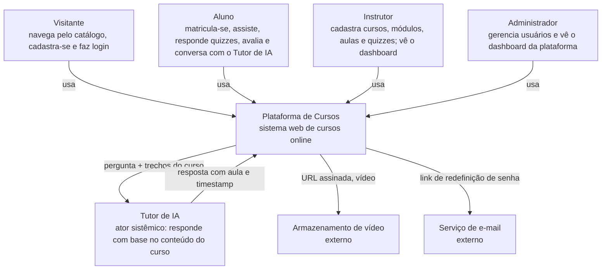
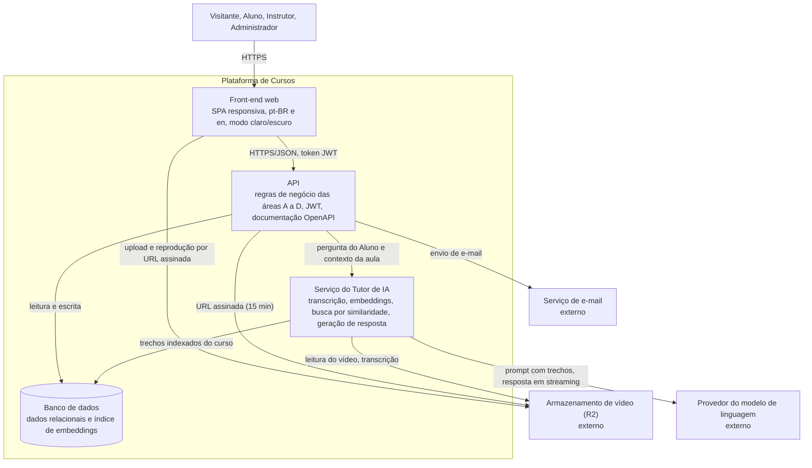
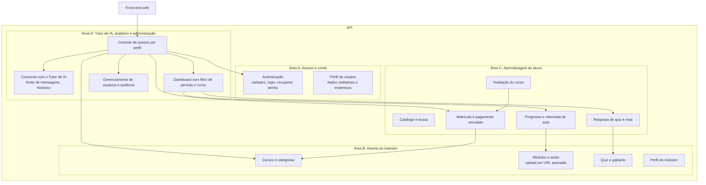
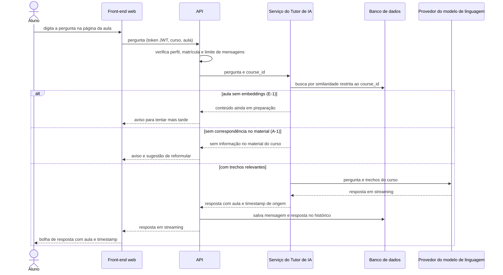
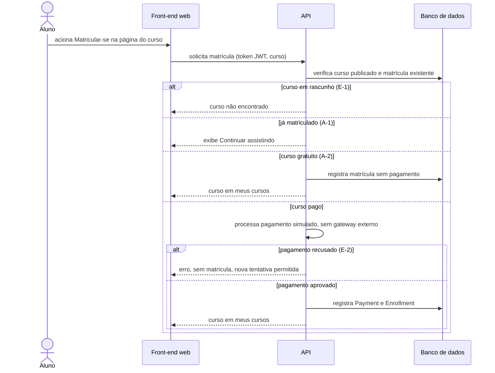
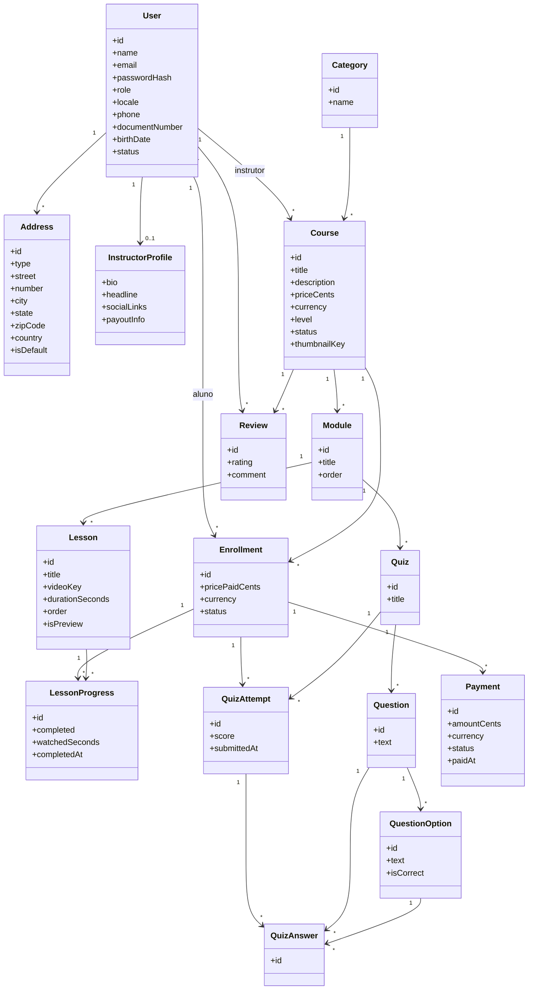

# SDD — Software Design Document

> Rascunho. Regras de escrita no [CONTEXT.md](../CONTEXT.md). O que não vem da v11, das ADRs ou da pesquisa vai marcado como proposta (`<!-- proposta: motivo -->`). Modelo de dados detalhado no TDD.

## 1. Visão da arquitetura

A Plataforma de Cursos é um sistema web com front-end separado de uma API central. A API concentra as regras de negócio das quatro áreas (A a D) e é a única a falar com o banco, com o armazenamento de vídeo e com os serviços externos. A v11 sustenta três pontos de arquitetura: autenticação por token JWT com rotas protegidas por perfil (RNF001), upload e entrega de vídeo por URL assinada (RNF002) e um Tutor de IA que consulta só o material do próprio curso (RAG restrito por `course_id`).

<!-- proposta: estilo monólito modular (API única dividida por área A a D) com front-end SPA; a v11 não nomeia o estilo. Motivo: equipe de 4 integrantes, uma área por integrante (ADR-0006) e prazo curto, o que não justifica microsserviços -->

O Tutor de IA é ator sistêmico (ADR-0005): recebe a pergunta do Aluno com o contexto da aula e devolve a resposta.

### 1.1 C4 nível 1 — Contexto

O pagamento é simulado dentro da própria plataforma, sem gateway externo (RF014), por isso não aparece como sistema externo.

## 2. Contêineres

### 2.1 C4 nível 2

| Contêiner | Responsabilidade | Origem da definição |
|---|---|---|
| Front-end web | Telas de todos os perfis; chat do Tutor de IA ao lado do vídeo; validação de campo obrigatório com mensagem de erro; layout de 360 a 1920 px (RNF005); textos em pt-BR e en (RNF013); modo escuro (RNF014) | v11 (RNF005, RNF013, RNF014, UC001) |
| API | Autenticação e perfis, cursos, módulos, aulas, matrícula, pagamento simulado, progresso, quiz com correção automática, avaliação, dashboard, administração; documentação OpenAPI online (RNF015) | v11 |
| Serviço do Tutor de IA | Transcrever a aula, gerar embeddings uma única vez por aula (RNF004), buscar trechos restritos ao curso, gerar resposta com aula e timestamp, responder em streaming (RNF003) | v11 |
| Banco de dados | Entidades do dicionário de dados da v11 (seção 5); histórico de conversa do Tutor de IA | v11 |
| Armazenamento de vídeo | Arquivos de vídeo, referenciados por `videoKey` (storage R2) | v11 (dicionário de dados) |

A stack tecnológica e os bancos de dados seguem a decisão do grupo registrada no [ADR-0007](adr/0007-stack-e-bancos.md):
- **Front-end:** Next.js com TypeScript arquitetado como SPA (sem Server Components ou Server Actions).
- **API (Core):** Laravel 13 / PHP 8.3 estruturado como monólito modular (módulos auth, catalog, learning e analytics).
- **Banco de dados do Core:** MySQL 8 como SGBD relacional primário para todas as entidades do sistema.
- **Serviço do Tutor de IA (`ai-service`):** Serviço físico separado rodando em seu próprio container (Laravel 13 / PHP 8.3) com banco de dados dedicado **PostgreSQL 16 com extensão pgvector** para índice vetorial HNSW e busca restrita a `course_id`. A separação física isola a dependência de LLM, pipelines assíncronos de transcrição/embeddings e a carga pesada de cálculo vetorial.
- **Armazenamento de mídia (`media-service`):** Serviço separado com storage Cloudflare R2 para vídeos (`videoKey`).

## 3. Componentes

C4 nível 3 da API, organizada por área (ADR-0006).

| Área | Componente | Casos de uso e RFs que atende (v11) |
|---|---|---|
| A | Autenticação | UC005 Realizar Login, UC012 (cadastro), UC011 Recuperar Senha; RF001, RF013 |
| A | Perfil do usuário | UC013 Editar dados do perfil; RF001 |
| B | Cursos e categorias | UC006 Cadastrar Curso; RF002 |
| B | Módulos e aulas | UC014, UC015; RF003, RF004 |
| B | Quiz e gabarito | UC004 Cadastrar Quiz com Gabarito; RF007 |
| B | Perfil do instrutor | RF016 (sem UC na v11) |
| C | Catálogo e busca | RF015 (sem UC na v11) |
| C | Matrícula e pagamento simulado | UC003 Matricular-se em Curso; RF005, RF014 |
| C | Progresso | UC009 Assistir Aula; RF006 |
| C | Resposta de quiz | UC002 Responder Quiz; RF008 |
| C | Avaliação do curso | UC010 Avaliar Curso; RF011 |
| D | Conversa com o Tutor de IA | UC001 Conversar com Tutor de IA; RF009 |
| D | Dashboard | UC007 Ver Dashboard com Filtro; RF010 |
| D | Usuários e auditoria | UC008 Gerenciar Usuários; RF012; RNF016 |
| D | Controle de acesso por perfil | UC016; RF012; RNF001 |

<!-- proposta: a divisão em componentes, os nomes e as dependências entre eles não constam na v11, que traz só casos de uso e diagramas de sequência. Foram derivados dos RFs e das regras de negócio dos casos de uso. Motivo: C4 nível 3 exige componentes -->

### 3.1 Fluxo principal do Tutor de IA

Baseado no fluxo básico e nas exceções do UC001.

### 3.2 Matrícula com pagamento simulado

Baseado no UC003 e no RF014.

## 4. Integrações externas

| Integração | O que trafega | Falha | Fallback |
|---|---|---|---|
| Provedor do modelo de linguagem (Tutor de IA) | Pergunta do Aluno e trechos do curso recuperados por similaridade; resposta em streaming | Sem fonte na v11 para o comportamento em indisponibilidade | Sem fonte na v11. |
| Armazenamento e entrega de vídeo (R2) | Arquivo de vídeo, por URL assinada de envio com validade de 15 min (RNF002); `videoKey` guardada no banco; reprodução por URL assinada | Upload com URL expirada ou indisponível: o sistema informa o erro e gera nova URL assinada (UC015, E-2); falha na entrega do vídeo na reprodução (UC009) | Nova URL assinada para nova tentativa (v11, UC015) |
| Envio de e-mail (recuperar senha) | Link de redefinição, com validade de 30 minutos (UC011) | Sem fonte na v11 | Sem fonte na v11. |
| Pagamento | Não há integração externa: o pagamento é simulado (RF014; entidade Payment com status pendente, confirmado ou estornado) | Pagamento recusado: nenhuma matrícula criada, nova tentativa permitida (UC003, E-2) | Nova tentativa pelo Aluno |

<!-- proposta: provedor de e-mail transacional (por exemplo, serviço SMTP ou API de e-mail) com envio assíncrono e nova solicitação pelo usuário em caso de falha. A v11 diz que o e-mail é enviado, mas não escolhe serviço nem trata falha. Motivo: o fluxo de recuperar senha depende do envio -->

<!-- proposta: provedor do modelo de linguagem ainda não escolhido; a escolha deve considerar custo por token, região de processamento (LGPD) e suporte a streaming (RNF003). Fallback proposto: mensagem de indisponibilidade ao Aluno, sem resposta gerada fora do material do curso. Motivo: a v11 define o comportamento do tutor, não o fornecedor -->

<!-- proposta: transcrição das aulas feita por serviço de reconhecimento de fala (a escolher), executada uma vez por aula após o upload (RNF004). A v11 diz que a plataforma transcreve e indexa as aulas, sem indicar o mecanismo. Motivo: sem a transcrição não há timestamp de origem na citação -->

## 5. Dados e armazenamento

| Dado | Onde fica | Observação |
|---|---|---|
| Usuário, endereços, perfil do instrutor | Banco de dados | Entidades User, Address, InstructorProfile. `passwordHash` guarda só o hash da senha (RNF007). `documentNumber` (CPF) e `birthDate` são dados pessoais. `socialLinks` e `payoutInfo` são campos JSON, exceção conhecida à 1FN por decisão do Plano Técnico |
| Curso, módulo, aula, categoria | Banco de dados | Entidades Category, Course, Module, Lesson. Preço em centavos e moeda ISO 4217 |
| Vídeo da aula e imagem de capa | Armazenamento de vídeo (R2) | Banco guarda só `videoKey` e `thumbnailKey` |
| Matrícula, pagamento simulado, progresso | Banco de dados | Entidades Enrollment, Payment, LessonProgress (`watchedSeconds` para retomar de onde parou) |
| Quiz, perguntas, alternativas, gabarito, tentativas, respostas | Banco de dados | Entidades Quiz, Question, QuestionOption (`isCorrect` é o gabarito), QuizAttempt, QuizAnswer |
| Avaliação do curso | Banco de dados | Entidade Review, nota de 1 a 5 e comentário |
| Transcrição, embeddings e histórico de conversa do Tutor de IA | Banco de dados | Gerados uma única vez por aula (RNF004); busca restrita por `course_id`. O histórico guarda mensagem e resposta por Aluno e curso (UC001). Entidades ainda não constam no dicionário de dados da v11 |
| Trilha de auditoria das ações administrativas | Banco de dados | Registro de 100% das ações, retido por 12 meses (RNF016) |
| Backup | Banco de dados | Backup diário, com restauração testada mensalmente (RNF011) |

<!-- proposta: tabelas LessonTranscript (transcrição com marcação de tempo), LessonEmbedding (vetor, trecho, timestamp, course_id), ChatMessage (aluno, curso, aula, pergunta, resposta, citação) e AuditLog (autor, ação, data). O dicionário da v11 não traz essas entidades, embora o UC001 e o RNF004 exijam os dados. Motivo: dar lugar aos dados que a v11 manda gerar e guardar -->

<!-- proposta: retenção de dados pessoais após exclusão da conta. A v11 diz, na estória US016, que os dados pessoais são removidos e o histórico de matrícula e pagamento permanece anonimizado, mas não fixa prazo. Prazos de retenção do histórico de conversa e dos arquivos de vídeo ficam para decisão do grupo -->

### 5.1 Modelo de classes de domínio

Transcrito do dicionário de dados da v11 (seção 12). O diagrama de classes da v11 (figura 14) é imagem e não foi reproduzido; este diagrama é uma reconstrução a partir dos atributos e das referências do dicionário.

<!-- proposta: multiplicidades do diagrama (por exemplo, InstructorProfile 0..1 por User, Payment * por Enrollment). O dicionário da v11 só informa as chaves de referência, não a cardinalidade. Motivo: o classDiagram exige multiplicidade -->

## 6. Segurança

| Tema | Decisão | Origem |
|---|---|---|
| Autenticação | Token JWT com expiração de 1 h; token expirado exige novo login | v11 (RNF001, UC005) |
| Perfis e área protegida (área D) | Perfis aluno, instrutor e administrador; 100% das rotas protegidas verificam o perfil; acesso negado redireciona o usuário à própria área | v11 (RNF001, US015, UC016) |
| Senhas | Armazenadas só com hash; mínimo de 8 caracteres, com letra e número | v11 (RNF007, UC012) |
| Enumeração de usuários | Mensagem de login inválido e de recuperação de senha não revela se o e-mail existe | v11 (UC005, UC011) |
| Bloqueio de login | 15 min após 5 tentativas inválidas consecutivas | v11 (RNF008) |
| Recuperação de senha | Link de redefinição com validade de 30 minutos | v11 (UC011) |
| Vídeo | Upload e reprodução só por URL assinada, com expiração de 15 min; sem acesso direto ao armazenamento | v11 (RNF002) |
| Matrícula | Só o Aluno matriculado acessa as aulas, salvo aula marcada como prévia (`isPreview`) | v11 (US006, UC003) |
| Tutor de IA | Responde só com base no material do próprio curso (RAG restrito por `course_id`); limite de mensagens por Aluno por período | v11 (UC001) |
| LGPD | Aceite de termos e política de privacidade registrado em 100% dos cadastros; dados pessoais removidos na exclusão da conta, com histórico anonimizado | v11 (RNF007, UC012, US016) |
| Administração | Registro de 100% das ações administrativas, retido por 12 meses; o administrador não bloqueia a própria conta | v11 (RNF016, US016) |

<!-- proposta: o token JWT é guardado em cookie HttpOnly com `SameSite` e a API envia a política de CORS restrita ao domínio do front-end. A v11 não diz onde fica o token. Motivo: reduz o risco de roubo do token por XSS -->

<!-- proposta: mensagens ao provedor do modelo de linguagem não incluem nome, e-mail, CPF nem outros dados pessoais do Aluno; seguem só a pergunta e os trechos do curso. Motivo: a v11 pede LGPD (RNF007), mas não trata do envio de dados a terceiros -->

## 7. Qualidade

Como a arquitetura atende os RNFs do item 8 (ISO/IEC 25010). RNFs conforme a v11, seção 8.

| RNF | Característica | Meta | Como a arquitetura atende |
|---|---|---|---|
| RNF001 | Segurança | Token de 1 h; 100% das rotas verificam perfil | Controle de acesso por perfil na API (componente da área D), antes de qualquer componente de negócio |
| RNF002 | Segurança | URL assinada de 15 min; 0 acessos diretos | A API gera a URL; o front-end nunca recebe credencial do armazenamento |
| RNF003 | Eficiência de desempenho | Primeiro trecho da resposta do Tutor de IA em até 3 s (p95) | Resposta em streaming do provedor até o chat |
| RNF004 | Eficiência de desempenho | 0 reprocessamentos por aula | Transcrição e embeddings guardados no banco e gerados uma vez, após o upload |
| RNF005 | Capacidade de interação | 100% dos campos obrigatórios com erro claro; 360 a 1920 px | Front-end SPA responsiva com validação nos formulários |
| RNF006 | Manutenibilidade | Cobertura de testes de 75% no backend, com merge bloqueado abaixo | Verificação de cobertura no pipeline de integração contínua |
| RNF007 | Segurança | 0 senhas em texto puro; aceite registrado em 100% dos cadastros | Hash de senha na área A; campo de aceite no cadastro |
| RNF008 | Segurança | Bloqueio de 15 min após 5 tentativas | Contador de tentativas na autenticação (área A) |
| RNF009 | Eficiência de desempenho | p95 das listagens de até 2 s com 1000 usuários simultâneos | API sem estado (JWT), que permite várias instâncias; paginação das listagens |
| RNF010 | Confiabilidade | Disponibilidade mensal mínima de 99% | Sem fonte na v11 para o mecanismo |
| RNF011 | Confiabilidade | Backup diário; restauração testada mensalmente | Backup do banco de dados, que concentra os dados da plataforma |
| RNF012 | Acessibilidade | WCAG 2.1 AA; contraste 4,5:1; navegação por teclado | Front-end com componentes acessíveis e revisão de contraste |
| RNF013 | Capacidade de interação | pt-BR e en em 100% dos textos; datas e valores por idioma | Textos em arquivos de tradução e formatação por localidade; campo `locale` do usuário |
| RNF014 | Capacidade de interação | Claro/escuro em 100% das telas, preferência salva por usuário | Tema no front-end; preferência persistida no perfil |
| RNF015 | Manutenibilidade | 100% dos endpoints em OpenAPI, online | API documentada em OpenAPI e publicada |
| RNF016 | Segurança | 100% das ações administrativas registradas, por 12 meses | Registro de auditoria no componente de gerenciamento de usuários |

<!-- proposta: balanceador e mais de uma instância da API, cache de listagens e hospedagem com réplica ou reinício automático para atingir 1000 usuários simultâneos (RNF009) e 99% de disponibilidade (RNF010). A v11 define as metas, não o mecanismo. Motivo: a API sem estado permite escalar horizontalmente -->

<!-- proposta: preferência de tema (RNF014) persistida no perfil do usuário, em campo que o dicionário de dados da v11 não traz (a entidade User tem só `locale`). Motivo: a meta exige preferência salva por usuário -->

<!-- proposta: matriz de rastreabilidade RNF para componente fica para o TDD. Motivo: o item 8 está dividido por área (ADR-0006) e a renumeração definitiva dos RNFs ainda não foi feita (ADR-0001) -->
