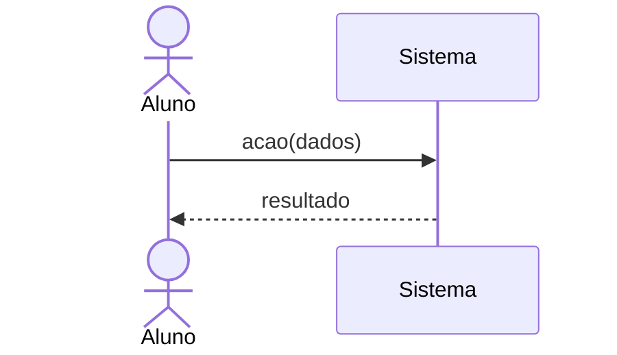

# SSD — System Sequence Diagrams

> Esqueleto. Cada seção traz um comentário-guia; apague o comentário quando escrever a seção. Regras de escrita no [CONTEXT.md](../../CONTEXT.md).

Um diagrama de sequência do sistema por caso de uso, em Mermaid (ADR-0004), no arquivo `UC-<área><n>.mmd` (IDs provisórios da ADR-0001).

| Caso de uso | Área | Arquivo |
|---|---|---|
<!-- Uma linha por UC do item 10, ex.: | UC-A1 Cadastrar-se | A | [UC-A1.mmd](UC-A1.mmd) | -->

Modelo:

