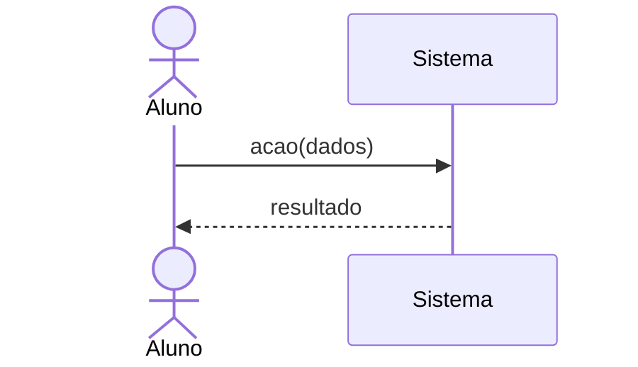

# SSD — System Sequence Diagrams

> Esqueleto. Cada seção traz um comentário-guia; apague o comentário quando escrever a seção. Regras de escrita no [CONTEXT.md](../../CONTEXT.md).

Um diagrama de sequência do sistema por caso de uso, em Mermaid (ADR-0004), no arquivo `UC-<área><n>.mmd` (IDs provisórios da ADR-0001).

| Caso de uso | Área | Arquivo |
|---|---|---|
<!-- Uma linha por UC do item 10, ex.: | UC012 Cadastrar-se na Plataforma | A | [UC012-cadastrar-se-na-plataforma.md](UC012-cadastrar-se-na-plataforma.md) | -->
| UC001 Conversar com Tutor de IA | D | [UC001-conversar-com-tutor-de-ia.md](UC001-conversar-com-tutor-de-ia.md) |
| UC002 Responder Quiz | C | [UC002-responder-quiz.md](UC002-responder-quiz.md) |
| UC003 Matricular-se em Curso | C | [UC003-matricular-se-em-curso.md](UC003-matricular-se-em-curso.md) |
| UC004 Cadastrar Quiz com Gabarito | B | [UC004-cadastrar-quiz-com-gabarito.md](UC004-cadastrar-quiz-com-gabarito.md) |
| UC005 Realizar Login | A | [UC005-realizar-login.md](UC005-realizar-login.md) |
| UC006 Cadastrar Curso | B | [UC006-cadastrar-curso.md](UC006-cadastrar-curso.md) |
| UC007 Ver Dashboard com Filtro | D | [UC007-ver-dashboard-com-filtro.md](UC007-ver-dashboard-com-filtro.md) |
| UC008 Gerenciar Usuários | D | [UC008-gerenciar-usuarios.md](UC008-gerenciar-usuarios.md) |
| UC009 Assistir Aula | C | [UC009-assistir-aula.md](UC009-assistir-aula.md) |
| UC010 Avaliar Curso | C | [UC010-avaliar-curso.md](UC010-avaliar-curso.md) |
| UC011 Recuperar Senha | A | [UC011-recuperar-senha.md](UC011-recuperar-senha.md) |

Modelo:

