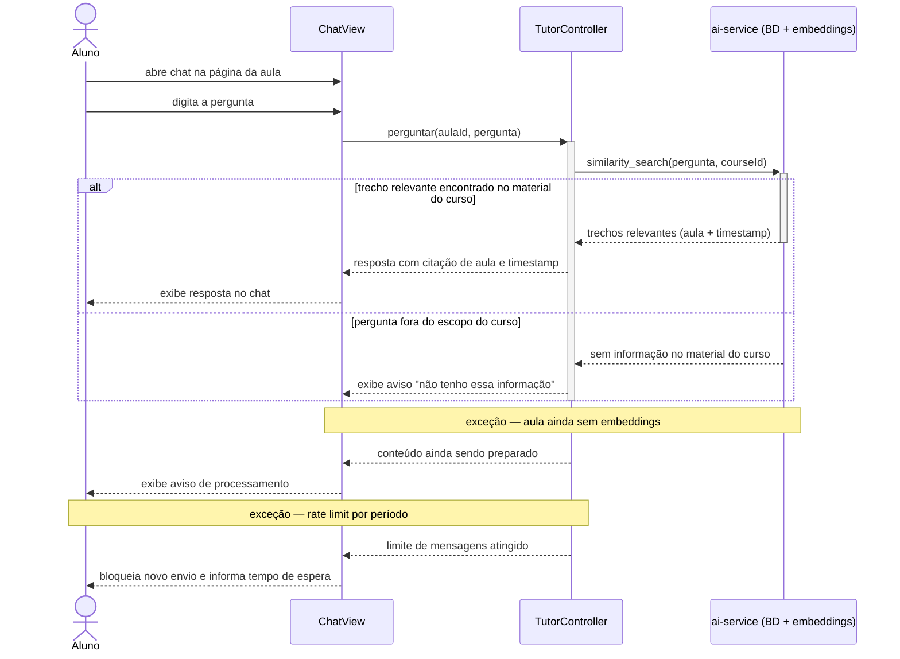

# UC001 — Conversar com Tutor de IA

Diagrama de sequência do sistema para o caso de uso UC001 (Conversar com Tutor de IA). Representa a interação entre o Aluno, a interface de chat, a API de controle e o serviço do Tutor de IA com busca por similaridade em embeddings do material do curso.

