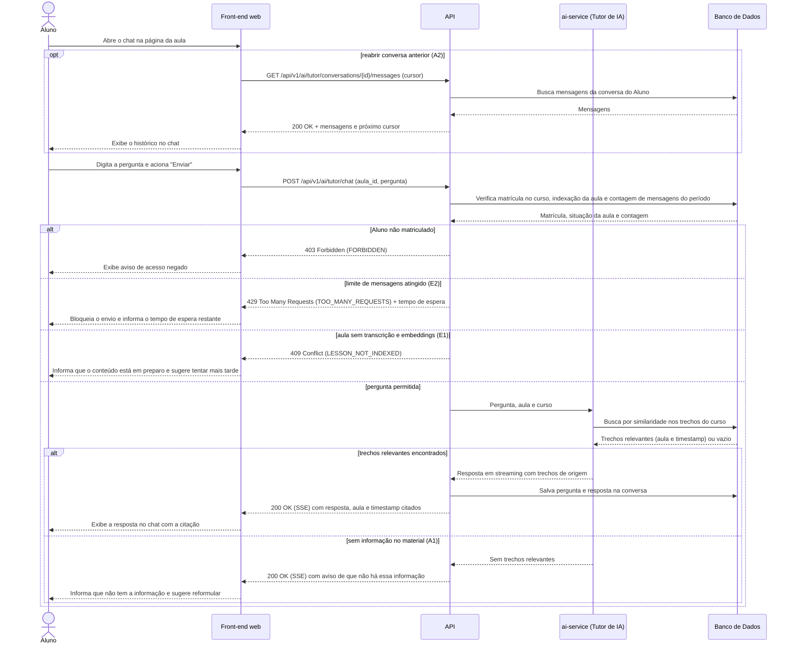

# UC001 — Conversar com Tutor de IA

Diagrama de sequência do sistema para o caso de uso UC001 (Conversar com Tutor de IA). Representa a conversa do Aluno matriculado com o Tutor de IA (ator sistêmico, ADR-0005) na página da aula: reabertura do histórico (A2), busca por similaridade nos embeddings do material do curso, resposta em streaming SSE com citação de aula e timestamp, pergunta fora do escopo (A1), aula ainda não indexada (E1) e limite de mensagens (E2).

