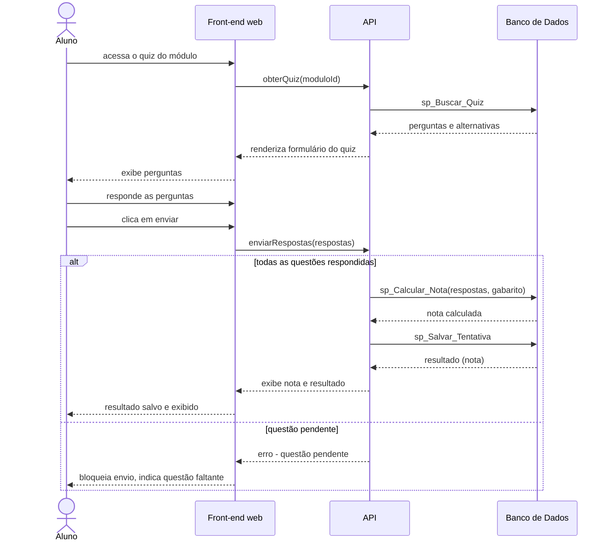

# UC002 — Responder Quiz

Diagrama de sequência do sistema para o caso de uso UC002 (Responder Quiz). Representa a obtenção das questões do quiz pelo Aluno, o envio das respostas, a validação de preenchimento, o cálculo da nota e a persistência da tentativa.

<!-- revisar: diagrama reconstruído a partir da descrição da v11 (na v11 é só imagem); conferir contra a figura original. -->

