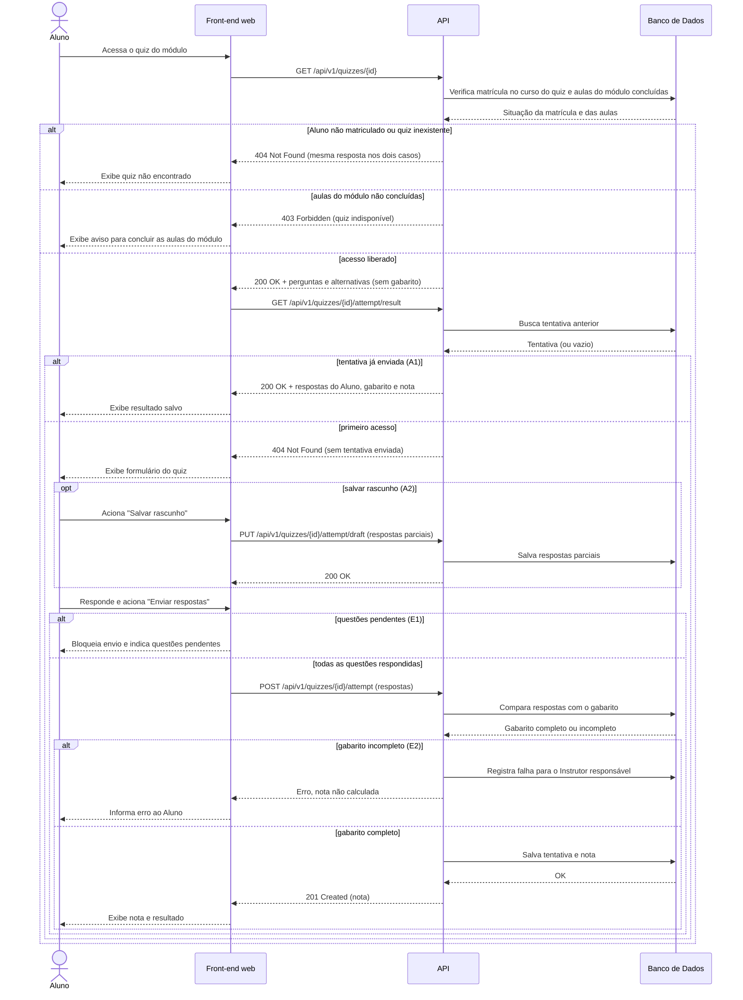

# UC002 — Responder Quiz

Diagrama de sequência do sistema para o caso de uso UC002 (Responder Quiz). Representa a verificação de acesso ao quiz pelo Aluno (aulas do módulo concluídas), a retomada de tentativa já enviada, o salvamento de rascunho, o envio das respostas, a validação de preenchimento, o cálculo da nota e a persistência da tentativa.

