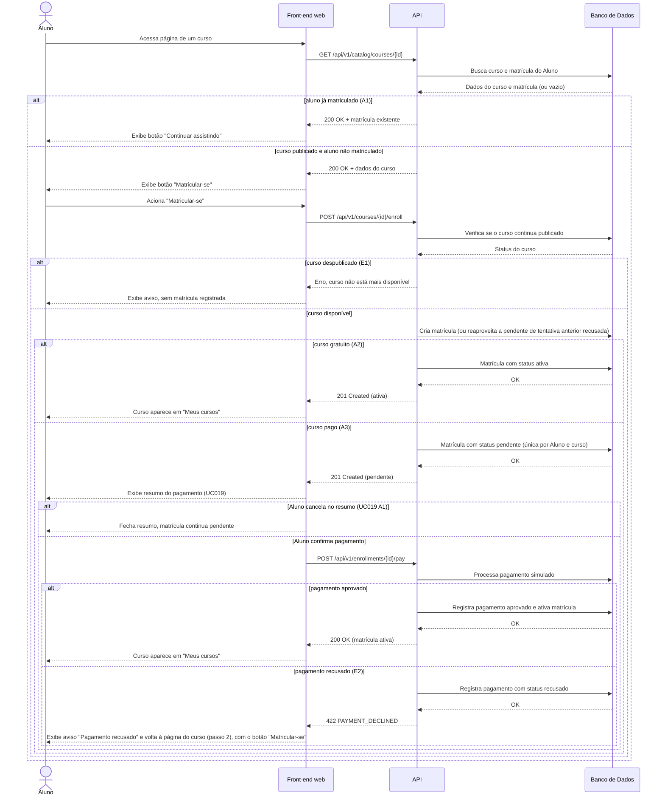

# UC003 — Matricular-se em Curso

Diagrama de sequência do sistema para o caso de uso UC003 (Matricular-se em Curso). Representa a consulta do curso pelo Aluno, a verificação de matrícula prévia, a criação da matrícula pendente, o pagamento simulado do UC019 (aprovado ou recusado) e a ativação da matrícula apenas com pagamento aprovado. Curso gratuito ativa a matrícula diretamente.

