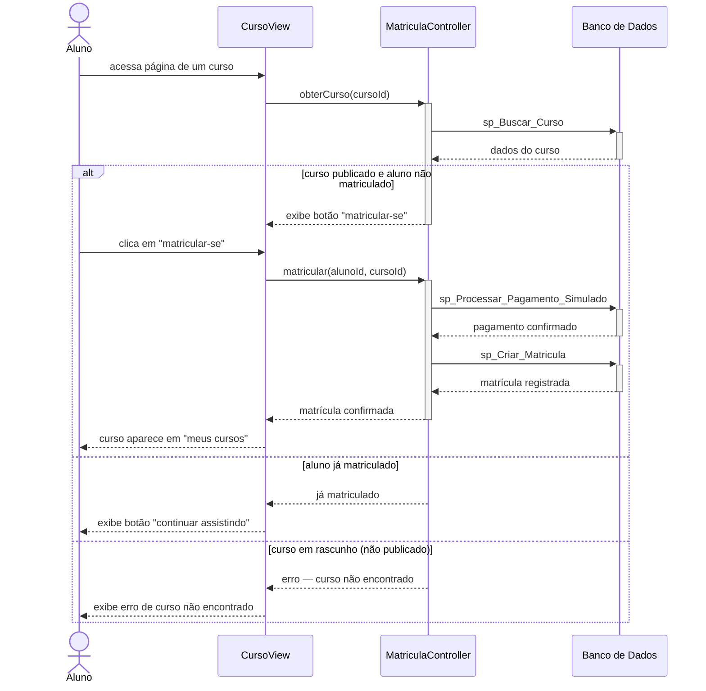

# UC003 — Matricular-se em Curso

Diagrama de sequência do sistema para o caso de uso UC003 (Matricular-se em Curso). Representa o fluxo de consulta do curso pelo Aluno, verificação de matrícula prévia, processamento do pagamento simulado e confirmação de matrícula.

