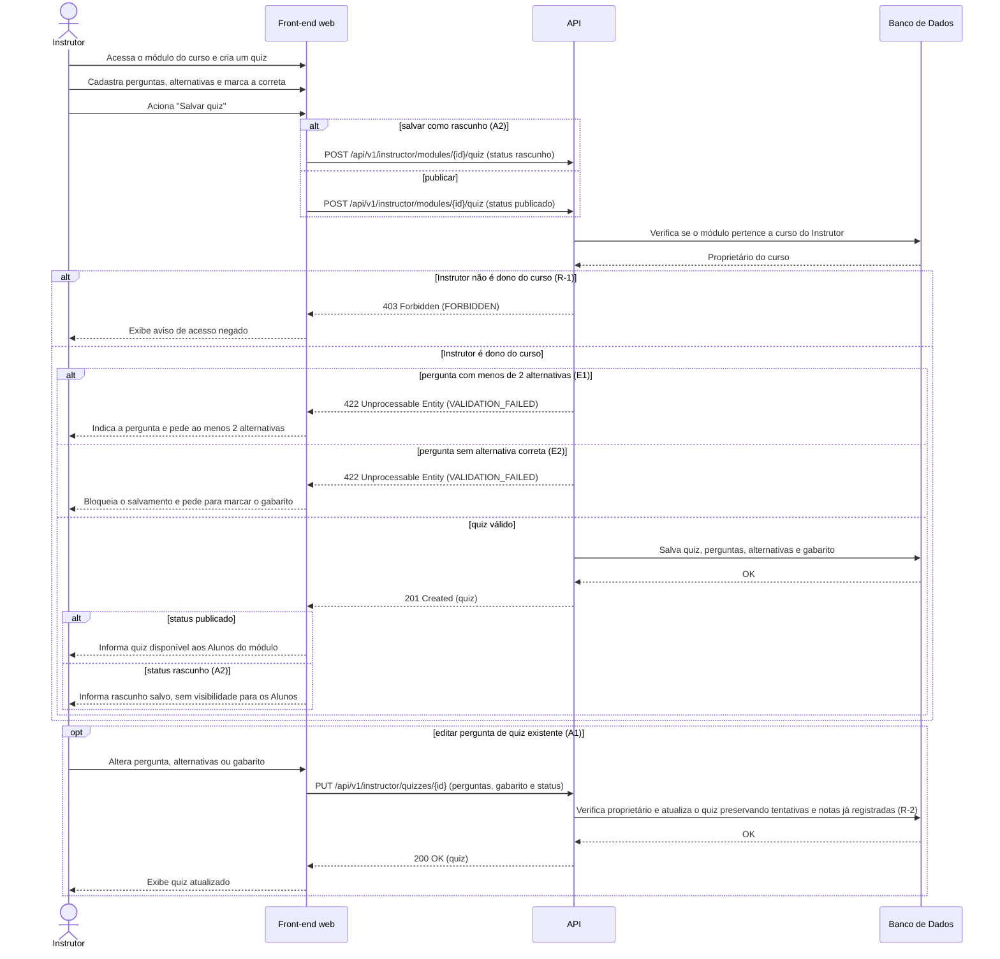

# UC004 — Cadastrar Quiz com Gabarito

Diagrama de sequência do sistema para o caso de uso UC004 (Cadastrar Quiz com Gabarito). Representa a criação do quiz pelo Instrutor dono do curso, o cadastro das perguntas com alternativas e gabarito, a edição de pergunta existente (A1), o salvamento como rascunho (A2), a validação do gabarito (E1 e E2) e a publicação.

