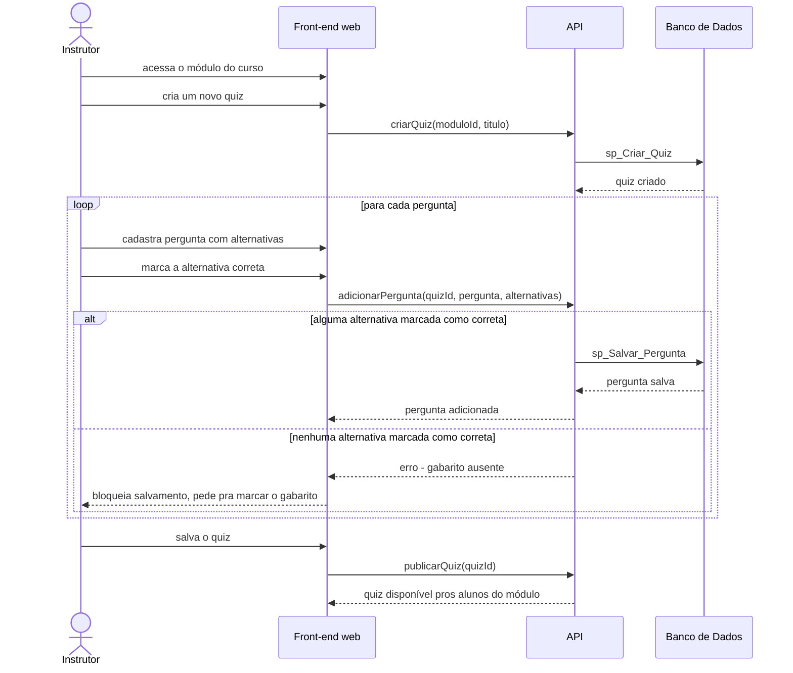

# UC004 — Cadastrar Quiz com Gabarito

Diagrama de sequência do sistema para o caso de uso UC004 (Cadastrar Quiz com Gabarito). Representa a criação de um quiz pelo Instrutor, o cadastro iterativo de perguntas com gabarito e sua publicação.

<!-- revisar: diagrama reconstruído a partir da descrição da v11 (na v11 é só imagem); conferir contra a figura original. -->

