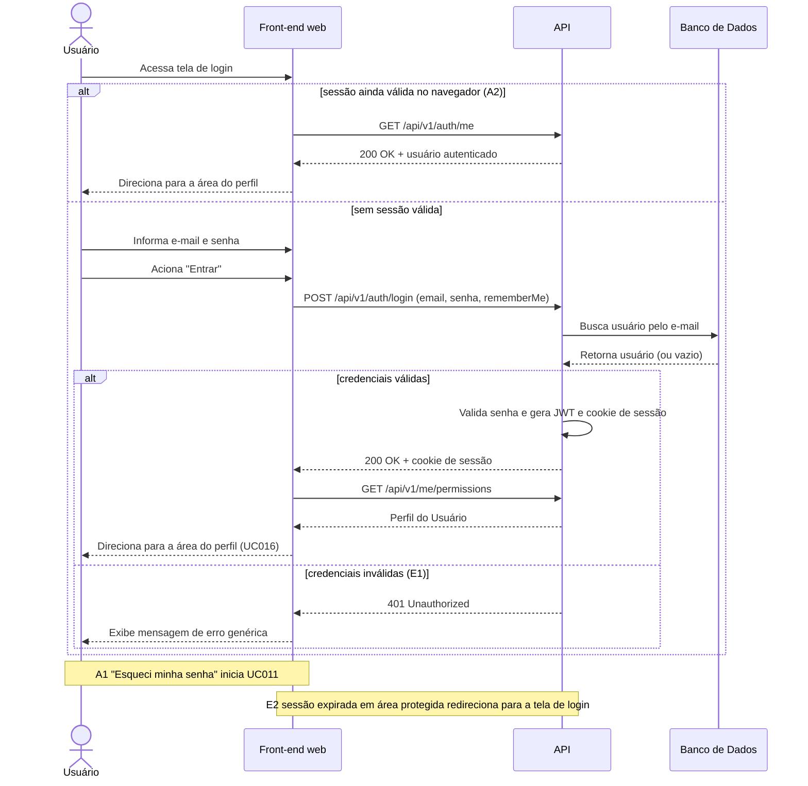

# UC005 — Realizar Login

Diagrama de sequência do sistema para o caso de uso UC005 (Realizar Login). Representa a autenticação de credenciais de um Usuário (Aluno, Instrutor ou Administrador) através do front-end web, emissão da sessão (JWT em cookie HttpOnly, ADR-0008) pela API, direcionamento à área do perfil ou resposta de erro genérica.

