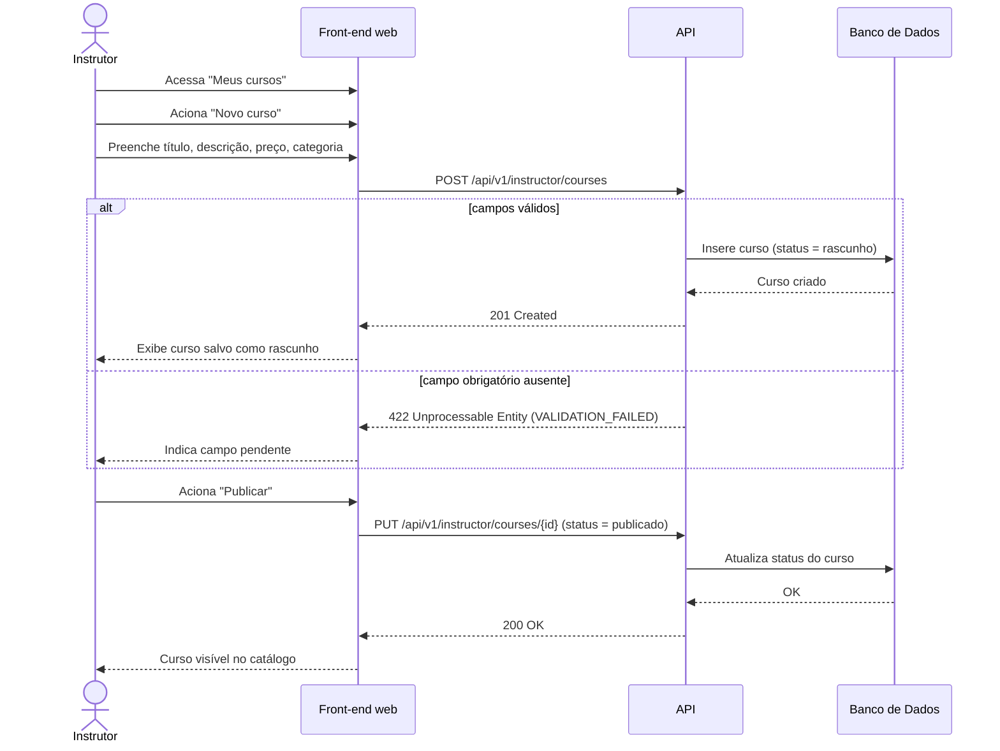

# UC006 — Cadastrar Curso

Diagrama de sequência do sistema para o caso de uso UC006 (Cadastrar Curso). Representa a criação de curso em estado de rascunho pelo Instrutor e posterior publicação no catálogo.

