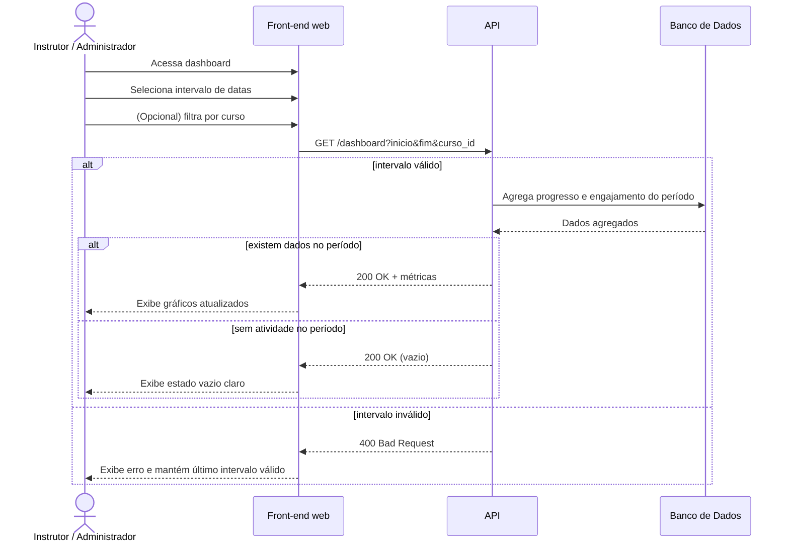

# UC007 — Ver Dashboard com Filtro

Diagrama de sequência do sistema para o caso de uso UC007 (Ver Dashboard com Filtro). Representa a consulta de métricas e gráficos filtrados por período e curso por parte do Instrutor ou Administrador.

