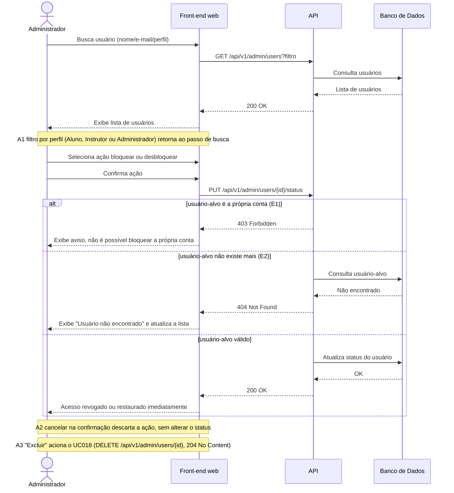

# UC008 — Gerenciar Usuários

Diagrama de sequência do sistema para o caso de uso UC008 (Gerenciar Usuários). Representa a consulta de usuários pelo Administrador, a alteração de status (bloqueio e desbloqueio) com revogação ou restauração imediata do acesso, e a prevenção de bloqueio da própria conta logada. A exclusão não é uma ação de status: é o UC018, acionado a partir desta lista.

