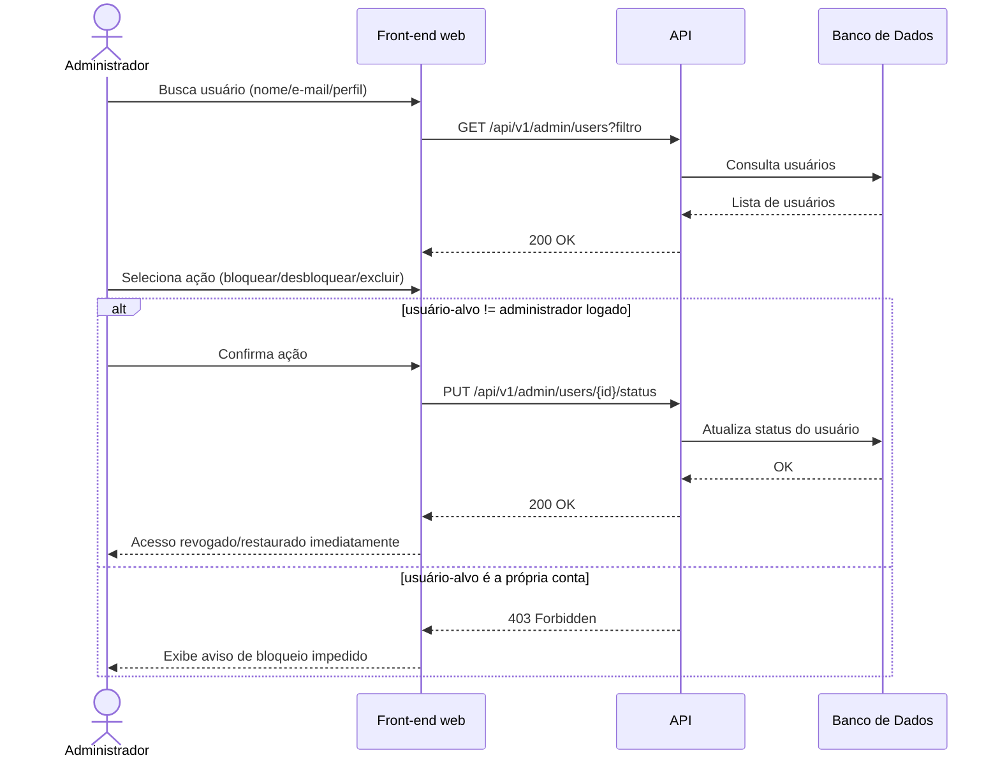

# UC008 — Gerenciar Usuários

Diagrama de sequência do sistema para o caso de uso UC008 (Gerenciar Usuários). Representa a consulta e atualização de status/perfil de usuários pelo Administrador, prevenindo alteração da própria conta logada.

