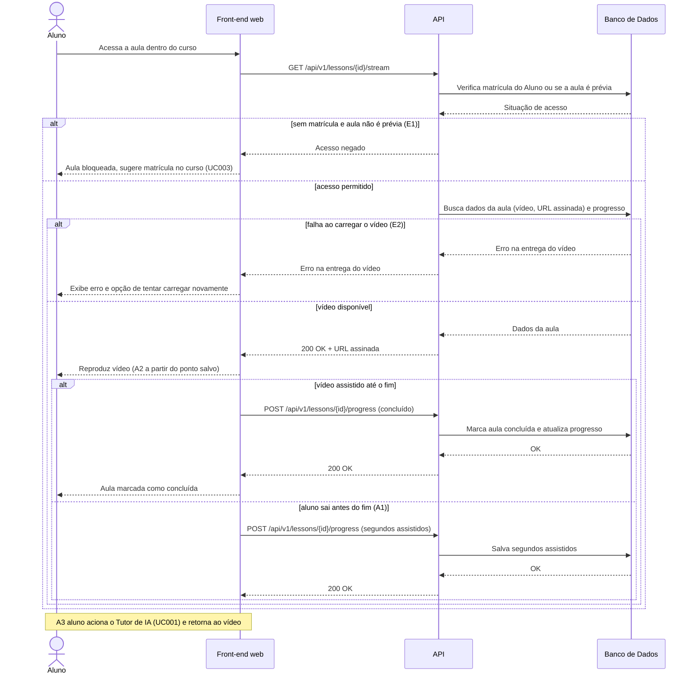

# UC009 — Assistir Aula

Diagrama de sequência do sistema para o caso de uso UC009 (Assistir Aula). Representa a verificação de acesso à aula (matrícula ou aula prévia), o carregamento dos dados e a reprodução do vídeo pelo Aluno, e o registro do progresso por conclusão ou segundos assistidos.

