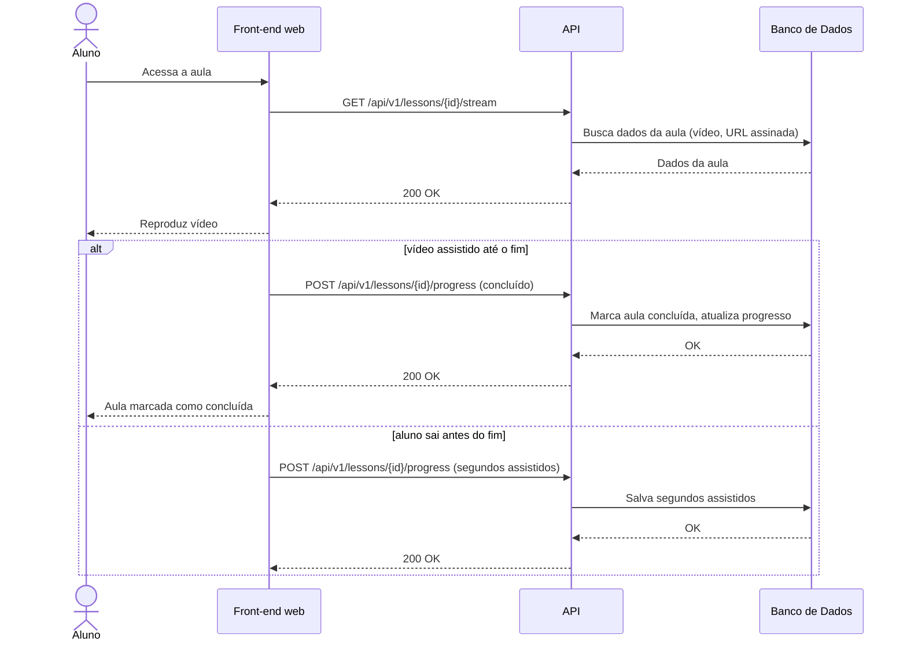

# UC009 — Assistir Aula

Diagrama de sequência do sistema para o caso de uso UC009 (Assistir Aula). Representa o carregamento dos dados e reprodução do vídeo pelo Aluno, acompanhando o progresso por conclusão ou segundos assistidos.

