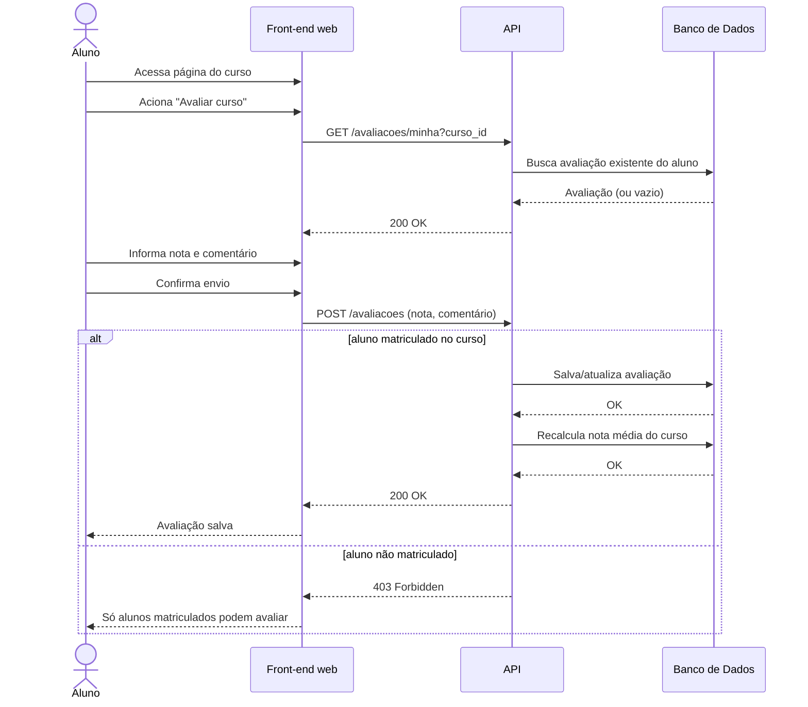

# UC010 — Avaliar Curso

Diagrama de sequência do sistema para o caso de uso UC010 (Avaliar Curso). Representa a avaliação com nota e comentário realizada pelo Aluno matriculado, com validação de matrícula e recálculo da nota média.

