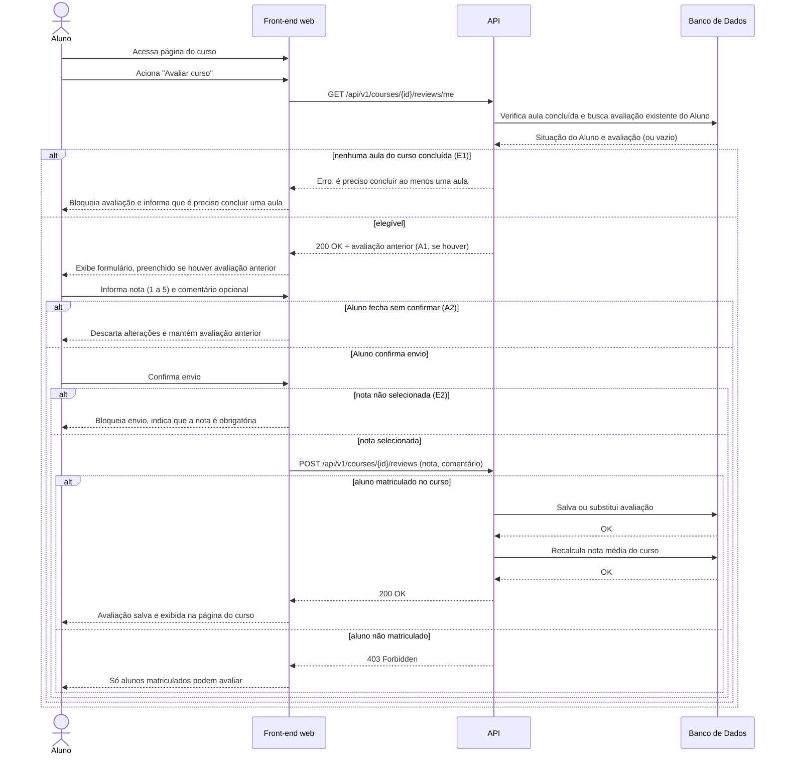

# UC010 — Avaliar Curso

Diagrama de sequência do sistema para o caso de uso UC010 (Avaliar Curso). Representa a avaliação com nota de 1 a 5 e comentário opcional realizada pelo Aluno matriculado, com verificação de aula concluída, pré-preenchimento da avaliação anterior, validação de nota obrigatória e recálculo da nota média.

