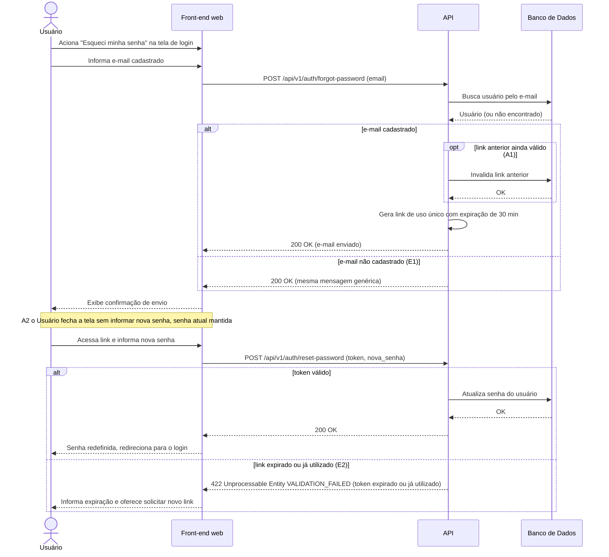

# UC011 — Recuperar Senha

Diagrama de sequência do sistema para o caso de uso UC011 (Recuperar Senha). Representa a solicitação de redefinição de senha pelo Usuário que não lembra a senha, geração segura do link de uso único com expiração de 30 minutos, invalidação de link anterior ainda válido e atualização da senha com validação de token.

