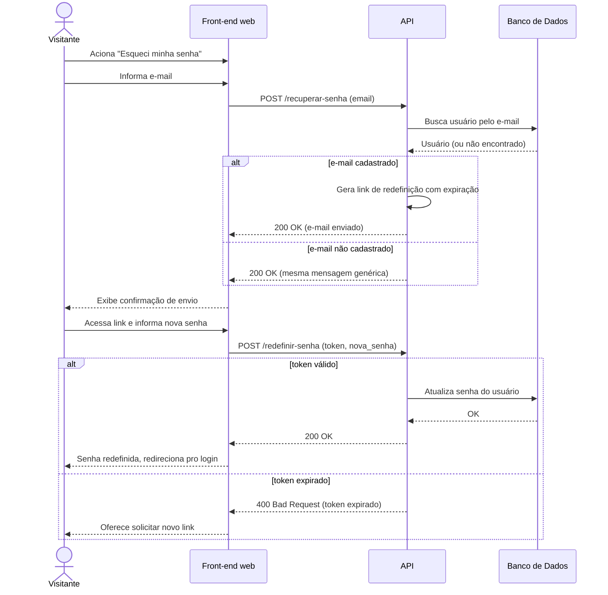

# UC011 — Recuperar Senha

Diagrama de sequência do sistema para o caso de uso UC011 (Recuperar Senha). Representa a solicitação de redefinição de senha pelo Visitante, geração segura do link de expiração e posterior atualização da senha com validação de token.

