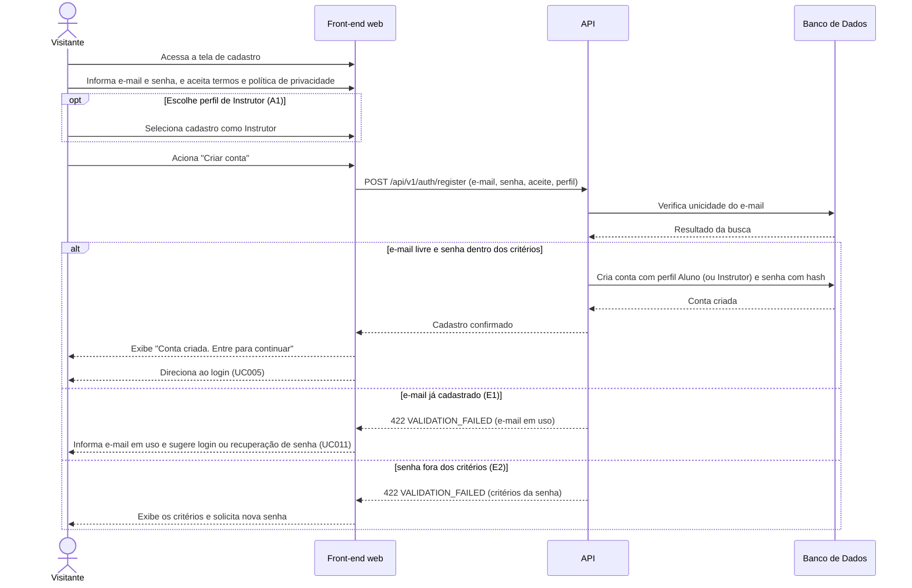

# UC012 — Cadastrar-se na Plataforma

Diagrama de sequência do sistema para o caso de uso UC012 (Cadastrar-se na Plataforma). Representa o cadastro de um Visitante com e-mail e senha, a validação de unicidade do e-mail e dos critérios da senha, a criação da conta com perfil Aluno ou Instrutor e o direcionamento ao login.

