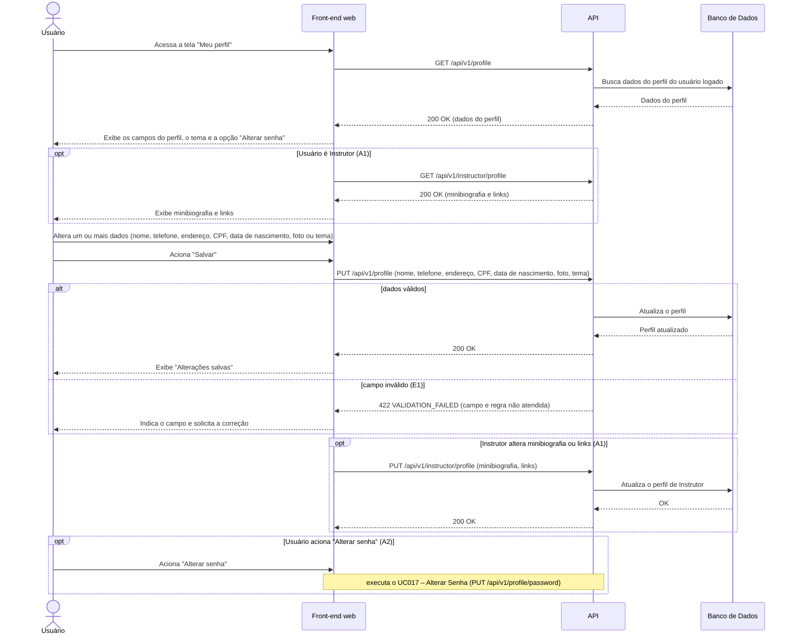

# UC013 — Editar Dados do Perfil

Diagrama de sequência do sistema para o caso de uso UC013 (Editar Dados do Perfil). Representa a leitura e a atualização dos dados do perfil do Usuário autenticado (nome, telefone, endereço, CPF, data de nascimento, foto e tema), a validação de campos, a edição de minibiografia e links do Instrutor (A1) e o encaminhamento para a alteração de senha (A2, UC017).

