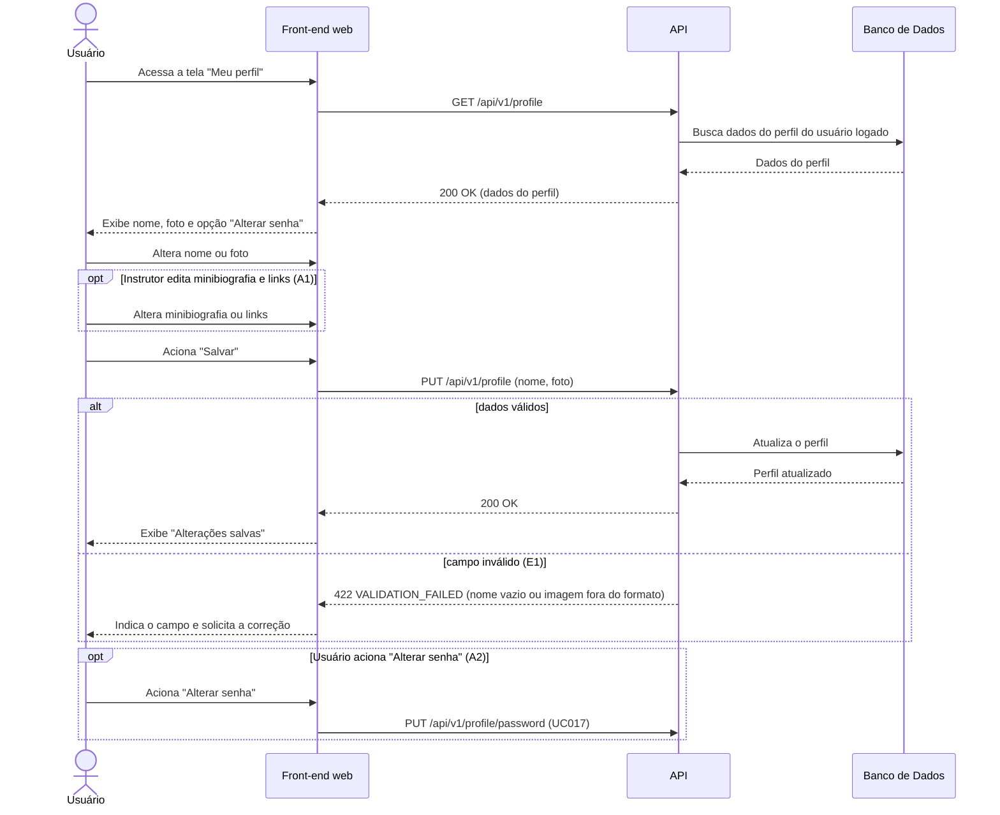

# UC013 — Editar Dados do Perfil

Diagrama de sequência do sistema para o caso de uso UC013 (Editar Dados do Perfil). Representa a leitura e a atualização dos dados do perfil do Usuário autenticado, a validação de campos, o acesso ao fluxo de Instrutor e o encaminhamento para a alteração de senha (UC017).

