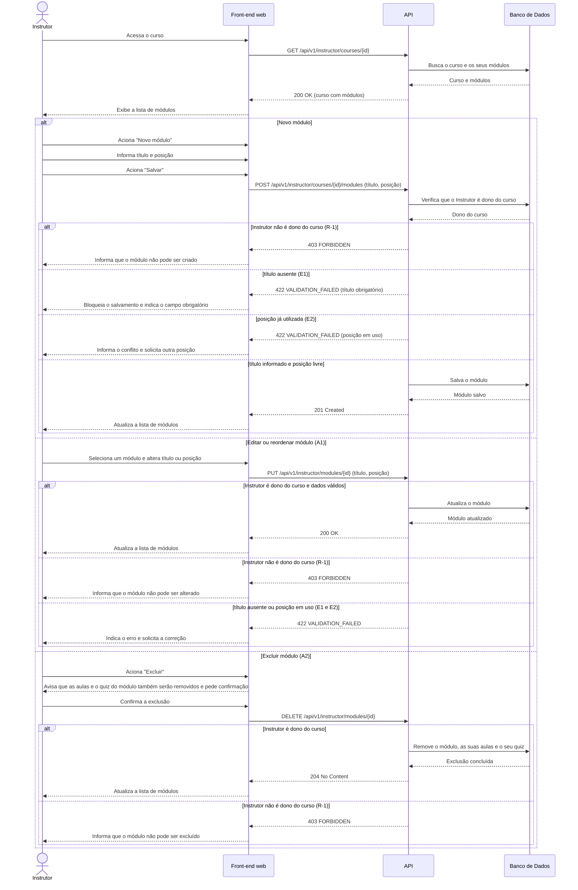

# UC014 — Gerenciar Módulos do Curso

Diagrama de sequência do sistema para o caso de uso UC014 (Gerenciar Módulos do Curso). Representa a criação, a edição e a reordenação de módulos por um Instrutor dono do curso, a validação de título e de posição única e a exclusão de módulo com remoção das suas aulas e do seu quiz. Editar e excluir verificam o dono do curso (R-1).

