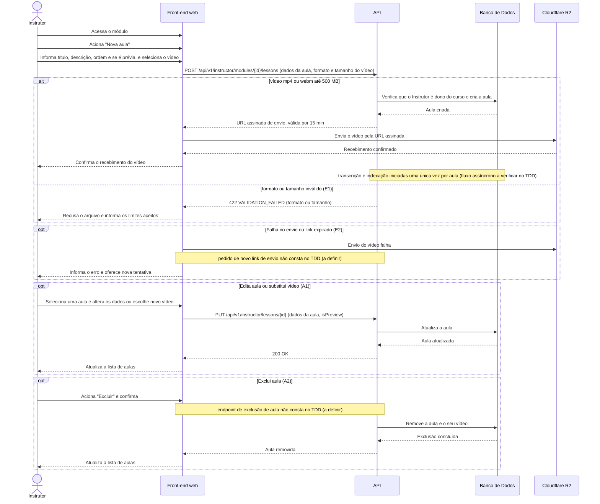

# UC015 — Gerenciar Aulas do Curso

Diagrama de sequência do sistema para o caso de uso UC015 (Gerenciar Aulas do Curso). Representa a criação de aula por um Instrutor dono do curso, a obtenção de URL assinada para envio do vídeo no Cloudflare R2 com validade de 15 minutos, a validação de formato e tamanho do vídeo, a edição de dados e a exclusão de aula.

