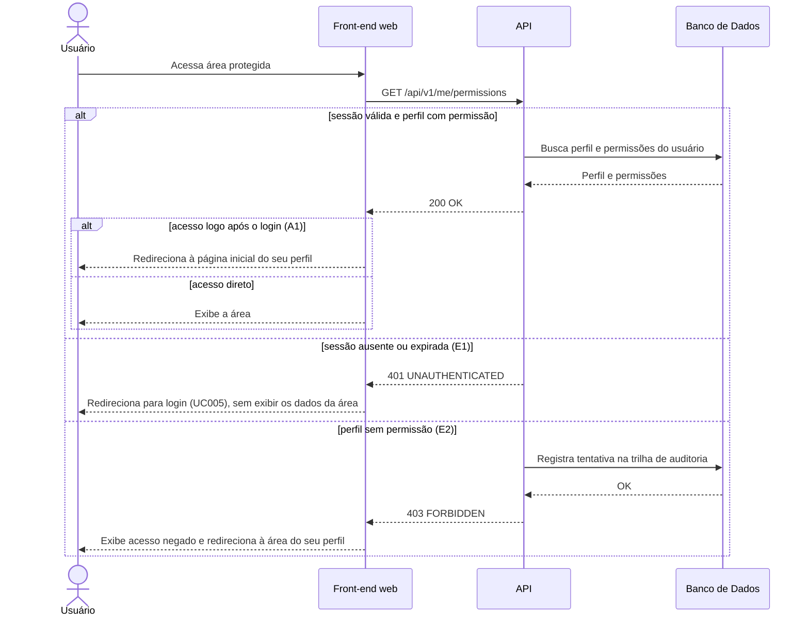

# UC016 — Acessar Área Protegida por Perfil

Diagrama de sequência do sistema para o caso de uso UC016 (Acessar Área Protegida por Perfil). Representa a verificação de sessão e de permissão do perfil antes de exibir uma área restrita, o direcionamento à página inicial do perfil após o login (A1) e a negação de acesso registrada em trilha de auditoria, com redirecionamento à área do próprio perfil.

