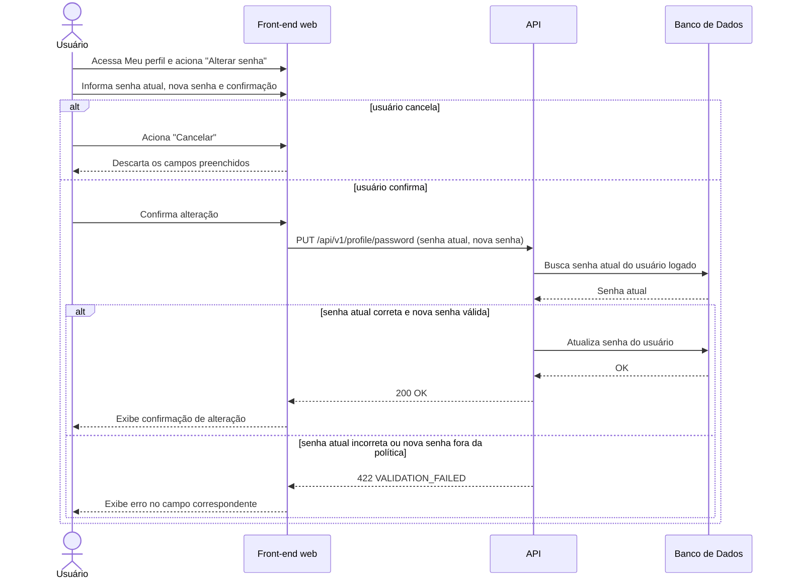

# UC017 — Alterar Senha

Diagrama de sequência do sistema para o caso de uso UC017 (Alterar Senha). Representa a alteração de senha pelo Usuário logado, no bloco da tela Meu perfil, com validação da senha atual e da nova senha pela API.

