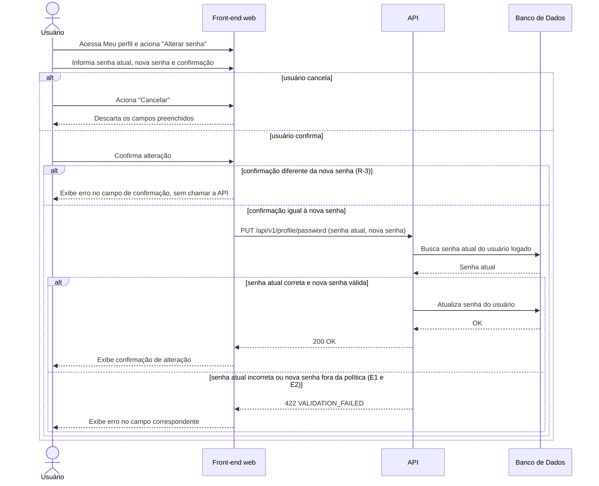

# UC017 — Alterar Senha

Diagrama de sequência do sistema para o caso de uso UC017 (Alterar Senha, RF019), acionado a partir da tela Meu perfil (UC013). Representa a alteração de senha pelo Usuário logado, com conferência local de confirmação (R-3), validação da senha atual e da nova senha pela API e erro exibido no campo correspondente.

