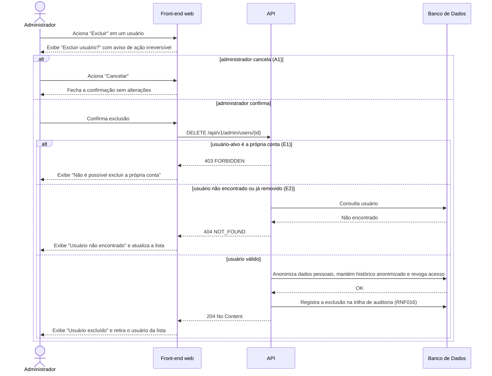

# UC018 — Excluir e Anonimizar Usuário

Diagrama de sequência do sistema para o caso de uso UC018 (Excluir e Anonimizar Usuário, RF012). Estende o UC008 e é acionado pela ação "Excluir" da lista de usuários. Representa a exclusão de conta pelo Administrador após confirmação com aviso de ação irreversível, com anonimização dos dados conforme LGPD, bloqueio da exclusão da própria conta e atualização da lista após a exclusão.

