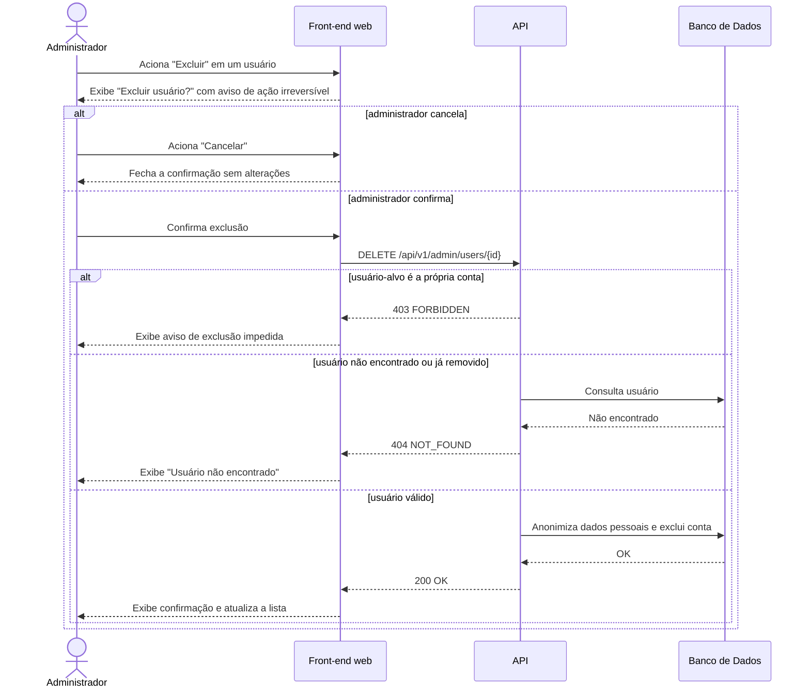

# UC018 — Excluir e Anonimizar Usuário

Diagrama de sequência do sistema para o caso de uso UC018 (Excluir e Anonimizar Usuário). Representa a exclusão de conta pelo Administrador após confirmação com aviso de ação irreversível, com anonimização dos dados conforme LGPD e bloqueio da exclusão da própria conta.

