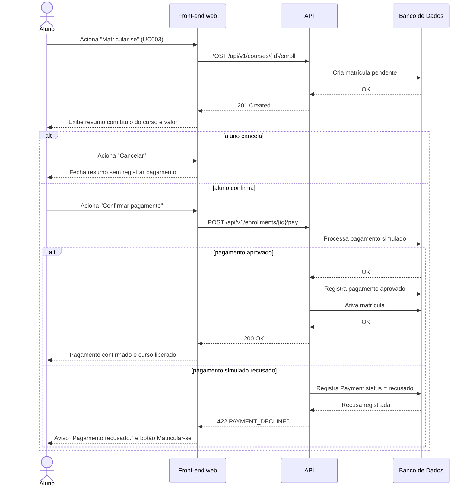

# UC019 — Processar Pagamento Simulado

Diagrama de sequência do sistema para o caso de uso UC019 (Processar Pagamento Simulado). Representa a matrícula pendente criada no UC003, a confirmação do pagamento simulado pelo Aluno, sem gateway externo, e o registro de pagamento aprovado (matrícula ativa) ou recusado (matrícula pendente).

