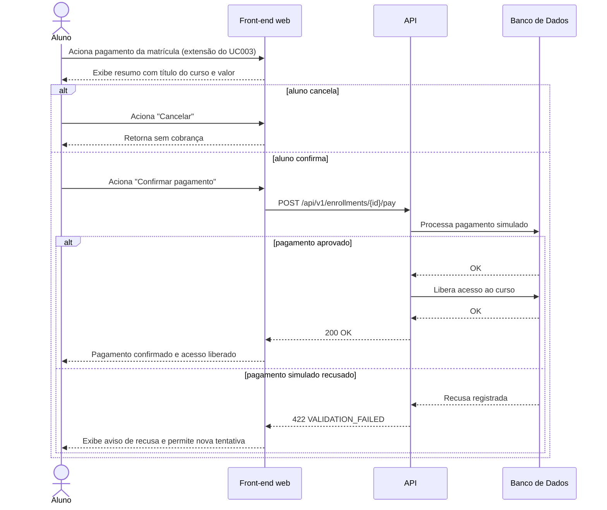

# UC019 — Processar Pagamento Simulado

Diagrama de sequência do sistema para o caso de uso UC019 (Processar Pagamento Simulado). Representa a confirmação do pagamento simulado pelo Aluno, estendendo o fluxo de matrícula do UC003, sem gateway externo, com tratamento de recusa e nova tentativa.

