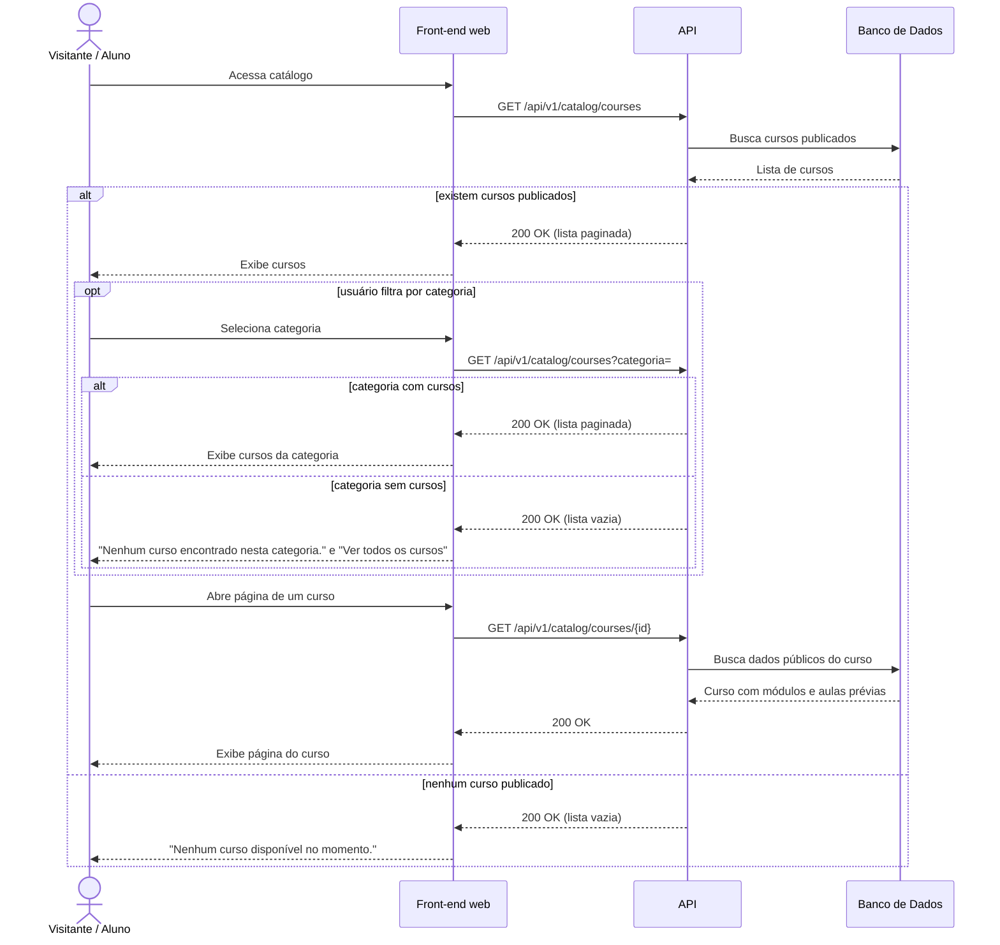

# UC020 — Consultar Catálogo de Cursos

Diagrama de sequência do sistema para o caso de uso UC020 (Consultar Catálogo de Cursos). Representa a listagem paginada de cursos publicados, o filtro por categoria e a abertura da página pública de um curso, acessíveis a Visitante e Aluno.

