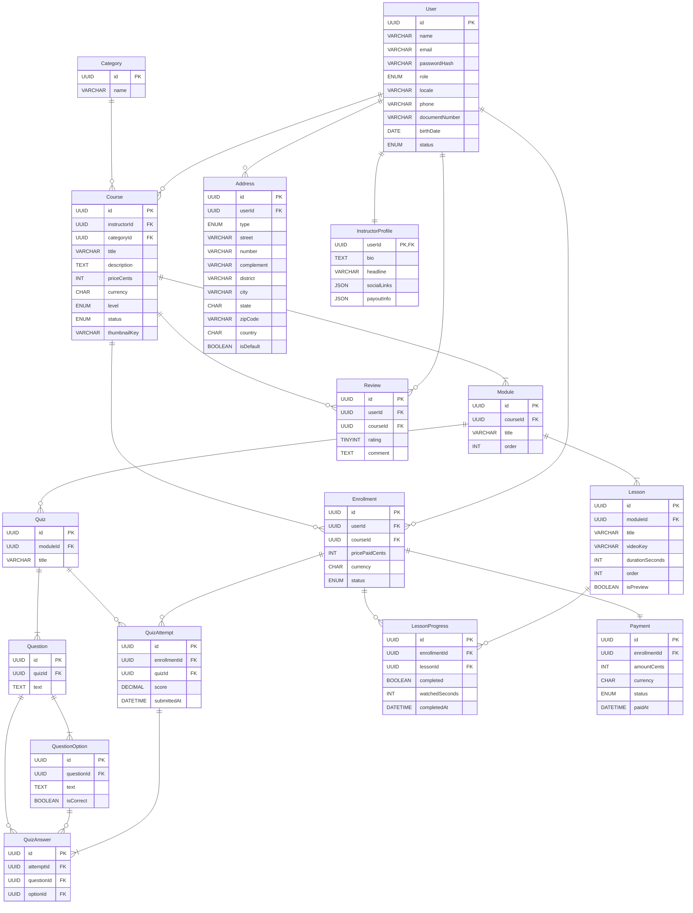
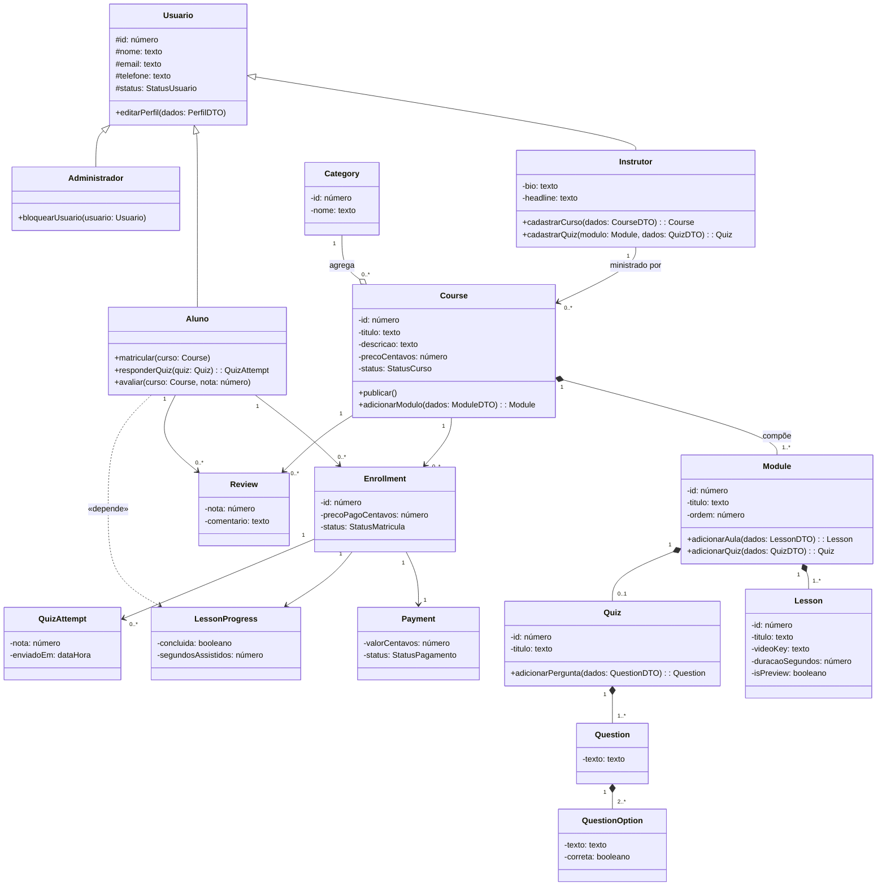

# TDD — Technical Design Document

> Esqueleto. Cada seção traz um comentário-guia; apague o comentário quando escrever a seção. Regras de escrita no [CONTEXT.md](../CONTEXT.md).

## 1. Stack
<!-- Linguagens, frameworks, banco, hospedagem. Cada escolha relevante vira ADR em docs/adr/. -->

## 2. Modelo de dados

### Dicionário de dados

Atributos normalizados até a 3FN, exceto os campos JSON InstructorProfile.socialLinks e InstructorProfile.payoutInfo, mantidos como estrutura semiestruturada por decisão do Plano Técnico (exceção conhecida à 1FN, não normalização pendente).

| Entidade / Atributo | Classe | Domínio | Tamanho | Descrição |
|---|---|---|---|---|
| **Entidade: User** | | | | |
| id | Determinante | Texto | - | Identificador único do usuário (UUID). |
| name | Simples | Texto | 150 | Nome completo do usuário. |
| email | Simples | Texto | 150 | E-mail, usado no login. |
| passwordHash | Simples | Texto | 255 | Hash da senha. |
| role | Simples | Texto | - | Perfil: aluno, instrutor ou administrador. |
| locale | Simples | Texto | 10 | Idioma/localidade preferida. |
| phone | Simples | Texto | 20 | Telefone de contato. |
| documentNumber | Simples | Texto | 14 | CPF do usuário. |
| birthDate | Simples | Data | - | Data de nascimento. |
| status | Simples | Texto | - | Ativo, bloqueado ou excluído. |
| **Entidade: Address** | | | | |
| id | Determinante | Texto | - | Identificador único do endereço (UUID). |
| userId | Simples | Texto | - | Referência ao usuário dono do endereço. |
| type | Simples | Texto | - | Tipo: cobrança ou entrega. |
| street | Simples | Texto | 150 | Logradouro. |
| number | Simples | Texto | 10 | Número. |
| complement | Simples | Texto | 60 | Complemento (opcional). |
| district | Simples | Texto | 80 | Bairro. |
| city | Simples | Texto | 80 | Cidade. |
| state | Simples | Texto | 2 | UF. |
| zipCode | Simples | Texto | 9 | CEP. |
| country | Simples | Texto | 2 | País (ISO 3166-1 alpha-2). |
| isDefault | Simples | Booleano | - | Indica se é o endereço padrão do usuário. |
| **Entidade: InstructorProfile** | | | | |
| userId | Determinante | Texto | - | Referência ao usuário instrutor (PK e FK). |
| bio | Simples | Texto | - | Biografia curta do instrutor. |
| headline | Simples | Texto | 150 | Chamada/título de apresentação. |
| socialLinks | Composto | Texto | - | Conjunto de links de redes sociais (JSON). |
| payoutInfo | Composto | Texto | - | Dados de repasse financeiro (JSON). |
| **Entidade: Category** | | | | |
| id | Determinante | Texto | - | Identificador único da categoria (UUID). |
| name | Simples | Texto | 80 | Nome da categoria de curso. |
| **Entidade: Course** | | | | |
| id | Determinante | Texto | - | Identificador único do curso (UUID). |
| instructorId | Simples | Texto | - | Referência ao instrutor dono do curso. |
| categoryId | Simples | Texto | - | Referência à categoria do curso. |
| title | Simples | Texto | 150 | Título do curso. |
| description | Simples | Texto | - | Descrição do curso. |
| priceCents | Simples | Numérico | - | Preço do curso, em centavos. |
| currency | Simples | Texto | 3 | Moeda (ISO 4217). |
| level | Simples | Texto | - | Nível: iniciante, intermediário, avançado. |
| status | Simples | Texto | - | Rascunho ou publicado. |
| thumbnailKey | Simples | Texto | 255 | Chave da imagem de capa no storage. |
| **Entidade: Module** | | | | |
| id | Determinante | Texto | - | Identificador único do módulo (UUID). |
| courseId | Simples | Texto | - | Referência ao curso dono do módulo. |
| title | Simples | Texto | 150 | Título do módulo. |
| order | Simples | Numérico | - | Posição do módulo dentro do curso. |
| **Entidade: Lesson** | | | | |
| id | Determinante | Texto | - | Identificador único da aula (UUID). |
| moduleId | Simples | Texto | - | Referência ao módulo dono da aula. |
| title | Simples | Texto | 150 | Título da aula. |
| videoKey | Simples | Texto | 255 | Chave do vídeo no storage (R2). |
| durationSeconds | Simples | Numérico | - | Duração do vídeo em segundos. |
| order | Simples | Numérico | - | Posição da aula dentro do módulo. |
| isPreview | Simples | Booleano | - | Indica se a aula é liberada sem matrícula. |
| **Entidade: Enrollment** | | | | |
| id | Determinante | Texto | - | Identificador único da matrícula (UUID). |
| userId | Simples | Texto | - | Referência ao aluno matriculado. |
| courseId | Simples | Texto | - | Referência ao curso da matrícula. |
| pricePaidCents | Simples | Numérico | - | Valor pago, em centavos. |
| currency | Simples | Texto | 3 | Moeda (ISO 4217). |
| status | Simples | Texto | - | Ativa, cancelada ou concluída. |
| **Entidade: LessonProgress** | | | | |
| id | Determinante | Texto | - | Identificador único do registro de progresso (UUID). |
| enrollmentId | Simples | Texto | - | Referência à matrícula. |
| lessonId | Simples | Texto | - | Referência à aula assistida. |
| completed | Simples | Booleano | - | Indica se a aula foi concluída. |
| watchedSeconds | Simples | Numérico | - | Segundos assistidos, pra retomar de onde parou. |
| completedAt | Simples | Data | - | Data/hora de conclusão da aula. |
| **Entidade: Quiz** | | | | |
| id | Determinante | Texto | - | Identificador único do quiz (UUID). |
| moduleId | Simples | Texto | - | Referência ao módulo dono do quiz. |
| title | Simples | Texto | 150 | Título do quiz. |
| **Entidade: Question** | | | | |
| id | Determinante | Texto | - | Identificador único da pergunta (UUID). |
| quizId | Simples | Texto | - | Referência ao quiz dono da pergunta. |
| text | Simples | Texto | - | Enunciado da pergunta. |
| **Entidade: QuestionOption** | | | | |
| id | Determinante | Texto | - | Identificador único da alternativa (UUID). |
| questionId | Simples | Texto | - | Referência à pergunta dona da alternativa. |
| text | Simples | Texto | - | Texto da alternativa. |
| isCorrect | Simples | Booleano | - | Indica se é a alternativa do gabarito. |
| **Entidade: QuizAttempt** | | | | |
| id | Determinante | Texto | - | Identificador único da tentativa (UUID). |
| enrollmentId | Simples | Texto | - | Referência à matrícula do aluno. |
| quizId | Simples | Texto | - | Referência ao quiz respondido. |
| score | Simples | Numérico | - | Nota calculada da tentativa. |
| submittedAt | Simples | Data | - | Data/hora de envio das respostas. |
| **Entidade: QuizAnswer** | | | | |
| id | Determinante | Texto | - | Identificador único da resposta (UUID). |
| attemptId | Simples | Texto | - | Referência à tentativa. |
| questionId | Simples | Texto | - | Referência à pergunta respondida. |
| optionId | Simples | Texto | - | Referência à alternativa escolhida. |
| **Entidade: Payment** | | | | |
| id | Determinante | Texto | - | Identificador único do pagamento (UUID). |
| enrollmentId | Simples | Texto | - | Referência à matrícula paga. |
| amountCents | Simples | Numérico | - | Valor pago, em centavos. |
| currency | Simples | Texto | 3 | Moeda (ISO 4217). |
| status | Simples | Texto | - | Pendente, confirmado ou estornado (simulado). |
| paidAt | Simples | Data | - | Data/hora do pagamento. |
| **Entidade: Review** | | | | |
| id | Determinante | Texto | - | Identificador único da avaliação (UUID). |
| userId | Simples | Texto | - | Referência ao aluno autor da avaliação. |
| courseId | Simples | Texto | - | Referência ao curso avaliado. |
| rating | Simples | Numérico | - | Nota de 1 a 5. |
| comment | Simples | Texto | - | Comentário do aluno. |

### Diagrama de Classes

## 3. APIs
<!-- Endpoints por área, em OpenAPI (arquivo separado quando existir). Padrão de erro e paginação. -->

## 4. Autenticação e autorização
<!-- Fluxo de login, sessão ou token, perfis (Aluno, Instrutor, Administrador), recuperação de senha. -->

## 5. Tutor de IA
<!-- Como a aula vira contexto (transcrição, material), limites de uso, custo, tratamento de indisponibilidade (ADR-0005). -->

## 6. Decisões técnicas
<!-- Lista com link para cada ADR técnica. -->
