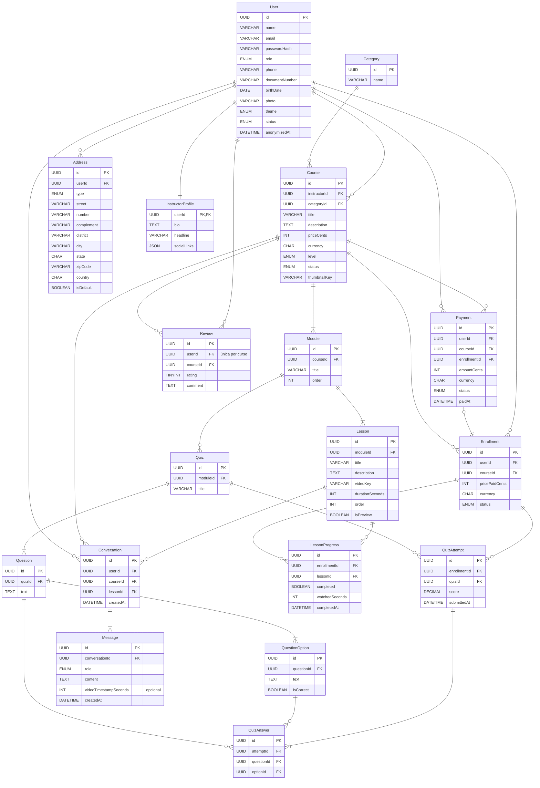
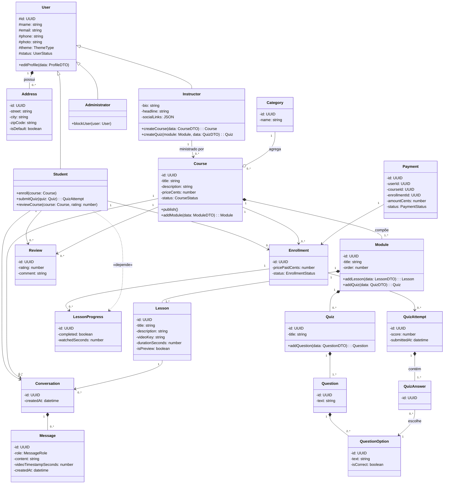

# TDD — Technical Design Document

> Regras de escrita no [CONTEXT.md](../CONTEXT.md). O que não tiver fonte formal é anotado como proposta (`<!-- proposta: motivo -->`).

## 1. Stack

A infraestrutura e as escolhas tecnológicas da plataforma estão consolidadas no [ADR-0007](adr/0007-stack-e-bancos.md) e detalhadas na tabela abaixo:

| Camada / Função | Tecnologia | Versão | Justificativa | Decisão / ADR |
|---|---|---|---|---|
| **Front-end Web** | Next.js com TypeScript | 14+ <!-- proposta: versão a confirmar pelo grupo --> | Arquitetado estritamente como SPA (Single Page Application, sem Server Components ou Server Actions) consumindo a API via JSON/REST e SSE. TypeScript unifica a tipagem com os DTOs do sistema e viabiliza tema claro/escuro (RNF014), suporte i18n (RNF013) e responsividade 360–1920 px (RNF019). | [ADR-0007](adr/0007-stack-e-bancos.md) |
| **API (Core)** | Laravel / PHP | Laravel 13 / PHP 8.3 | Monólito modular dividido nas áreas A a D (`auth`, `catalog`, `learning`, `analytics`). Proporciona produtividade, migrações integradas, Eloquent ORM e separação coesa de domínios para a equipe de 4 desenvolvedores ([ADR-0006](adr/0006-divisao-por-areas.md)). | [ADR-0007](adr/0007-stack-e-bancos.md) |
| **Banco de dados do Core** | MySQL | 8.0+ | SGBD relacional transacional primário que atende com maturidade todas as entidades relacionais da plataforma (usuários, cursos, matrículas, progresso, avaliações e quizzes). | [ADR-0007](adr/0007-stack-e-bancos.md) |
| **Serviço do Tutor de IA (`ai-service`)** | Laravel com Laravel AI SDK / PHP | Laravel 13 / PHP 8.3 | Microsserviço físico separado responsável por transcrever aulas, gerar embeddings uma única vez (RNF004), executar o pipeline RAG do `CourseTutorAgent` e responder em streaming SSE (RNF003) sem onerar o core transacional. | [ADR-0007](adr/0007-stack-e-bancos.md) |
| **Banco vetorial (`ai-service`)** | PostgreSQL com extensão `pgvector` | PostgreSQL 16 (`pgvector:pg16`) | Suporte nativo de primeira classe no Laravel 13 e Laravel AI SDK (`whereVectorSimilarTo`, `$table->vector()`), indexação HNSW de alta performance com filtragem híbrida e particionada por `course_id`. | [ADR-0007](adr/0007-stack-e-bancos.md) |
| **Serviço de Mídia (`media-service`)** | Laravel / PHP | Laravel 13 / PHP 8.3 | Serviço físico desacoplado para coordenar upload e streaming de vídeos via URLs assinadas de 15 minutos (RNF002). | [ADR-0007](adr/0007-stack-e-bancos.md), [sdd.md](sdd.md) |
| **Armazenamento de Objetos (Storage)** | Cloudflare R2 | API S3-compatible | Armazenamento seguro de vídeos das aulas e thumbnails com geração de URLs pré-assinadas temporárias (RNF002), sem tráfego de mídia passando pelo servidor web da API. | [sdd.md](sdd.md) |
| **Mensageria e Filas** | RabbitMQ | 3.13+ | Broker de mensageria assíncrona para orquestração de pipelines pesados em background (transcrição de vídeos e ingestão de embeddings para o `ai-service`). | <!-- proposta: alinhado ao Obsidian Vault e SDD para jobs assíncronos desacoplados --> |
| **Cache e Gerenciamento de Sessão** | Redis | 7.2+ | Cache de listagens em memória (RNF009), rate limiting de requisições e suporte à blocklist de tokens JWT revogados na Sprint 2. | <!-- proposta: alinhado ao Obsidian Vault para rate limit e blocklist --> |
| **Testes Automatizados (Backend)** | Pest PHP | 2.x / 3.x | Framework de testes fluente para PHP que assegura cobertura mínima de testes de 75% no backend com validação em pipeline de CI (RNF006). | <!-- proposta: alinhado ao Obsidian Vault e RNF006 --> |
| **Testes Automatizados (Frontend)** | Vitest e Playwright | Mais recentes | Vitest para testes unitários/componentes do Next.js e Playwright para validação de testes ponta a ponta (E2E) dos fluxos principais. | <!-- proposta: alinhado ao Obsidian Vault --> |
| **Hospedagem e Deploy** | Vercel (front-end), Railway (API e serviços) e Cloudflare R2 (mídia) | Planos gratuitos ou de entrada | Front-end SPA na Vercel, com `rewrites` de `/api/*` para a API no Railway, de modo que navegador e API compartilham o mesmo host e o cookie `__Host-` do ADR-0008 continua válido. API, `media-service`, `ai-service` e bancos no Railway; bancos, cache e mensageria sem exposição pública. Docker Compose fica só para o ambiente de desenvolvimento local. Domínio ainda pendente. | [ADR-0010](adr/0010-hospedagem-e-armazenamento.md), [ADR-0007](adr/0007-stack-e-bancos.md) |

Os protótipos de alta fidelidade do front-end (24 telas em HTML, com PNGs em tema claro e escuro) ficam em `especificacao/10-especificacoes-de-caso-de-uso/prototipos/` e seguem o [design system](design-system.md).

## 2. Modelo de dados



### Dicionário de dados

Atributos normalizados até a 3FN, exceto o campo JSON InstructorProfile.socialLinks, mantido como estrutura semiestruturada por decisão do Plano Técnico (exceção conhecida à 1FN, não normalização pendente).

| Entidade / Atributo | Classe | Domínio | Tamanho | Descrição |
|---|---|---|---|---|
| **Entidade: User** | | | | |
| id | Determinante | UUID | - | Identificador único do usuário. |
| name | Simples | Texto | 150 | Nome completo do usuário. |
| email | Simples | Texto | 150 | E-mail, usado no login. |
| passwordHash | Simples | Texto | 255 | Hash da senha. |
| role | Simples | Texto | - | Perfil: student, instructor ou admin. |
| phone | Simples | Texto | 20 | Telefone de contato. |
| documentNumber | Simples | Texto | 14 | CPF do usuário. |
| birthDate | Simples | Data | - | Data de nascimento. |
| photo | Simples | Texto | 255 | URL ou chave da foto de perfil no storage (R2). |
| theme | Simples | Texto | - | Tema da interface: claro, escuro ou sistema. |
| status | Simples | Texto | - | Ativo, bloqueado ou excluído. |
| anonymizedAt | Simples | Data | - | Data/hora da anonimização dos dados na exclusão da conta (UC018); nulo enquanto a conta não for anonimizada. |
| **Entidade: Address** | | | | |
| id | Determinante | UUID | - | Identificador único do endereço. |
| userId | Simples | UUID | - | Referência ao usuário dono do endereço. |
| type | Simples | Texto | - | Tipo: cobrança ou entrega. |
| street | Simples | Texto | 150 | Logradouro. |
| number | Simples | Texto | 10 | Número. |
| complement | Simples | Texto | 60 | Complemento (opcional). |
| district | Simples | Texto | 80 | Bairro. |
| city | Simples | Texto | 80 | Cidade. |
| state | Simples | Texto | 2 | UF. |
| zipCode | Simples | Texto | 9 | CEP. |
| country | Simples | Texto | 2 | País (ISO 3166-1 alpha-2). |
| isDefault | Simples | Booleano | - | Indica se é o endereço padrão do usuário. |
| **Entidade: InstructorProfile** | | | | |
| userId | Determinante | UUID | - | Referência ao usuário instrutor (PK e FK). |
| bio | Simples | Texto | - | Biografia curta do instrutor. |
| headline | Simples | Texto | 150 | Chamada/título de apresentação. |
| socialLinks | Composto | JSON | - | Conjunto de links de redes sociais. |
| **Entidade: Category** | | | | |
| id | Determinante | UUID | - | Identificador único da categoria. |
| name | Simples | Texto | 80 | Nome da categoria de curso. |
| **Entidade: Course** | | | | |
| id | Determinante | UUID | - | Identificador único do curso. |
| instructorId | Simples | UUID | - | Referência ao instrutor dono do curso. |
| categoryId | Simples | UUID | - | Referência à categoria do curso. |
| title | Simples | Texto | 150 | Título do curso. |
| description | Simples | Texto longo | TEXT | Descrição do curso. |
| priceCents | Simples | Numérico | - | Preço do curso, em centavos. |
| currency | Simples | Texto | 3 | Moeda (ISO 4217). |
| level | Simples | Texto | - | Nível: iniciante, intermediário, avançado. |
| status | Simples | Texto | - | Rascunho ou publicado. |
| thumbnailKey | Simples | Texto | 255 | Chave da imagem de capa no storage. |
| **Entidade: Module** | | | | |
| id | Determinante | UUID | - | Identificador único do módulo. |
| courseId | Simples | UUID | - | Referência ao curso dono do módulo. |
| title | Simples | Texto | 150 | Título do módulo. |
| order | Simples | Numérico | - | Posição do módulo dentro do curso. |
| **Entidade: Lesson** | | | | |
| id | Determinante | UUID | - | Identificador único da aula. |
| moduleId | Simples | UUID | - | Referência ao módulo dono da aula. |
| title | Simples | Texto | 150 | Título da aula. |
| description | Simples | Texto longo | TEXT | Descrição da aula. |
| videoKey | Simples | Texto | 255 | Chave do vídeo no storage (R2). |
| durationSeconds | Simples | Numérico | - | Duração do vídeo em segundos. |
| order | Simples | Numérico | - | Posição da aula dentro do módulo. |
| isPreview | Simples | Booleano | - | Indica se a aula é liberada sem matrícula. |
| **Entidade: Enrollment** | | | | |
| id | Determinante | UUID | - | Identificador único da matrícula. |
| userId | Simples | UUID | - | Referência ao aluno matriculado. |
| courseId | Simples | UUID | - | Referência ao curso da matrícula. |
| pricePaidCents | Simples | Numérico | - | Valor pago, em centavos. |
| currency | Simples | Texto | 3 | Moeda (ISO 4217). |
| status | Simples | Texto | - | `pendente` (criada, aguardando pagamento), `ativa`, `cancelada` ou `concluida`. Curso gratuito nasce `ativa`; curso pago nasce `pendente` e vira `ativa` quando o pagamento é aprovado (UC003, UC019). |
| **Entidade: LessonProgress** | | | | |
| id | Determinante | UUID | - | Identificador único do registro de progresso. |
| enrollmentId | Simples | UUID | - | Referência à matrícula. |
| lessonId | Simples | UUID | - | Referência à aula assistida. |
| completed | Simples | Booleano | - | Indica se a aula foi concluída. |
| watchedSeconds | Simples | Numérico | - | Segundos assistidos, pra retomar de onde parou. |
| completedAt | Simples | Data | - | Data/hora de conclusão da aula. |
| **Entidade: Quiz** | | | | |
| id | Determinante | UUID | - | Identificador único do quiz. |
| moduleId | Simples | UUID | - | Referência ao módulo dono do quiz. Cada quiz pertence a exatamente um módulo, e cada módulo tem zero ou mais quizzes (UC014). |
| title | Simples | Texto | 150 | Título do quiz. |
| **Entidade: Question** | | | | |
| id | Determinante | UUID | - | Identificador único da pergunta. |
| quizId | Simples | UUID | - | Referência ao quiz dono da pergunta. |
| text | Simples | Texto | - | Enunciado da pergunta. |
| **Entidade: QuestionOption** | | | | |
| id | Determinante | UUID | - | Identificador único da alternativa. |
| questionId | Simples | UUID | - | Referência à pergunta dona da alternativa. |
| text | Simples | Texto | - | Texto da alternativa. |
| isCorrect | Simples | Booleano | - | Indica se é a alternativa do gabarito. |
| **Entidade: QuizAttempt** | | | | |
| id | Determinante | UUID | - | Identificador único da tentativa. |
| enrollmentId | Simples | UUID | - | Referência à matrícula do aluno. |
| quizId | Simples | UUID | - | Referência ao quiz respondido. |
| score | Simples | Numérico | - | Nota calculada da tentativa. |
| submittedAt | Simples | Data | - | Data/hora de envio das respostas. |
| **Entidade: QuizAnswer** | | | | |
| id | Determinante | UUID | - | Identificador único da resposta. |
| attemptId | Simples | UUID | - | Referência à tentativa. |
| questionId | Simples | UUID | - | Referência à pergunta respondida. |
| optionId | Simples | UUID | - | Referência à alternativa escolhida. |
| **Entidade: Payment** | | | | Registro de pagamento simulado; não guarda dado de cartão ou de conta. |
| id | Determinante | UUID | - | Identificador único do pagamento. |
| userId | Simples | UUID | - | Referência ao aluno que pagou. |
| courseId | Simples | UUID | - | Referência ao curso pago. |
| enrollmentId | Simples | UUID | - | Referência à matrícula pendente criada antes do pagamento; se o pagamento for recusado, a matrícula segue pendente (UC019, E-1). |
| amountCents | Simples | Numérico | - | Valor pago, em centavos. |
| currency | Simples | Texto | 3 | Moeda (ISO 4217). |
| status | Simples | Texto | - | `aprovado` ou `recusado` (simulado). A recusa fica registrada e não gera matrícula ativa (UC019, E-1). |
| paidAt | Simples | Data | - | Data/hora do pagamento. |
| **Entidade: Review** | | | | Uma avaliação por aluno e curso: nova avaliação substitui a anterior (UC010, R-2). |
| id | Determinante | UUID | - | Identificador único da avaliação. |
| userId | Simples | UUID | - | Referência ao aluno autor da avaliação. |
| courseId | Simples | UUID | - | Referência ao curso avaliado. |
| rating | Simples | Inteiro | - | Nota de 1 a 5. |
| comment | Simples | Texto | - | Comentário do aluno. |
| **Entidade: Conversation** | | | | Conversa do Aluno com o Tutor de IA no contexto de uma aula (UC001). |
| id | Determinante | UUID | - | Identificador único da conversa. |
| userId | Simples | UUID | - | Referência ao aluno que conversa com o Tutor. |
| courseId | Simples | UUID | - | Referência ao curso da aula. |
| lessonId | Simples | UUID | - | Referência à aula em reprodução, contexto da conversa. |
| createdAt | Simples | Data | - | Data/hora de início da conversa. |
| **Entidade: Message** | | | | Mensagem trocada em uma conversa com o Tutor de IA (UC001). |
| id | Determinante | UUID | - | Identificador único da mensagem. |
| conversationId | Simples | UUID | - | Referência à conversa dona da mensagem. |
| role | Simples | Texto | - | Autor da mensagem: user ou assistant. |
| content | Simples | Texto longo | TEXT | Texto da pergunta ou da resposta. |
| videoTimestampSeconds | Simples | Numérico | - | Segundo da aula citado na resposta; opcional. |
| createdAt | Simples | Data | - | Data/hora da mensagem. |

### Diagrama de Classes



## 3. APIs

A API central expõe interfaces REST sobre HTTPS, com payloads estritamente em JSON, seguindo versionamento por URI (`/api/v1`). O contrato formal completo é mantido em especificação OpenAPI 3.0 (arquivo a publicar no repositório de código da aplicação, garantindo cumprimento do RNF015).

### 3.1 Padrão de Resposta de Erro

Para garantir consistência no consumo pelo front-end SPA e facilitar o tratamento de exceções, todas as respostas de erro HTTP (famílias 4xx e 5xx) seguem uma estrutura padronizada com código de erro interno, mensagem amigável e detalhamento opcional de campos (essencial para validação de formulários, RNF005):

```json
{
  "error": {
    "code": "VALIDATION_FAILED",
    "message": "Os dados fornecidos são inválidos.",
    "fields": {
      "email": [
        "O campo e-mail é obrigatório.",
        "O e-mail deve ter um formato válido."
      ],
      "password": [
        "A senha deve conter no mínimo 8 caracteres, incluindo letras e números."
      ]
    }
  }
}
```

Códigos de erro padrão da API:
- `UNAUTHENTICATED` (401): Token JWT ausente, inválido ou expirado.
- `FORBIDDEN` (403): Perfil sem permissão para acessar o recurso ou violação de propriedade (`assertOwnership`).
- `NOT_FOUND` (404): Entidade solicitada inexistente.
- `VALIDATION_FAILED` (422): Falha de validação estrutural ou semântica dos dados da requisição.
- `PAYMENT_DECLINED` (422): Pagamento simulado recusado (UC019); o pagamento é registrado como `recusado` e a matrícula continua `pendente`.
- `TOO_MANY_REQUESTS` (429): Limite de taxa de requisições excedido (rate limit).
- `INTERNAL_SERVER_ERROR` (500): Falha inesperada no processamento interno do servidor.

Respostas de sucesso: `200 OK` com corpo em leituras e atualizações, `201 Created` em criações e `204 No Content`, sem corpo, em todo `DELETE` bem-sucedido.

### 3.2 Paginação

Toda listagem é paginada ([ADR-0009](adr/0009-listagens-na-url-e-paginacao.md)). Os parâmetros são `page` (padrão 1), `per_page` (padrão 20, máximo 100), `sort` (lista branca de campos; prefixo `-` para decrescente, com desempate por `id`) e os filtros próprios de cada rota. Os mesmos parâmetros ficam na URL da tela, que é a fonte do estado de filtros e página. A única exceção é o histórico de mensagens do Tutor de IA (`Message`), paginado por cursor (`cursor` e `per_page`, resposta com `meta.nextCursor`) para a rolagem infinita da conversa; todo o resto usa `page` e `per_page`. Cada tela usa um API Resource que devolve somente os campos que ela exibe. Metadados consolidados seguem no envelope da resposta (RNF009):

```json
{
  "data": [ ... ],
  "meta": {
    "currentPage": 1,
    "perPage": 20,
    "totalItems": 42,
    "totalPages": 3
  },
  "links": {
    "first": "/api/v1/courses?page=1&per_page=20",
    "last": "/api/v1/courses?page=3&per_page=20",
    "prev": null,
    "next": "/api/v1/courses?page=2&per_page=20"
  }
}
```

### 3.3 Endpoints por Área e Casos de Uso

A tabela abaixo resume os endpoints da API REST organizados pelas áreas A a D ([ADR-0006](adr/0006-divisao-por-areas.md)) e correlacionados aos casos de uso correspondentes ([especificacao/10-especificacoes-de-caso-de-uso/](especificacao/10-especificacoes-de-caso-de-uso/00-item.md)):

| Área | Método e Endpoint | Descrição e Acesso | UC Relacionado |
|---|---|---|---|
| **Área A: Acesso e conta** | `POST /api/v1/auth/register` | Cadastro de novo usuário na plataforma, com o papel escolhido (Aluno ou Instrutor) e o aceite dos termos (público) | UC012 |
| | `POST /api/v1/auth/login` | Autenticação com e-mail, senha e campo booleano `rememberMe`; emissão de JWT em cookie HttpOnly e, com `rememberMe` verdadeiro, de refresh token (público) | UC005 |
| | `POST /api/v1/auth/refresh` | Troca o refresh token do cookie por novo par de cookies, com rotação (cookie de refresh presente apenas com `rememberMe`) | UC005 |
| | `GET /api/v1/auth/me` | Dados do usuário autenticado, para restaurar a sessão ao carregar a SPA (autenticado) | UC005 |
| | `POST /api/v1/auth/logout` | Encerramento de sessão e invalidação do token (autenticado) | UC005 |
| | `POST /api/v1/auth/forgot-password` | Solicitação de link de redefinição de senha com validade de 30 min (público) | UC011 |
| | `POST /api/v1/auth/reset-password` | Redefinição de senha com token recebido por e-mail (público) | UC011 |
| | `GET /api/v1/profile` | Obtenção dos dados cadastrais do usuário logado (autenticado) | UC013 |
| | `PUT /api/v1/profile` | Atualização de nome, telefone, endereço, CPF, data de nascimento, foto e tema (autenticado) | UC013 |
| | `PUT /api/v1/profile/password` | Alteração de senha do usuário logado com confirmação da senha atual e da nova senha (autenticado) | UC017 (RF019) |
| | `GET /api/v1/profile/instructor` | Leitura do perfil de instrutor: `headline`, `bio` e `socialLinks` (Instrutor) | UC013 |
| | `PUT /api/v1/profile/instructor` | Atualização do perfil de instrutor: `headline`, `bio` e `socialLinks` (Instrutor) | UC013 |
| **Área B: Autoria do instrutor** | `GET /api/v1/instructor/courses` | Listagem paginada de "Meus cursos" do instrutor (Instrutor) | UC006 |
| | `GET /api/v1/instructor/courses/{id}` | Leitura de um curso do instrutor, para edição (Instrutor dono) | UC006 |
| | `POST /api/v1/instructor/courses` | Criação de novo curso em status de rascunho (Instrutor) | UC006 |
| | `PUT /api/v1/instructor/courses/{id}` | Atualização de metadados, título, preço e publicação do curso (Instrutor dono) | UC006 |
| | `DELETE /api/v1/instructor/courses/{id}` | Exclusão de curso e de seus módulos e aulas; responde `204` (Instrutor dono) | UC006 |
| | `POST /api/v1/instructor/courses/{id}/modules` | Criação e ordenação de módulos do curso (Instrutor dono) | UC014 |
| | `PUT /api/v1/instructor/modules/{id}` | Edição e reordenação de módulos (Instrutor dono) | UC014 |
| | `DELETE /api/v1/instructor/modules/{id}` | Exclusão de módulo; responde `204` (Instrutor dono) | UC014 |
| | `POST /api/v1/instructor/modules/{id}/lessons` | Criação de aula e solicitação de URL assinada para upload de vídeo (Instrutor dono) | UC015 |
| | `POST /api/v1/instructor/lessons/{id}/upload-url` | Novo link assinado de upload, para trocar o vídeo de uma aula existente (Instrutor dono) | UC015 |
| | `DELETE /api/v1/instructor/lessons/{id}` | Exclusão de aula; responde `204` (Instrutor dono) | UC015 |
| | `PUT /api/v1/instructor/lessons/{id}` | Edição de dados da aula e marcação de `isPreview` (Instrutor dono) | UC015 |
| | `POST /api/v1/instructor/modules/{id}/quiz` | Cadastro de quiz com perguntas e alternativas com gabarito (Instrutor dono) | UC004 |
| | `PUT /api/v1/instructor/quizzes/{id}` | Edição de perguntas e gabarito do quiz (Instrutor dono) | UC004 |
| **Área C: Aprendizagem do aluno** | `GET /api/v1/catalog/courses` | Listagem paginada de cursos publicados com filtro `category` e ordenação `sort`: `GET /api/v1/catalog/courses?category=&page=&per_page=&sort=` (público) | UC020 |
| | `GET /api/v1/catalog/courses/{id}` | Detalhes públicos do curso com lista de módulos e aulas prévia (público) | UC020 |
| | `POST /api/v1/courses/{id}/enroll` | Criação da matrícula: `ativa` em curso gratuito; `pendente` em curso pago, devolvendo os dados para o pagamento (Aluno) | UC003 |
| | `POST /api/v1/enrollments/{id}/pay` | Processamento de pagamento simulado (Aluno dono). Aprovado: registra o pagamento, a matrícula vira `ativa` e o acesso é liberado (`200`). Recusado: registra `Payment.status = recusado`, mantém a matrícula `pendente` e responde `422 PAYMENT_DECLINED` | UC019 |
| | `GET /api/v1/lessons/{id}/stream` | Geração de URL assinada de 15 min no Cloudflare R2 para assistir à aula (Aluno matriculado ou preview) | UC009 |
| | `POST /api/v1/lessons/{id}/progress` | Registro de segundos assistidos e marcação de conclusão da aula (Aluno matriculado) | UC009 |
| | `PUT /api/v1/quizzes/{id}/attempt/draft` | Salvamento do rascunho das respostas do quiz (Aluno matriculado) | UC002 |
| | `GET /api/v1/quizzes/{id}/attempt/result` | Consulta do resultado da última tentativa enviada (Aluno matriculado) | UC002 |
| | `POST /api/v1/quizzes/{id}/attempt` | Submissão de respostas do quiz e correção automática imediata (Aluno matriculado) | UC002 |
| | `POST /api/v1/courses/{id}/reviews` | Criação ou substituição da avaliação e comentário do aluno sobre o curso, uma por aluno e curso (Aluno matriculado) | UC010 |
| | `GET /api/v1/courses/{id}/reviews/me` | Consulta da avaliação anterior do próprio aluno para o curso, para pré-preencher o formulário (Aluno matriculado) | UC010 |
| **Área D: Tutor de IA e Administração** | `GET /api/v1/ai/tutor/conversations/{id}/messages` | Histórico da conversa com rolagem infinita, paginado por cursor (Aluno dono) | UC001 |
| | `POST /api/v1/ai/tutor/chat` | Envio de dúvida ao Tutor de IA com streaming SSE da resposta contextualizada (Aluno matriculado) | UC001 |
| | `GET /api/v1/analytics/dashboard` | Visualização de métricas e gráficos com filtros de período (Instrutor / Administrador) | UC007 |
| | `GET /api/v1/admin/users` | Listagem paginada e busca de usuários da plataforma (Administrador) | UC008 |
| | `PUT /api/v1/admin/users/{id}/status` | Bloqueio ou desbloqueio de conta de usuário (Administrador) | UC008 |
| | `DELETE /api/v1/admin/users/{id}` | Exclusão de conta com anonimização de dados conforme LGPD (Administrador) | UC018 |
| | `GET /api/v1/me/permissions` | Verificação de permissões e direcionamento de rota protegida por perfil (autenticado) | UC016 |

---

## 4. Autenticação e autorização

### 4.1 Mecanismo de Autenticação e Emissão de Token

A autenticação é inteiramente baseada em tokens JWT (*JSON Web Tokens*) assinados com RS256, criptografia assimétrica de par de chaves RSA, pela biblioteca `php-open-source-saver/jwt-auth` ([ADR-0008](adr/0008-sessao-jwt-em-cookie.md)), dispensando sessões com estado no servidor web da API e assegurando alta escalabilidade (RNF001).
- **Emissão e Assinatura:** No login bem-sucedido (UC005), a API assina o JWT utilizando sua chave privada. O token carrega claims padrão (`sub` com UUID do usuário, `role`, `iat`, `exp`).
- **Validação:** Requisições subsequentes são validadas pelo middleware da API utilizando a chave pública, que os microsserviços também usam para validar o token sem acesso à chave privada, eliminando queries ao banco de dados apenas para checagem criptográfica do token.
- **Armazenamento Seguro do Token:** Para blindar a aplicação contra ataques de furto por *Cross-Site Scripting* (XSS), o JWT é transmitido ao cliente e armazenado em um cookie com flags `HttpOnly`, `Secure` e `SameSite=Strict`. O front-end SPA nunca manipula o token via código JavaScript de acesso a storage local (`localStorage` / `sessionStorage`).
- **Tempo de Vida (TTL):** O JWT possui TTL de 1 hora (RNF001 e UC005). Ao expirar, o front-end renova a sessão com o refresh token da opção "manter conectado", quando existir; sem ele, o usuário reautentica.
- **Manter conectado:** No login, o campo booleano `rememberMe` decide se a API também emite um refresh token rotativo, em cookie `HttpOnly` de vida longa. Cada renovação invalida o anterior. A duração (30 dias) e a rotação estão definidas no [ADR-0008](adr/0008-sessao-jwt-em-cookie.md).
- **Revogação e Blocklist:** Na Sprint 2, a invalidação antecipada (logout imediato ou bloqueio administrativo de usuário, UC008/UC018) será realizada por meio de uma blocklist mantida em Redis pelo tempo residual de expiração do token.

### 4.2 Autorização, Perfis e Verificação de Propriedade (*Ownership*)

O sistema adota o modelo RBAC (*Role-Based Access Control*) com três perfis formais de acesso:
1. **Aluno (`student`):** Permissão para matricular-se, assistir aulas liberadas, responder quizzes, interagir com o Tutor de IA e avaliar cursos.
2. **Instrutor (`instructor`):** Permissão de autoria para criar cursos, módulos, aulas e quizzes, além de consultar relatórios de seus próprios cursos no dashboard.
3. **Administrador (`admin`):** Permissão irrestrita de gestão, incluindo governança de usuários, bloqueios de contas, exclusão e auditoria de ações administrativas retida por 12 meses (RNF016).

**Regras de proteção e controle de acesso:**
- **Guarda por Perfil (UC016):** 100% das rotas privadas passam por middlewares dedicados de autorização (`EnsureUserHasRole`). Usuários que tentarem acessar rotas fora de seu perfil recebem HTTP 403 (*Forbidden*) e são redirecionados à sua respectiva interface no front-end.
- **Verificação Estrita de Propriedade (`assertOwnership`):** Em todas as operações mutáveis de recursos pertencentes a instrutores ou alunos (ex.: edição de curso, alteração de módulo, resposta de quiz ou progresso de aula), a API executa obrigatoriamente a verificação de pertencimento: o `userId` autenticado no token deve corresponder ao proprietário da entidade ou o solicitante deve possuir o perfil de Administrador. Tentativas de acesso a recursos alheios são imediatamente rejeitadas.

### 4.3 Fluxos de Login e Recuperação de Senha

- **Proteção contra Força Bruta (RNF008, UC005):** A API monitora tentativas inválidas consecutivas de login por e-mail/IP. Após 5 falhas consecutivas, a conta ou endereço de origem é temporariamente bloqueado por 15 minutos.
- **Mitigação de Enumeração de Usuários (UC005, UC011):** Respostas de falha de login exibem uma mensagem genérica (*"Credenciais inválidas"*). No fluxo de recuperação de senha (UC011), o envio do link por e-mail retorna status afirmativo padronizado independentemente de o e-mail constar ou não na base de dados.
- **Ciclo de Recuperação de Senha (UC011):** O link de redefinição de senha encaminhado por e-mail contém um token de uso único (*one-time token*) com validade estrita de 30 minutos. Uma vez utilizado para gravar a nova senha (com hash seguro conforme RNF007), o token é imediatamente invalidado.

---

## 5. Tutor de IA

O Tutor de IA é projetado como um ator sistêmico especializado ([ADR-0005](adr/0005-tutor-de-ia-como-ator-sistemico.md)) que atua como assistente pedagógico contextual dentro do reprodutor de aulas (UC001). A inteligência do assistente é materializada pelo `CourseTutorAgent`, implementado no microsserviço dedicado `ai-service` utilizando as ferramentas nativas do Laravel AI SDK.

### 5.1 Pipeline de Contextualização e RAG

O ciclo de vida do conhecimento do curso e atendimento ao aluno é composto pelas seguintes etapas:

```mermaid
flowchart TD
    subgraph Ingestao["1. Pipeline de Ingestão Assíncrona (RNF004)"]
        Upload["Instrutor conclui upload do vídeo da aula"]
        JobTrans["Job de Transcrição (Whisper / STT) via RabbitMQ"]
        Chunks["Geração de chunks com texto e timestamp (início e fim)"]
        Embed["Geração de embeddings (uma única vez por aula)"]
        Persist[("Gravação no PostgreSQL 16 + pgvector com course_id")]
        Upload --> JobTrans --> Chunks --> Embed --> Persist
    end

    subgraph Consulta["2. Atendimento ao Aluno em Tempo Real (UC001, RNF003)"]
        Pergunta["Aluno envia dúvida no chat da aula"]
        AuthCheck["ai-service valida autenticação e course_id da aula"]
        VetSearch["Busca vetorial filtrada: course_id + HNSW cosine similarity"]
        ContextBuild["Montagem de prompt pedagógico com chunks mais relevantes"]
        StreamLLM["Chamada ao LLM com streaming Server-Sent Events (SSE)"]
        Resposta["Exibição gradual da resposta com citação de aula e timestamp"]
        Pergunta --> AuthCheck --> VetSearch --> ContextBuild --> StreamLLM --> Resposta
    end
```



1. **Transcrição de Vídeo e Segmentação:** Ao receber o evento de upload de aula, um worker assíncrono consome a fila no RabbitMQ, extrai a trilha de áudio do Cloudflare R2 e executa o reconhecimento de voz (transcrição). O texto resultante é segmentado em trechos (*chunks*) lógicos conservando seus intervalos temporais (`start_time` e `end_time` em segundos).
2. **Indexação Vetorial Única (RNF004):** Para cada chunk, o vetor de embedding é gerado uma única vez e persistido na tabela de chunks do PostgreSQL 16 com a coluna `embedding` do tipo `vector`. O índice HNSW (`vector_cosine_ops`) garante busca rápida mesmo com crescimento da base.
3. **Busca Vetorial Restrita por Curso:** A busca semântica é estritamente vinculada ao curso da aula em reprodução. A query executa um filtro relacional composto: `Chunk::where('course_id', $courseId)->whereVectorSimilarTo('embedding', $queryEmbedding)->limit(5)->get()`. Isso isola categoricamente o conteúdo de diferentes cursos e impede vazamento de dados de outros instrutores.
4. **Geração de Resposta e Citação Obrigatória:** O modelo de linguagem recebe os chunks recuperados com instruções de sistema (*system prompt*) instruindo postura de tutor socrático. A resposta final deve obrigatoriamente citar o nome da aula e o timestamp correspondente (ex.: *"[Aula 3 — Introdução, aos 04:15]"*), permitindo ao aluno navegar diretamente ao ponto exato do vídeo.
5. **Streaming de Resposta (RNF003):** A resposta gerada é enviada de volta ao front-end por conexão *Server-Sent Events* (SSE), garantindo que o primeiro token da resposta chegue ao aluno em menos de 3 segundos (meta p95 do RNF003).

### 5.2 Limites de Uso, Controle de Custo e Privacidade

- **Rate Limiting:** Para conter custos de chamadas de inferência de LLM e evitar abusos, cada aluno matriculado possui uma cota de perguntas por janela de tempo (ex.: máximo de 20 perguntas por hora, monitoradas em Redis). Requisições excedentes recebem HTTP 429 com aviso de tempo de espera.
- **Privacidade e LGPD:** Em estrito cumprimento à privacidade do aluno (RNF020), nenhuma informação de identificação pessoal (PII) — como nome, e-mail, telefone ou CPF — é enviada aos provedores de modelos de linguagem externos. A mensagem enviada contém apenas a dúvida formulada pelo aluno e os fragmentos de contexto extraídos das aulas do curso.
- **Tratamento de Indisponibilidade do Modelo:** Conforme determinado no [ADR-0005](adr/0005-tutor-de-ia-como-ator-sistemico.md), o Tutor de IA é tratado como ator sistêmico externo. Caso a API de inferência externa falhe ou atinja timeout, o sistema ativa um fluxo alternativo/de degradação graciosa: o chat exibe uma mensagem informativa amigável (*"O Tutor de IA está temporariamente indisponível no momento. Por favor, tente novamente em alguns instantes."*), sem interromper a reprodução do vídeo ou o progresso da aula pelo aluno.

---

## 6. Decisões técnicas

As decisões arquiteturais do projeto são formalizadas e mantidas como Architecture Decision Records (ADRs) no diretório [`docs/adr/`](adr/README.md). A tabela abaixo consolida as decisões vigentes:

| ADR | Identificador | Título e Síntese da Decisão | Itens Afetados |
|---|---|---|---|
| [ADR-0001](adr/0001-minimo-por-integrante-e-numeracao-provisoria.md) | D1 | **Meta interna de 4 por integrante e numeração final da v11:** Estabelece divisão de trabalho com meta de 4 artefatos por aluno e consolida identificadores definitivos sequenciais. | 6, 7, 8, 9, 10 |
| [ADR-0002](adr/0002-formato-de-estoria-e-criterios.md) | D2 | **Formato de estória e critérios de aceite:** Padroniza estórias de usuário no padrão *Como / Posso / Para* com ao menos 2 critérios em formato *DADO QUE / QUANDO / ENTÃO*. | 7 |
| [ADR-0003](adr/0003-extend-no-sentido-do-te3-3.md) | D3 | **«extend» no sentido do TE3_3 e UML:** Fixa a direção correta do relacionamento de extensão nos casos de uso (do caso opcional/estendido para o caso base). | 9, 10 |
| [ADR-0004](adr/0004-diagramas-como-codigo.md) | D4 | **Diagramas como código:** Adoção de BPMN 2.0 (item 4) e PlantUML (itens 9 e 11) mantidos em código versionável no repositório. | 4, 9, 11 |
| [ADR-0005](adr/0005-tutor-de-ia-como-ator-sistemico.md) | D5 | **Tutor de IA como ator sistêmico:** Modela o Tutor como ator secundário participante de casos de uso sem iniciar fluxos autônomos. | 2, 5, 6, 9, 10 |
| [ADR-0006](adr/0006-divisao-por-areas.md) | D6 | **Divisão por áreas de A a D:** Estrutura o sistema e o trabalho da equipe em 4 áreas funcionais especializadas. | 6, 7, 8, 10 |
| [ADR-0007](adr/0007-stack-e-bancos.md) | D7 | **Definição da stack tecnológica e bancos de dados:** Formaliza Next.js SPA, API Laravel 13 modular, MySQL 8 relacional e `ai-service` físico com PostgreSQL 16 + pgvector. | 5, 11 |
| [ADR-0008](adr/0008-sessao-jwt-em-cookie.md) | D8 | **Sessão com JWT em cookie HttpOnly:** Token de acesso de 1 hora, refresh token rotacionado para «manter conectado» e blocklist no Redis. | 5, 11 |
| [ADR-0009](adr/0009-listagens-na-url-e-paginacao.md) | D9 | **Listagens com estado na URL e paginação obrigatória:** Filtros, ordenação e página na query string, `per_page` limitado e resposta mínima por tela. | 5, 11 |

