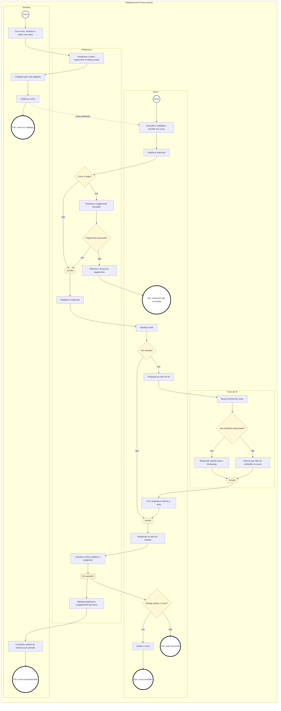

# 4 MAPEAMENTO DE NEGÓCIOS

O template exige o mapeamento dos principais processos do negócio. O diagrama é BPMN 2.0 como código (ADR-0004).

O mapeamento representa o fluxo de valor do produto (TO BE), organizado em quatro raias: Instrutor, Aluno, Plataforma e Tutor de IA.

**Aluno:** consulta o catálogo, escolhe um curso e solicita a matrícula (com pagamento simulado se o curso for pago), assiste às aulas e, se tiver dúvida, pergunta ao tutor de IA, que responde com citação da aula e timestamp. Ao final do módulo, responde ao quiz e pode avaliar o curso.

**Instrutor:** cria curso, módulos e aulas com vídeo, cadastra quiz e gabarito, publica o curso e consulta o painel de métricas por período.

**Plataforma e Tutor de IA:** a plataforma processa o pagamento simulado, registra a matrícula, armazena, transcreve e indexa as aulas, calcula a nota do quiz, registra o progresso e agrega o engajamento da turma; o tutor de IA busca trechos do curso e responde com citação de origem, ou informa que não há conteúdo relacionado.

Esse fluxo é a base para a Relação de Requisitos Funcionais (item 6) e para as Especificações de Caso de Uso (item 10) do restante do documento.

Fonte: `diagramas/04-mapeamento-de-negocios.mmd`

*Figura 1 – Mapeamento de Negócios — fluxo entre Aluno, Instrutor, Plataforma e Tutor de IA*
