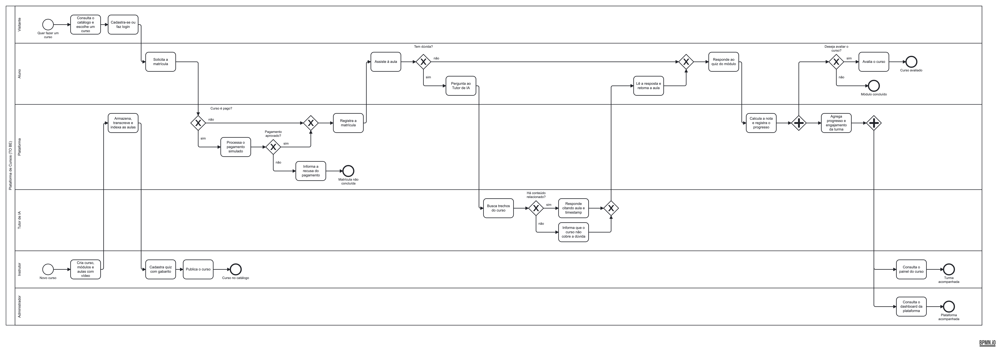

# 4 MAPEAMENTO DE NEGÓCIOS

Fonte: `especificacao/diagramas/04-mapeamento-de-negocios.bpmn` (BPMN 2.0, [ADR-0004](../docs/adr/0004-diagramas-como-codigo.md)). O arquivo abre em qualquer editor BPMN, como o bpmn.io e o Camunda Modeler.

O mapeamento representa o fluxo de valor do produto (TO BE) em um pool, a Plataforma de Cursos, com seis raias: Visitante, Aluno, Plataforma, Tutor de IA, Instrutor e Administrador.

**Instrutor:** cria curso, módulos e aulas com vídeo, cadastra o quiz com gabarito e publica o curso, que passa a aparecer no catálogo. Depois acompanha a turma pelo painel do curso.

**Visitante e Aluno:** o Visitante consulta o catálogo, escolhe um curso e se cadastra ou faz login; a partir daí atua como Aluno. O Aluno solicita a matrícula (com pagamento simulado se o curso for pago), assiste às aulas e, se tiver dúvida, pergunta ao Tutor de IA. Ao final do módulo, responde ao quiz e pode avaliar o curso.

**Plataforma e Tutor de IA:** a Plataforma armazena, transcreve e indexa as aulas, processa o pagamento simulado, registra a matrícula, calcula a nota do quiz, registra o progresso e agrega o engajamento da turma. O Tutor de IA busca trechos do curso e responde citando a aula e o timestamp, ou informa que o curso não cobre a dúvida.

**Administrador:** depois que o progresso é registrado, a agregação alimenta em paralelo o painel do Instrutor e o dashboard da plataforma, que o Administrador consulta.

O gateway paralelo (+) indica caminhos que seguem ao mesmo tempo; os gateways exclusivos (X) indicam decisões com um único caminho. Esse fluxo é a base para a Relação de Requisitos Funcionais (item 6) e para as Especificações de Caso de Uso (item 10).

*Figura 1 – Mapeamento de Negócios*
