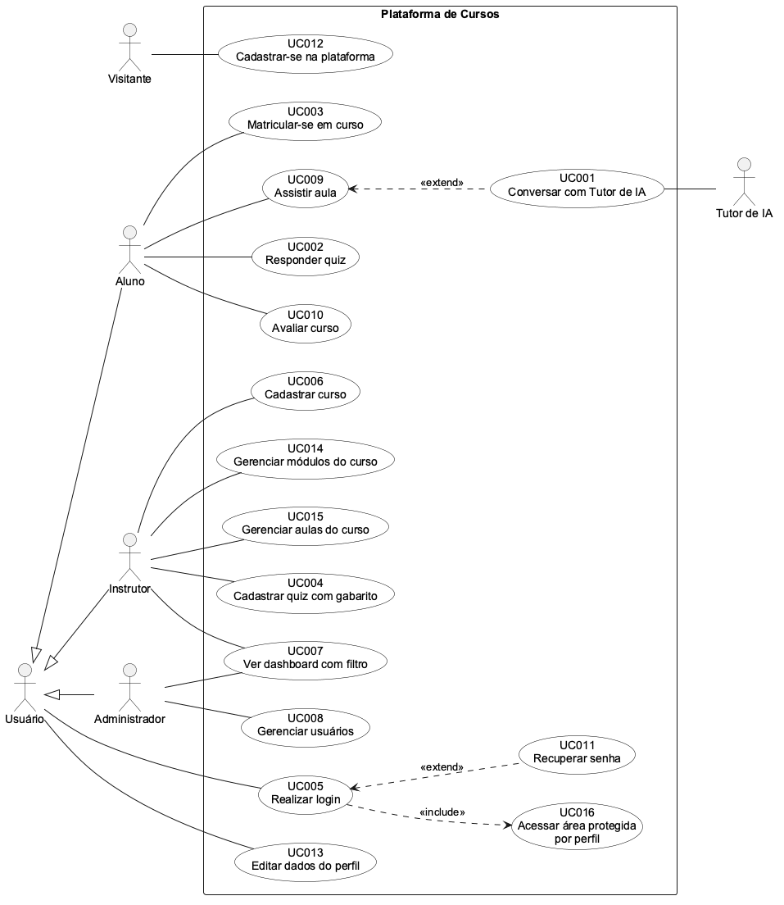

# 9 DIAGRAMA GERAL DE CASOS DE USO

Fonte: `especificacao/diagramas/09-casos-de-uso.puml` (PlantUML, [ADR-0004](../docs/adr/0004-diagramas-como-codigo.md)). O «extend» segue a [ADR-0003](../docs/adr/0003-extend-no-sentido-do-te3-3.md): a seta sai do caso de uso opcional e aponta para o caso de uso base.

*Figura 2 – Diagrama Geral de Casos de Uso*
