## UC012 – Cadastrar-se na Plataforma

- **Nome do caso de uso:** Cadastrar-se na Plataforma
- **Ator(es):** Visitante.
- **Descrição:** o Visitante cria uma conta na plataforma informando e-mail e senha e aceitando os termos de uso e a política de privacidade (US002, RF001).
- **Pré-condições:** o Visitante ter acessado a plataforma sem estar autenticado.
- **Pós-condições:** conta criada com perfil Aluno (ou Instrutor, se escolhido) e senha armazenada com hash; Visitante direcionado ao login.
- **Regras de negócio:** R-1 o e-mail deve ser único na plataforma; R-2 a senha deve ter ao menos 8 caracteres, com letra e número; R-3 a senha é armazenada com hash (RNF007); R-4 o aceite dos termos e da política de privacidade é obrigatório (LGPD, RNF020).
- **Protótipo(s) de tela:** tela de cadastro com campos de e-mail, senha e confirmação, caixa de aceite de termos e política, opção de perfil e botão “Criar conta”. As telas de cada fluxo aparecem junto ao fluxo, abaixo.
- **Fluxo básico:**
  1. O Visitante acessa a tela de cadastro.
  2. O Visitante informa e-mail, senha e confirmação da senha e aceita os termos de uso e a política de privacidade. (A-1)
  3. O Visitante aciona “Criar conta”. (E-3)
  4. O sistema valida a unicidade do e-mail, os critérios da senha e o aceite dos termos. (E-1) (E-2)
  5. O sistema cria a conta com perfil Aluno e armazena a senha com hash.
  6. O sistema confirma o cadastro e direciona o Visitante ao login (UC005).
  7. Este caso de uso é finalizado.

  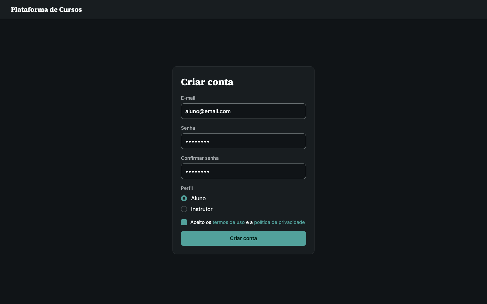

  *Figura 0 – UC012, fluxo básico: formulário de cadastro vazio*

  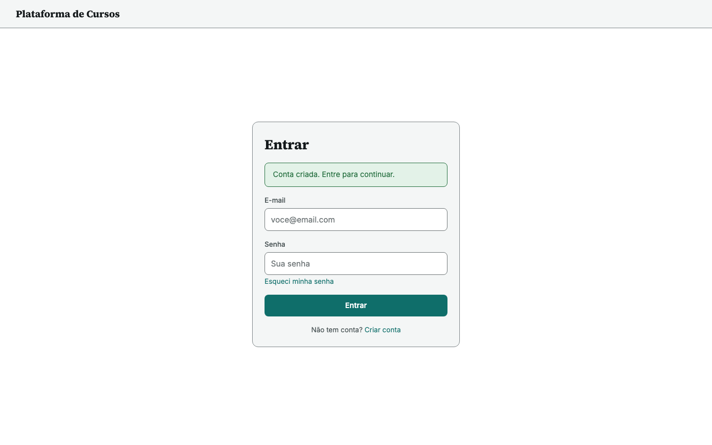

  *Figura 0 – UC012, fluxo básico: login com aviso "Conta criada. Entre para continuar"*
- **Fluxos alternativos:**
  - **A1 – O Visitante escolhe o perfil de Instrutor**
    - A-1.1 O Visitante seleciona a opção de cadastro como Instrutor.
    - A-1.2 O sistema marca a conta para criação com perfil Instrutor e orienta o preenchimento do perfil de Instrutor depois do login.
    - A-1.3 Este caso de uso retorna ao fluxo básico (passo 3).

    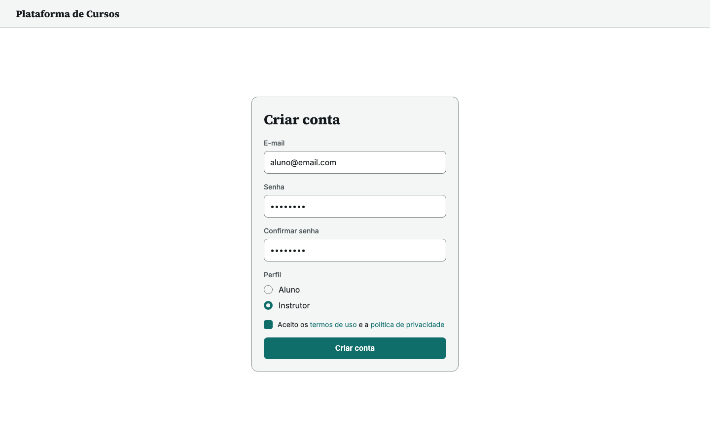

    *Figura 0 – UC012, fluxo alternativo A1: formulário de cadastro com perfil Instrutor marcado*
- **Fluxos de exceção:**
  - **E1 – E-mail já cadastrado**
    - E-1.1 O sistema identifica que o e-mail informado já possui conta.
    - E-1.2 O sistema informa que o e-mail está em uso e sugere fazer login ou recuperar a senha (UC011).
    - E-1.3 Este caso de uso retorna ao fluxo básico (passo 2).

    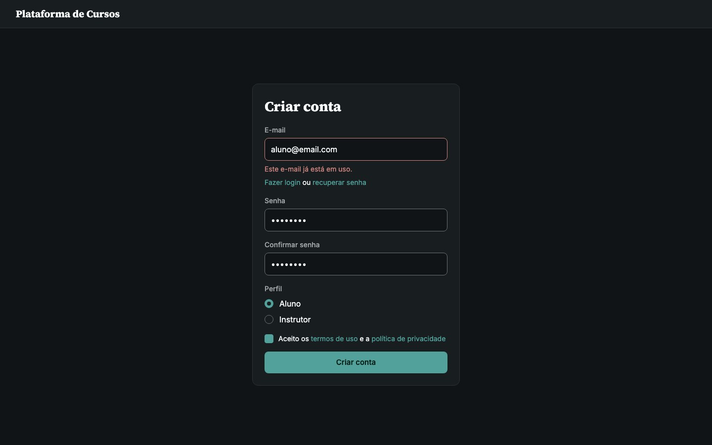

    *Figura 0 – UC012, fluxo de exceção E1: erro "Este e-mail já está em uso"*
  - **E2 – Senha fora dos critérios**
    - E-2.1 O sistema identifica que a senha não atende aos critérios mínimos.
    - E-2.2 O sistema exibe os critérios exigidos e solicita nova senha.
    - E-2.3 Este caso de uso retorna ao fluxo básico (passo 2).

    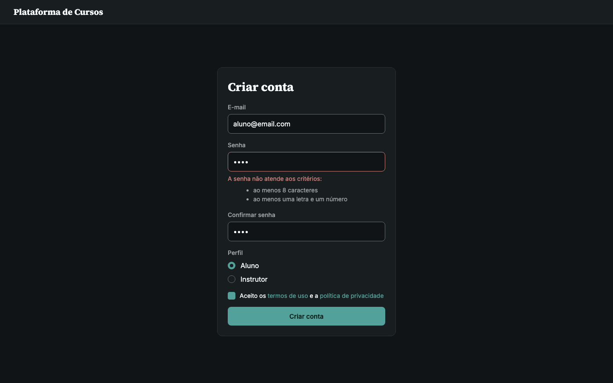

    *Figura 0 – UC012, fluxo de exceção E2: erro de senha fraca com critérios listados*
  - **E3 – Termos de uso e política de privacidade não aceitos**
    - E-3.1 O sistema identifica que o aceite dos termos não foi marcado (R-4); a confirmação da senha também é conferida no front-end antes do envio.
    - E-3.2 O sistema rejeita o cadastro (422), mantém os dados preenchidos e solicita o aceite.
    - E-3.3 Este caso de uso retorna ao fluxo básico (passo 2).

## UC005 – Realizar Login

- **Nome do caso de uso:** Realizar Login
- **Ator(es):** Usuário (Aluno, Instrutor ou Administrador).
- **Descrição:** o Usuário informa e-mail e senha para autenticar-se e acessar a área correspondente ao seu perfil (US001, RF017).
- **Pré-condições:** o Usuário já possui conta cadastrada na plataforma.
- **Pós-condições:** Usuário autenticado, com sessão ativa, e direcionado para a sua área.
- **Regras de negócio:** R-1 a mensagem de erro de credencial inválida não revela se o e-mail existe ou não (evita enumeração de usuários); R-2 a sessão expira após um período de inatividade e, depois disso, exige novo login.
- **Protótipo(s) de tela:** tela de login com campos e-mail/senha e link “esqueci minha senha”. As telas de cada fluxo aparecem junto ao fluxo, abaixo.
- **Fluxo básico:**
  1. O Usuário acessa a tela de login. (A-1) (A-2)
  2. O Usuário informa e-mail e senha.
  3. O Usuário aciona “Entrar”.
  4. O sistema valida as credenciais. (E-1)
  5. O sistema inicia a sessão do Usuário.
  6. O sistema inicia o caso de uso UC016 (Acessar Área Protegida por Perfil) e direciona o Usuário para a sua área conforme o perfil (Aluno, Instrutor ou Administrador). (E-2)
  7. Este caso de uso é finalizado.

  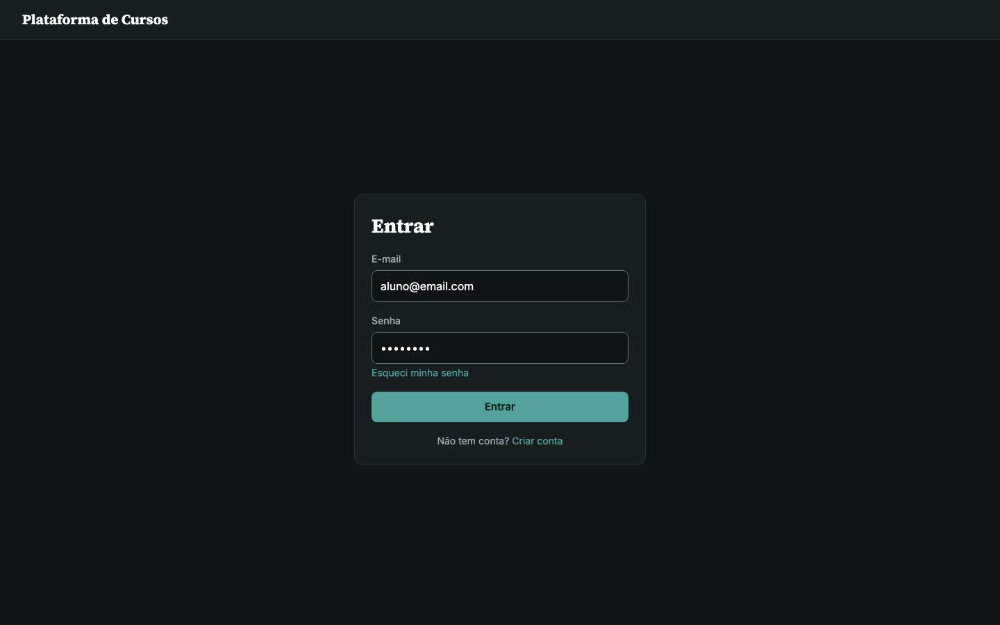

  *Figura 0 – UC005, fluxo básico: formulário de login vazio*
- **Fluxos alternativos:**
  - **A1 – O Usuário não lembra a senha**
    - A-1.1 O Usuário aciona “Esqueci minha senha”.
    - A-1.2 O caso de uso “Recuperar senha” (UC011) é iniciado.
    - A-1.3 Este caso de uso é finalizado.
  - **A2 – O Usuário já possui uma sessão ativa**
    - A-2.1 O sistema identifica uma sessão ainda válida no navegador.
    - A-2.2 O sistema direciona o Usuário diretamente para a sua área, sem exibir a tela de login.
    - A-2.3 Este caso de uso é finalizado.
- **Fluxos de exceção:**
  - **E1 – Credenciais incorretas**
    - E-1.1 O sistema identifica e-mail ou senha inválidos.
    - E-1.2 O sistema exibe mensagem de erro genérica, sem indicar qual campo está incorreto.
    - E-1.3 Este caso de uso retorna ao fluxo básico (passo 2).

    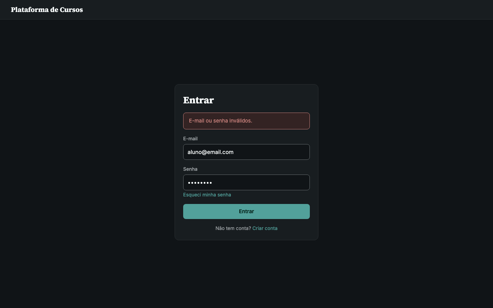

    *Figura 0 – UC005, fluxo de exceção E1: erro "E-mail ou senha inválidos"*
  - **E2 – Sessão expirada**
    - E-2.1 O sistema identifica que a sessão do Usuário expirou ao acessar uma área protegida.
    - E-2.2 O sistema direciona o Usuário para a tela de login.
    - E-2.3 Este caso de uso retorna ao fluxo básico (passo 1).

    

    *Figura 0 – UC005, fluxo de exceção E2: aviso "Sua sessão expirou. Entre novamente para continuar"*

## UC011 – Recuperar Senha

- **Nome do caso de uso:** Recuperar Senha
- **Ator(es):** Usuário (ainda não autenticado).
- **Descrição:** o Usuário que esqueceu a senha solicita um link de redefinição por e-mail (US017, RF013). Iniciado a partir do UC005 (Realizar Login), fluxo alternativo A1: UC011 «extend» UC005 (a seta sai do UC011 e aponta para o UC005).
- **Pré-condições:** o Usuário possui conta cadastrada na plataforma.
- **Pós-condições:** senha do Usuário redefinida; ele consegue fazer login com a nova senha.
- **Regras de negócio:** R-1 o link de redefinição é de uso único e expira em 30 minutos (RNF017); R-2 a mensagem de confirmação não revela se o e-mail existe ou não na base (mesma regra anti-enumeração do UC005).
- **Protótipo(s) de tela:** duas telas simples: formulário para informar o e-mail cadastrado e formulário para informar e confirmar a nova senha. As telas de cada fluxo aparecem junto ao fluxo, abaixo.
- **Fluxo básico:**
  1. O Usuário aciona “Esqueci minha senha” na tela de login.
  2. O Usuário informa o e-mail cadastrado. (A-1)
  3. O sistema envia um e-mail com link de redefinição de senha. (E-1)
  4. O Usuário acessa o link e informa a nova senha. (A-2) (E-2) (E-3)
  5. O sistema salva a nova senha e confirma a redefinição.
  6. Este caso de uso é finalizado, retornando à tela de login (UC005).

  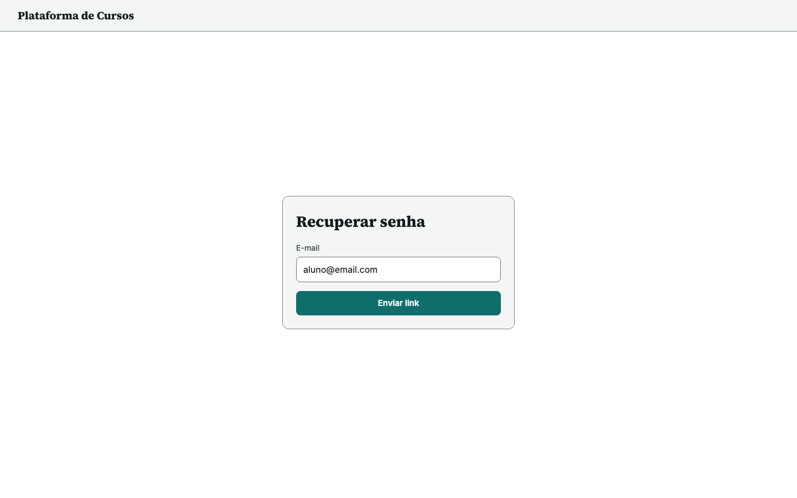

  *Figura 0 – UC011, fluxo básico: formulário de recuperação de senha com e-mail preenchido*

  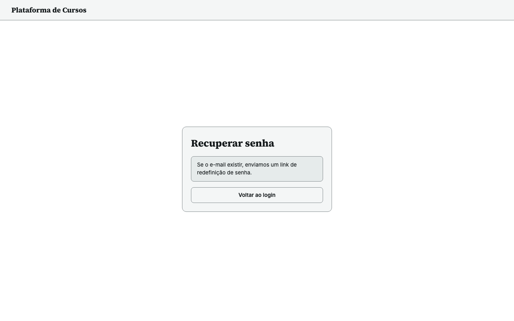

  *Figura 0 – UC011, fluxo básico: aviso de envio do link com botão "Voltar ao login"*

  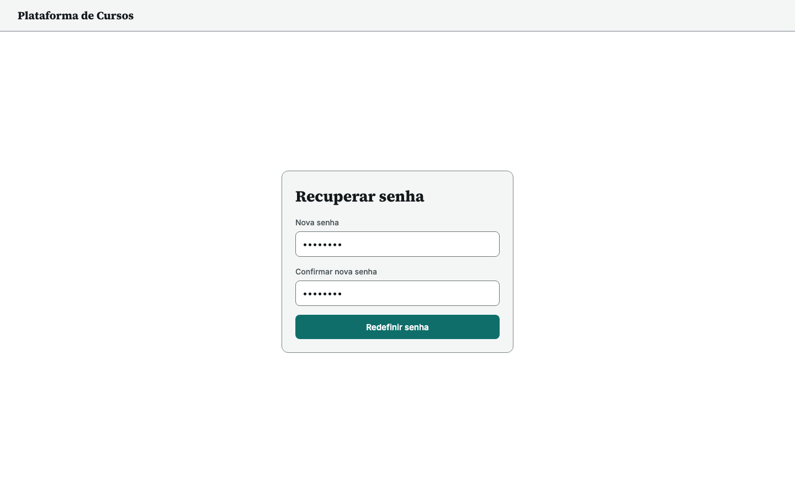

  *Figura 0 – UC011, fluxo básico: formulário de nova senha e confirmação*

  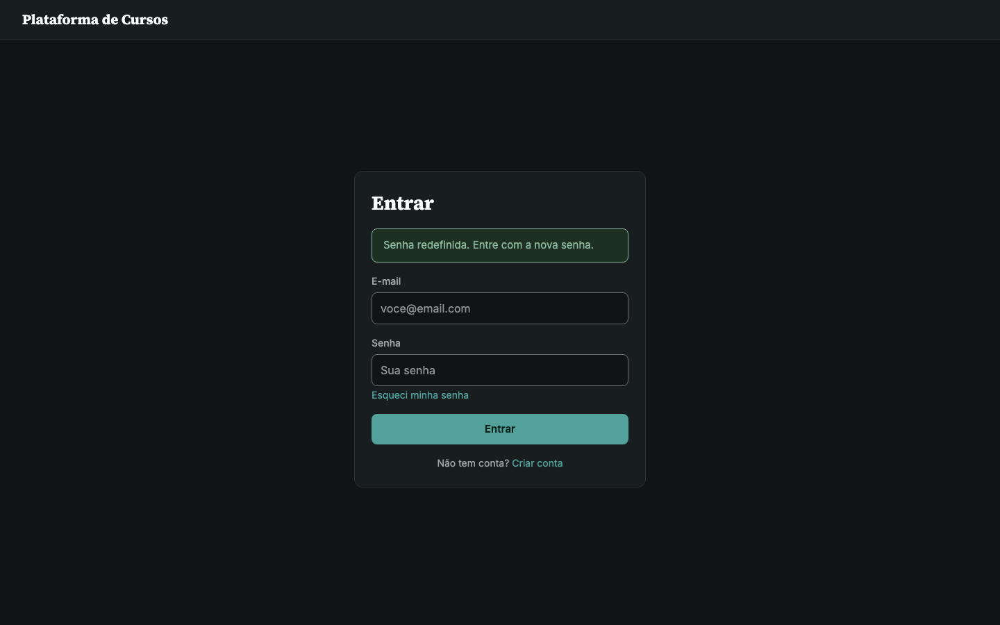

  *Figura 0 – UC011, fluxo básico: login com aviso "Senha redefinida. Entre com a nova senha"*
- **Fluxos alternativos:**
  - **A1 – O Usuário solicita um novo link antes do anterior expirar**
    - A-1.1 O sistema identifica um link de redefinição ainda válido para aquele e-mail.
    - A-1.2 O sistema invalida o link anterior e envia um novo.
    - A-1.3 Este caso de uso retorna ao fluxo básico (passo 3).

    

    *Figura 0 – UC011, fluxo alternativo A1: novo link enviado: mesma confirmação*
  - **A2 – O Usuário cancela a redefinição**
    - A-2.1 O Usuário fecha a tela de redefinição sem informar a nova senha.
    - A-2.2 O sistema mantém a senha atual inalterada.
    - A-2.3 Este caso de uso é finalizado.
- **Fluxos de exceção:**
  - **E1 – E-mail não cadastrado**
    - E-1.1 O sistema não encontra o e-mail informado na base de usuários.
    - E-1.2 O sistema exibe a mesma mensagem de confirmação genérica de envio, sem revelar que o e-mail não existe (evita enumeração de usuários).
    - E-1.3 Este caso de uso é finalizado.

    

    *Figura 0 – UC011, fluxo de exceção E1: e-mail não cadastrado: mesma confirmação genérica*
  - **E2 – Link de redefinição expirado**
    - E-2.1 O sistema identifica que o link acessado passou do tempo limite.
    - E-2.2 O sistema informa que o link expirou e oferece a opção de solicitar um novo.
    - E-2.3 Este caso de uso retorna ao fluxo básico (passo 1).

    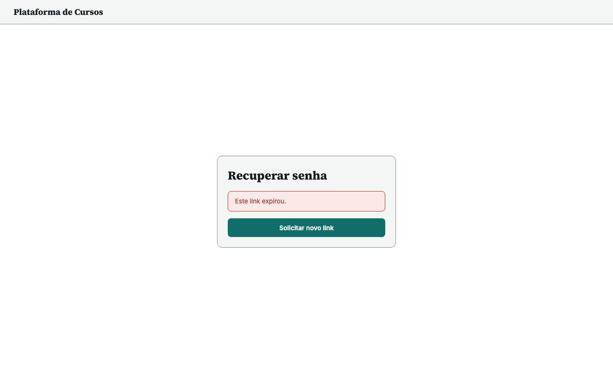

    *Figura 0 – UC011, fluxo de exceção E2: aviso "Este link expirou" com botão "Solicitar novo link"*
  - **E3 – Link de redefinição já utilizado ou inválido**
    - E-3.1 O sistema identifica que o link acessado já foi utilizado ou não corresponde a um token válido (R-1).
    - E-3.2 O sistema rejeita a redefinição (422), informa que o link é inválido e oferece a opção de solicitar um novo.
    - E-3.3 Este caso de uso retorna ao fluxo básico (passo 1).

## UC013 – Editar Dados do Perfil

- **Nome do caso de uso:** Editar Dados do Perfil
- **Ator(es):** Usuário (Aluno, Instrutor ou Administrador).
- **Descrição:** o Usuário autenticado altera os seus dados de perfil: nome, telefone, endereço, CPF, data de nascimento, foto de perfil e tema da interface (US003, RF001). O Instrutor também mantém por aqui a minibiografia e os links do perfil de Instrutor (US020, RF016). A troca de senha fica no UC017, acionado a partir desta tela.
- **Pré-condições:** o Usuário ter realizado login na plataforma.
- **Pós-condições:** dados do perfil atualizados e confirmados ao Usuário; o tema escolhido aplicado imediatamente e salvo no perfil.
- **Regras de negócio:** R-1 o perfil de acesso (Aluno, Instrutor ou Administrador) não pode ser editado pelo próprio Usuário; R-2 apenas o nome é obrigatório, os demais campos são opcionais; R-3 o CPF deve ter 11 dígitos com dígitos verificadores válidos, caso contrário o sistema exibe erro no campo; R-4 a data de nascimento deve ser válida e não pode ser futura; R-5 o telefone deve incluir o DDD; R-6 a foto de perfil aceita somente JPG ou PNG, com até 2 MB, e é armazenada no storage com a URL gravada no perfil; R-7 o tema aceita três opções (claro, escuro ou sistema), é aplicado imediatamente e salvo no perfil.
- **Protótipo(s) de tela:** tela “Meu perfil” com campos de nome, telefone, endereço, CPF, data de nascimento, foto e tema, opção “Alterar senha” e botão “Salvar”. As telas de cada fluxo aparecem junto ao fluxo, abaixo.
- **Fluxo básico:**
  1. O Usuário acessa a tela “Meu perfil”.
  2. O Usuário altera um ou mais dados do perfil (nome, telefone, endereço, CPF, data de nascimento, foto ou tema). (A-1) (A-2)
  3. O Usuário aciona “Salvar”.
  4. O sistema valida os dados informados. (E-1)
  5. O sistema atualiza o perfil e confirma a alteração.
  6. Este caso de uso é finalizado.

  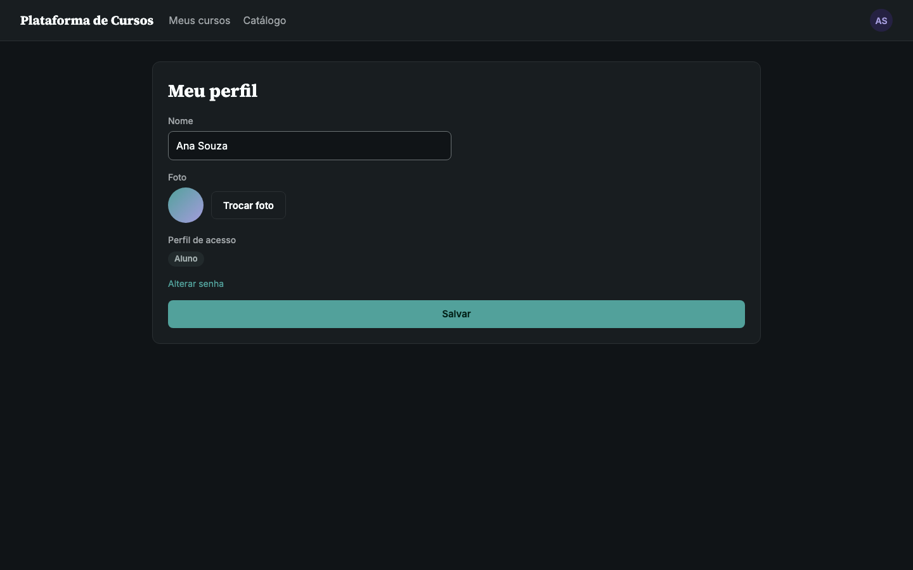

  *Figura 0 – UC013, fluxo básico: perfil do Aluno*

  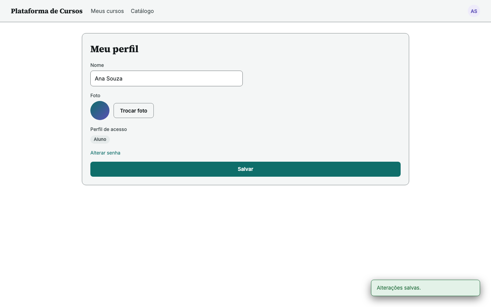

  *Figura 0 – UC013, fluxo básico: perfil com aviso "Alterações salvas"*
- **Fluxos alternativos:**
  - **A1 – O Instrutor edita minibiografia e links**
    - A-1.1 O sistema identifica que o Usuário é Instrutor e exibe os campos de minibiografia e links do perfil de Instrutor (US020, RF016).
    - A-1.2 O Instrutor altera a minibiografia ou os links.
    - A-1.3 Este caso de uso retorna ao fluxo básico (passo 3).

    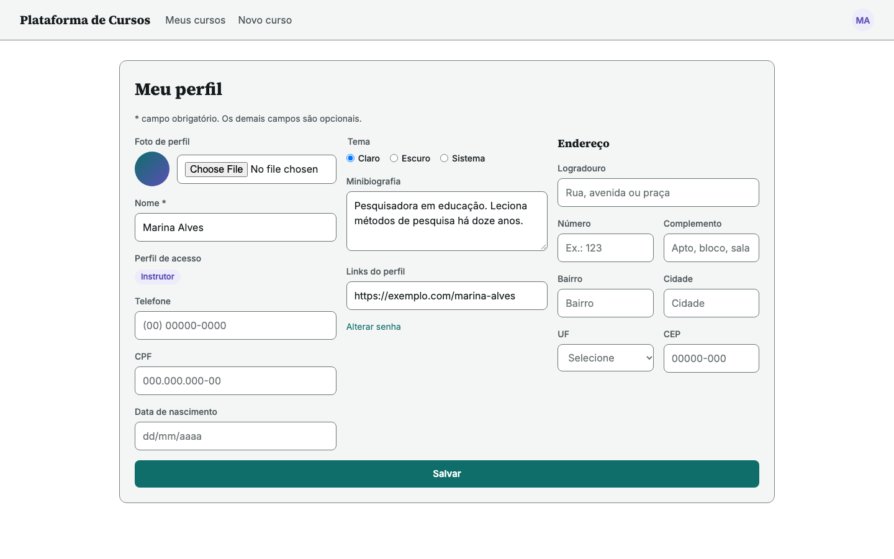

    *Figura 0 – UC013, fluxo alternativo A1: perfil do Instrutor com minibiografia e links*
  - **A2 – O Usuário aciona “Alterar senha”**
    - A-2.1 O Usuário aciona “Alterar senha”.
    - A-2.2 O sistema executa o UC017 – Alterar Senha.
    - A-2.3 Este caso de uso retorna ao fluxo básico (passo 2).
- **Fluxos de exceção:**
  - **E1 – Campo inválido**
    - E-1.1 O sistema identifica um campo com valor inválido: nome vazio; CPF com dígitos verificadores incorretos ou fora de 11 dígitos; data de nascimento inválida ou futura; telefone sem DDD; ou foto fora do formato JPG/PNG ou acima de 2 MB.
    - E-1.2 O sistema indica o campo, informa a regra não atendida e solicita a correção.
    - E-1.3 Este caso de uso retorna ao fluxo básico (passo 2).

    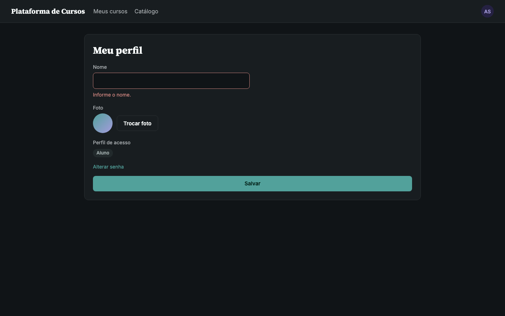

    *Figura 0 – UC013, fluxo de exceção E1: erro "Informe o nome" no campo Nome*

    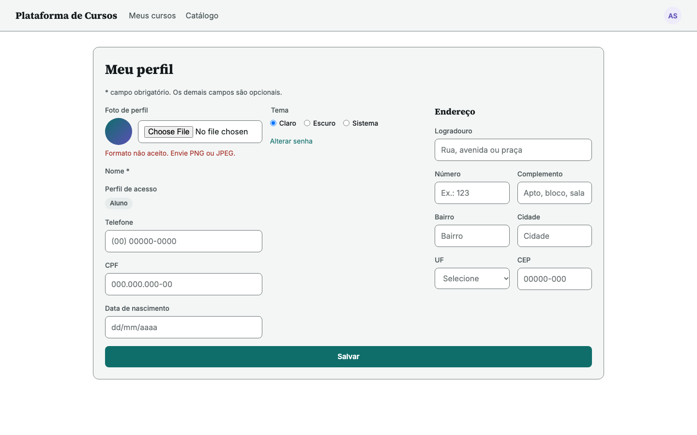

    *Figura 0 – UC013, fluxo de exceção E1: erro "Formato não aceito" no campo Foto*

## UC017 – Alterar Senha

- **Nome do caso de uso:** Alterar Senha
- **Ator(es):** Usuário (Aluno, Instrutor ou Administrador).
- **Descrição:** o Usuário autenticado troca a própria senha informando a senha atual e a nova senha (US021, RF019). Estende o UC013 – Editar Dados do Perfil, a partir da opção “Alterar senha”.
- **Pré-condições:** o Usuário ter realizado login na plataforma e estar na tela “Meu perfil” (UC013).
- **Pós-condições:** senha do Usuário substituída pela nova e alteração confirmada ao Usuário.
- **Regras de negócio:** R-1 a troca de senha exige a senha atual; R-2 a nova senha segue a mesma política do cadastro (UC012); R-3 a confirmação deve coincidir com a nova senha.
- **Protótipo(s) de tela:** bloco “Alterar senha” na tela “Meu perfil”, com campos de senha atual, nova senha e confirmação e botões “Salvar senha” e “Cancelar”. As telas de cada fluxo aparecem junto ao fluxo, abaixo.
- **Fluxo básico:**
  1. O sistema exibe o bloco “Alterar senha” na tela “Meu perfil”.
  2. O Usuário informa a senha atual, a nova senha e a confirmação. (A-1)
  3. O Usuário aciona “Salvar senha”.
  4. O sistema valida a senha atual, a política da nova senha e a confirmação. (E-1) (E-2) (E-3)
  5. O sistema substitui a senha e confirma a alteração.
  6. Este caso de uso é finalizado.

  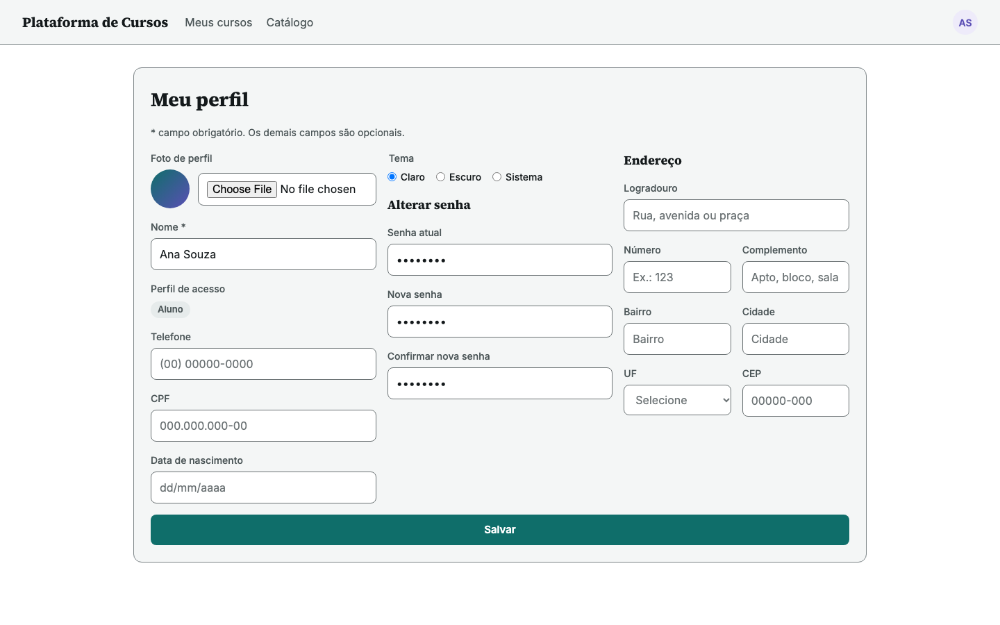

  *Figura 0 – UC017, fluxo básico: perfil com bloco de alteração de senha*

  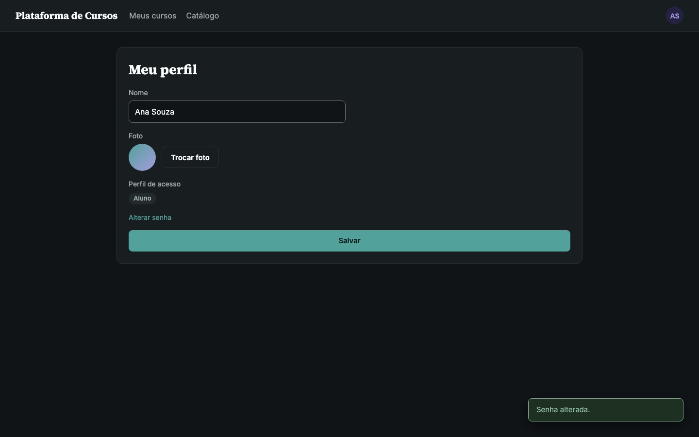

  *Figura 0 – UC017, fluxo básico: perfil com aviso "Senha alterada"*
- **Fluxos alternativos:**
  - **A1 – O Usuário cancela a alteração**
    - A-1.1 O Usuário aciona “Cancelar”.
    - A-1.2 O sistema fecha o bloco “Alterar senha” sem alterar a senha.
    - A-1.3 Este caso de uso é finalizado.

    

    *Figura 0 – UC017, fluxo alternativo A1: perfil sem alteração de senha após cancelar*
- **Fluxos de exceção:**
  - **E1 – Senha atual incorreta**
    - E-1.1 O sistema identifica que a senha atual informada não confere.
    - E-1.2 O sistema recusa a troca de senha e informa o erro.
    - E-1.3 Este caso de uso retorna ao fluxo básico (passo 2).

    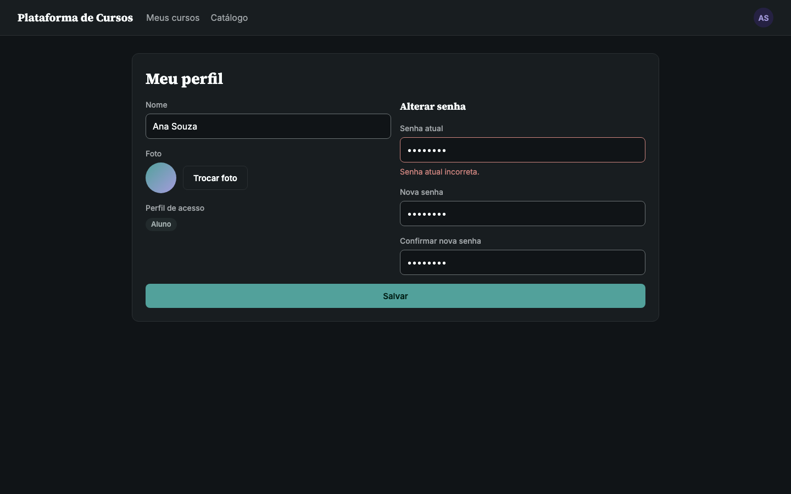

    *Figura 0 – UC017, fluxo de exceção E1: erro "Senha atual incorreta"*
  - **E2 – Nova senha fora da política**
    - E-2.1 O sistema identifica que a nova senha não segue a política de senha (R-2).
    - E-2.2 O sistema indica o campo e informa a regra.
    - E-2.3 Este caso de uso retorna ao fluxo básico (passo 2).

    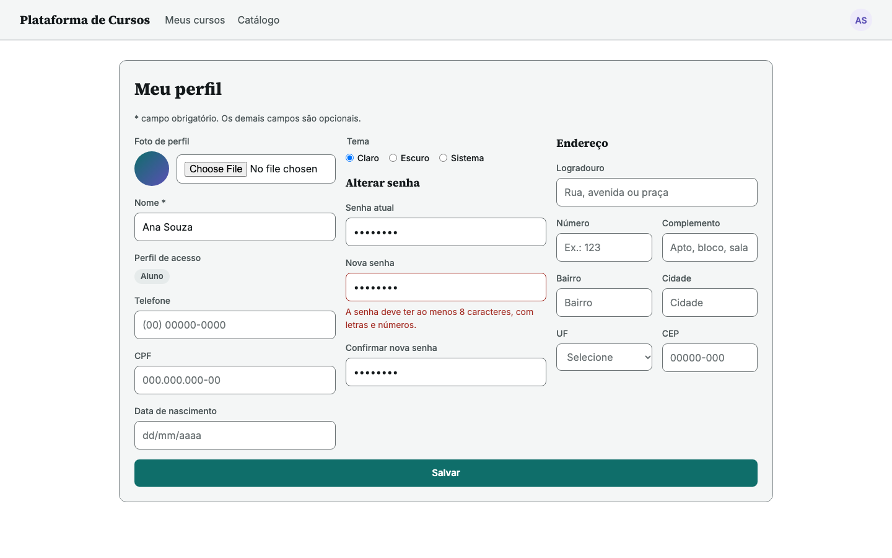

    *Figura 0 – UC017, fluxo de exceção E2: erro de nova senha fora da política*
  - **E3 – Confirmação não confere**
    - E-3.1 O sistema identifica que a confirmação informada é diferente da nova senha (R-3).
    - E-3.2 O sistema indica o campo de confirmação e solicita que a informação seja repetida.
    - E-3.3 Este caso de uso retorna ao fluxo básico (passo 2).
