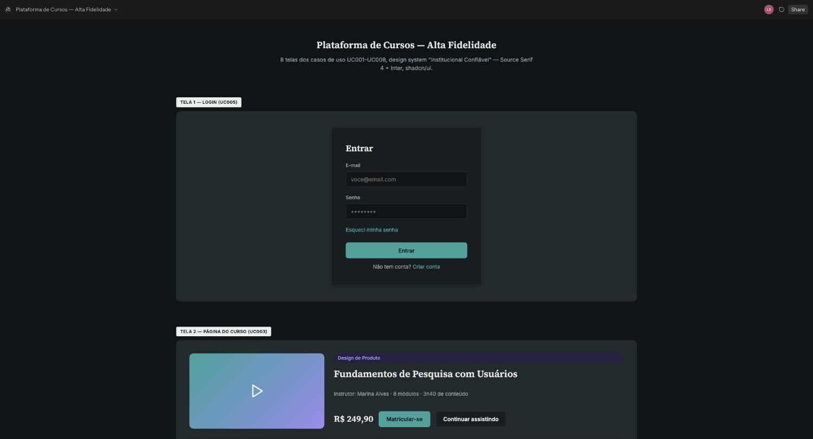
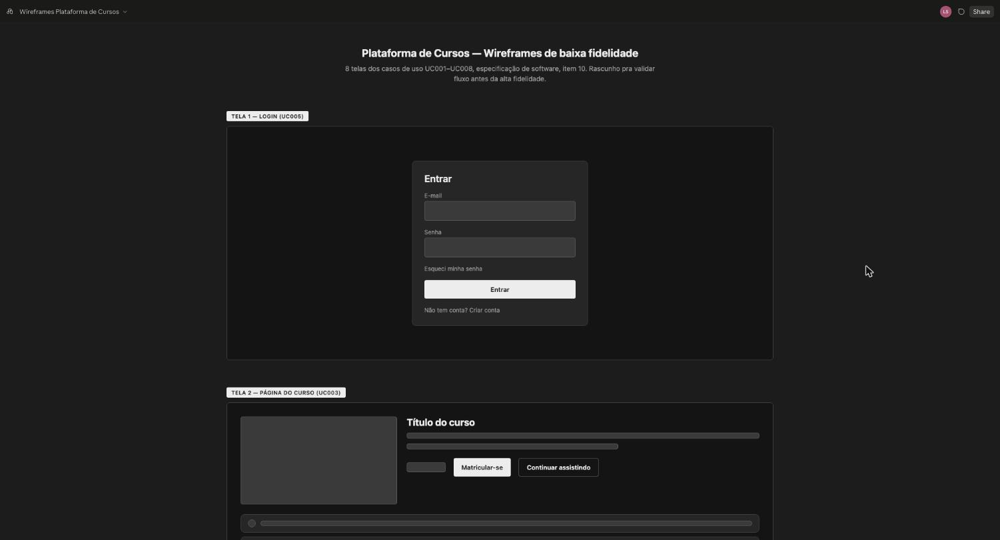

# 10 ESPECIFICAÇÕES DE CASO DE USO – ÁREA A (Acesso e conta)

O template exige a especificação de, no mínimo, 8 casos de uso, com protótipos de tela de alta fidelidade e fluxos principal, alternativo e de exceção.

Área A: Acesso e conta. Responsável: Lucas Stopinski da Silva (`LucasStop`). IDs: UC-A1, UC-A2… (mínimo 4 por integrante, sem máximo). Cada RF da área deve estar coberto por algum caso de uso; um RF extra pode entrar por include/extend de um caso existente..

## UC-A1 (UC012) – Cadastrar-se na Plataforma

- **Nome do caso de uso:** Cadastrar-se na Plataforma
- **Ator(es):** Visitante.
- **Descrição:** o visitante cria uma conta na plataforma informando e-mail e senha e aceitando os termos de uso e a política de privacidade (US002, RF001).
- **Pré-condições:** o visitante ter acessado a plataforma sem estar autenticado.
- **Pós-condições:** conta criada com perfil aluno (ou instrutor, se escolhido) e senha armazenada com hash; visitante redirecionado ao login.
- **Regras de negócio:** R-1 o e-mail deve ser único na plataforma; R-2 a senha deve ter ao menos 8 caracteres, com letra e número; R-3 a senha é armazenada com hash (RNF007); R-4 o aceite dos termos e da política de privacidade é obrigatório (LGPD, RNF007).
- **Protótipo(s) de tela:** tela de cadastro com campos de e-mail, senha e confirmação, caixa de aceite de termos e política, opção de perfil e botão “Criar conta”. Imagem do protótipo pendente.
- **Fluxo básico:**
  1. O visitante acessa a tela de cadastro.
  2. O visitante informa e-mail e senha e aceita os termos de uso e a política de privacidade. (A-1)
  3. O visitante aciona “Criar conta”.
  4. O sistema valida a unicidade do e-mail e os critérios da senha. (E-1) (E-2)
  5. O sistema cria a conta com perfil aluno e armazena a senha com hash.
  6. O sistema confirma o cadastro e redireciona o visitante ao login (UC005).
  7. Este caso de uso é finalizado.
- **Fluxos alternativos:**
  - **A1 – O visitante escolhe o perfil de instrutor**
    - A-1.1 O visitante seleciona a opção de cadastro como instrutor.
    - A-1.2 O sistema marca a conta para criação com perfil instrutor e orienta o preenchimento do perfil de instrutor depois do login (RF016).
    - A-1.3 Este caso de uso retorna ao fluxo básico (passo 3).
- **Fluxos de exceção:**
  - **E1 – E-mail já cadastrado**
    - E-1.1 O sistema identifica que o e-mail informado já possui conta.
    - E-1.2 O sistema informa que o e-mail está em uso e sugere fazer login ou recuperar a senha (UC011).
    - E-1.3 Este caso de uso retorna ao fluxo básico (passo 2).
  - **E2 – Senha fora dos critérios**
    - E-2.1 O sistema identifica que a senha não atende aos critérios mínimos.
    - E-2.2 O sistema exibe os critérios exigidos e solicita nova senha.
    - E-2.3 Este caso de uso retorna ao fluxo básico (passo 2).

## UC-A2 (UC005) – Realizar Login

- **Nome do caso de uso:** Realizar Login
- **Ator(es):** Aluno, Instrutor, Administrador.
- **Descrição:** o usuário informa e-mail e senha pra autenticar-se e acessar a área correspondente ao seu perfil.
- **Pré-condições:** usuário já possui conta cadastrada na plataforma.
- **Pós-condições:** usuário autenticado recebe um token JWT válido e é redirecionado pra sua área.
- **Regras de negócio:** mensagem de erro de credencial inválida não revela se o e-mail existe ou não (evita enumeração de usuários); token JWT expirado exige novo login.
- **Protótipo(s) de tela:** tela de login com campos e-mail/senha e link “esqueci minha senha”.

  

  

  *Figura 7 – Protótipo de tela do UC005 — Realizar Login*
- **Fluxo básico:**
  1. O usuário acessa a tela de login. (A-1)
  2. O usuário informa e-mail e senha.
  3. O usuário aciona “Entrar”.
  4. O sistema valida as credenciais. (E-1)
  5. O sistema emite o token JWT de autenticação.
  6. O sistema inicia o caso de uso UC016 (Acessar Área Protegida por Perfil) e redireciona o usuário para sua área conforme o perfil (aluno/instrutor/admin). (E-2)
  7. Este caso de uso é finalizado.
- **Fluxos alternativos:**
  - **A1 – O usuário não lembra a senha**
    - A-1.1 O usuário aciona “Esqueci minha senha”.
    - A-1.2 O caso de uso “Recuperar senha” é iniciado.
    - A-1.3 Este caso de uso é finalizado.
  - **A2 – O usuário já possui uma sessão ativa**
    - A-2.1 O sistema identifica um token JWT válido salvo no navegador.
    - A-2.2 O sistema redireciona diretamente para a área do usuário, sem exibir a tela de login.
    - A-2.3 Este caso de uso é finalizado.
- **Fluxos de exceção:**
  - **E1 – Credenciais incorretas**
    - E-1.1 O sistema identifica e-mail ou senha inválidos.
    - E-1.2 O sistema exibe mensagem de erro genérica, sem indicar qual campo está incorreto.
    - E-1.3 Este caso de uso retorna ao fluxo básico (passo 2).
  - **E2 – Token expirado ao acessar rota protegida**
    - E-2.1 O sistema identifica que o token JWT do usuário expirou.
    - E-2.2 O sistema redireciona o usuário para a tela de login.
    - E-2.3 Este caso de uso retorna ao fluxo básico (passo 1).

## UC-A3 (UC011) – Recuperar Senha

- **Nome do caso de uso:** Recuperar Senha
- **Ator(es):** Aluno, Instrutor, Administrador (ainda não autenticado).
- **Descrição:** o usuário que esqueceu a senha solicita um link de redefinição por e-mail. Iniciado a partir do UC005 (Realizar Login), fluxo alternativo A1: UC005 «extend» UC011.
- **Pré-condições:** usuário possui conta cadastrada na plataforma.
- **Pós-condições:** senha do usuário é redefinida e ele consegue fazer login com a nova senha.
- **Regras de negócio:** link de redefinição expira em tempo limitado (30 minutos); mensagem de confirmação não revela se o e-mail existe ou não na base (mesma regra anti-enumeração do UC005).
- **Protótipo(s) de tela:** duas telas simples: formulário para informar o e-mail cadastrado e formulário para informar e confirmar a nova senha. Imagem do protótipo pendente.
- **Fluxo básico:**
  1. O usuário aciona “Esqueci minha senha” na tela de login.
  2. O usuário informa o e-mail cadastrado. (A-1)
  3. O sistema envia um e-mail com link de redefinição de senha. (E-1)
  4. O usuário acessa o link e informa a nova senha. (A-2)
  5. O sistema salva a nova senha e confirma a redefinição. (E-2)
  6. Este caso de uso é finalizado, retornando à tela de login (UC005).
- **Fluxos alternativos:**
  - **A1 – O usuário solicita um novo link antes do anterior expirar**
    - A-1.1 O sistema identifica um link de redefinição ainda válido para aquele e-mail.
    - A-1.2 O sistema invalida o link anterior e envia um novo.
    - A-1.3 Este caso de uso retorna ao fluxo básico (passo 3).
  - **A2 – O usuário cancela a redefinição**
    - A-2.1 O usuário fecha a tela de redefinição sem informar a nova senha.
    - A-2.2 O sistema mantém a senha atual inalterada.
    - A-2.3 Este caso de uso é finalizado.
- **Fluxos de exceção:**
  - **E1 – E-mail não cadastrado**
    - E-1.1 O sistema não encontra o e-mail informado na base de usuários.
    - E-1.2 O sistema exibe a mesma mensagem de confirmação genérica de envio, sem revelar que o e-mail não existe (evita enumeração de usuários).
    - E-1.3 Este caso de uso é finalizado.
  - **E2 – Link de redefinição expirado**
    - E-2.1 O sistema identifica que o link acessado passou do tempo limite.
    - E-2.2 O sistema informa que o link expirou e oferece a opção de solicitar um novo.
    - E-2.3 Este caso de uso retorna ao fluxo básico (passo 1).

## UC-A4 (UC013) – Editar Dados do Perfil

- **Nome do caso de uso:** Editar Dados do Perfil
- **Ator(es):** Aluno, Instrutor, Administrador.
- **Descrição:** o usuário autenticado altera seus dados de perfil: nome, foto e senha (US003, RF001).
- **Pré-condições:** o usuário ter realizado login na plataforma.
- **Pós-condições:** dados do perfil atualizados e confirmados ao usuário.
- **Regras de negócio:** R-1 o perfil de acesso (aluno, instrutor, administrador) não pode ser editado pelo próprio usuário; R-2 a nova senha segue a mesma política do cadastro (UC012); R-3 a troca de senha exige a senha atual.
- **Protótipo(s) de tela:** tela “Meu perfil” com campos de nome, foto e senha e botão “Salvar”. Imagem do protótipo pendente.
- **Fluxo básico:**
  1. O usuário acessa a tela “Meu perfil”.
  2. O usuário altera nome, foto ou senha. (A-1)
  3. O usuário aciona “Salvar”.
  4. O sistema valida os dados informados. (E-1) (E-2)
  5. O sistema atualiza o perfil e confirma a alteração.
  6. Este caso de uso é finalizado.
- **Fluxos alternativos:**
  - **A1 – O usuário altera a senha**
    - A-1.1 O usuário informa a senha atual e a nova senha.
    - A-1.2 O sistema valida a senha atual e a política da nova senha.
    - A-1.3 Este caso de uso retorna ao fluxo básico (passo 5).
- **Fluxos de exceção:**
  - **E1 – Campo inválido**
    - E-1.1 O sistema identifica um campo com valor inválido (nome vazio ou imagem fora do formato aceito).
    - E-1.2 O sistema indica o campo e solicita a correção.
    - E-1.3 Este caso de uso retorna ao fluxo básico (passo 2).
  - **E2 – Senha atual incorreta**
    - E-2.1 O sistema identifica que a senha atual informada não confere.
    - E-2.2 O sistema recusa a troca de senha e informa o erro.
    - E-2.3 Este caso de uso retorna ao fluxo básico (passo 2).
