## UC006 – Cadastrar Curso

- **Nome do caso de uso:** Cadastrar Curso
- **Ator(es):** Instrutor.
- **Descrição:** o Instrutor cria, edita, exclui e lista os cursos do seu catálogo (US004, RF002).
- **Pré-condições:** o Instrutor ter realizado login na plataforma.
- **Pós-condições:** curso criado ou atualizado disponível no catálogo do Instrutor, com status rascunho ou publicado.
- **Regras de negócio:** R-1 o curso é criado com status rascunho por padrão; R-2 a exclusão é bloqueada se houver alunos matriculados (nesse caso, o Instrutor só pode despublicar o curso).
- **Protótipo(s) de tela:** formulário de cadastro de curso com título, descrição, preço e categoria. As telas de cada fluxo aparecem junto ao fluxo, abaixo. As telas de cada fluxo aparecem junto ao fluxo, abaixo.
- **Fluxo básico:**
  1. O Instrutor acessa “Meus cursos”. (A-2) (E-2)
  2. O Instrutor aciona “Novo curso”.
  3. O Instrutor preenche título, descrição, preço e categoria.
  4. O sistema salva o curso com status rascunho. (E-1)
  5. O Instrutor aciona “Publicar” quando estiver pronto. (A-1)
  6. O sistema torna o curso visível no catálogo.
  7. Este caso de uso é finalizado.

  

  *Figura 0 – UC006, fluxo básico: lista "Meus cursos" do instrutor*

  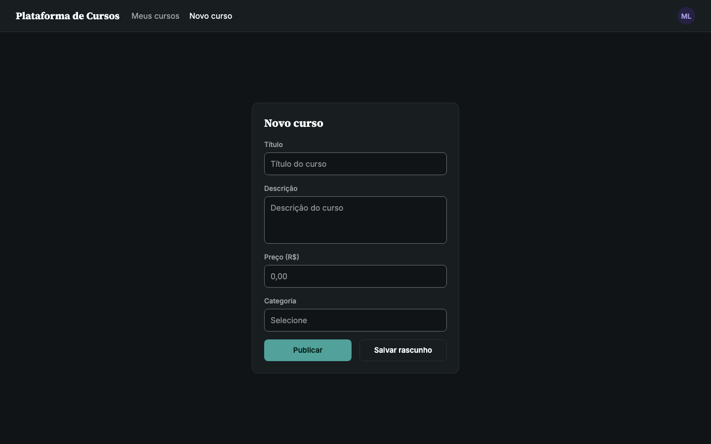

  *Figura 0 – UC006, fluxo básico: formulário "Novo curso" vazio*

  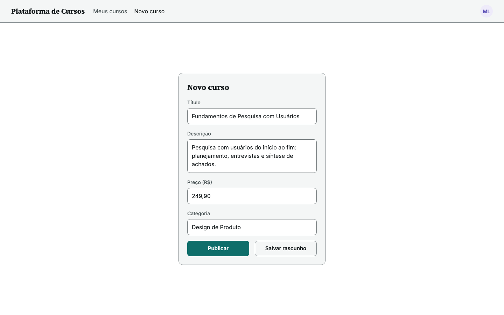

  *Figura 0 – UC006, fluxo básico: formulário "Novo curso" preenchido*

  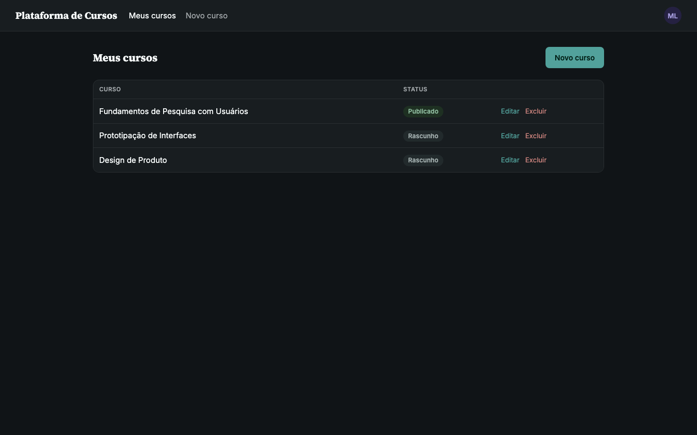

  *Figura 0 – UC006, fluxo básico: lista "Meus cursos" após salvar rascunho*

  

  *Figura 0 – UC006, fluxo básico: lista "Meus cursos" com curso publicado*

  

  *Figura 0 – UC006, fluxo básico: lista "Meus cursos" do instrutor*

  

  *Figura 0 – UC006, fluxo básico: formulário "Novo curso" vazio*

  

  *Figura 0 – UC006, fluxo básico: formulário "Novo curso" preenchido*

  

  *Figura 0 – UC006, fluxo básico: lista "Meus cursos" após salvar rascunho*

  

  *Figura 0 – UC006, fluxo básico: lista "Meus cursos" com curso publicado*
- **Fluxos alternativos:**
  - **A1 – O Instrutor edita um curso já publicado**
    - A-1.1 O Instrutor altera título, descrição ou preço do curso.
    - A-1.2 O sistema salva as alterações e as reflete no catálogo, sem afetar as matrículas existentes.
    - A-1.3 Este caso de uso é finalizado.

    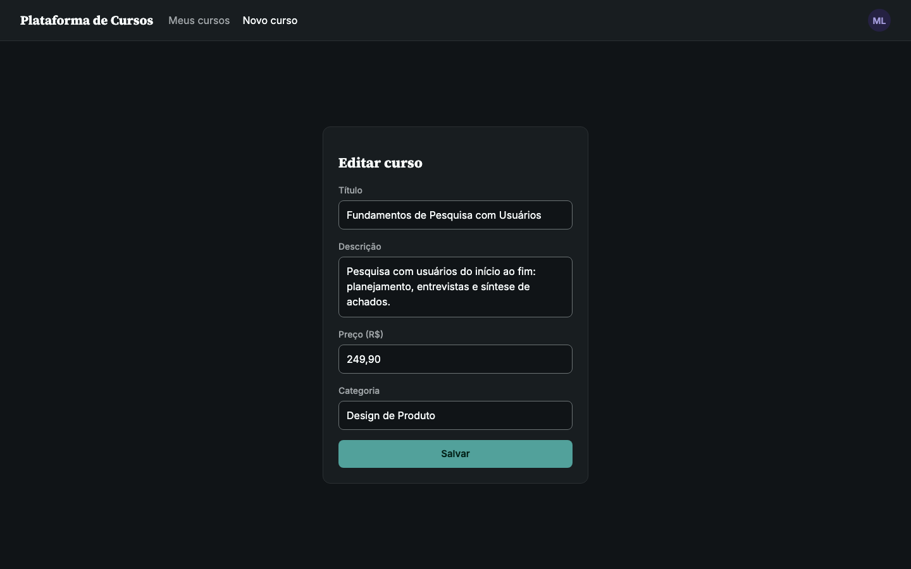

    *Figura 0 – UC006, fluxo alternativo A1: formulário "Editar curso" com dados atuais*

    

    *Figura 0 – UC006, fluxo alternativo A1: formulário "Editar curso" com dados atuais*
  - **A2 – O Instrutor exclui um curso sem matrículas**
    - A-2.1 O Instrutor aciona “Excluir curso” em um curso sem alunos matriculados.
    - A-2.2 O sistema remove o curso do catálogo.
    - A-2.3 Este caso de uso é finalizado.

    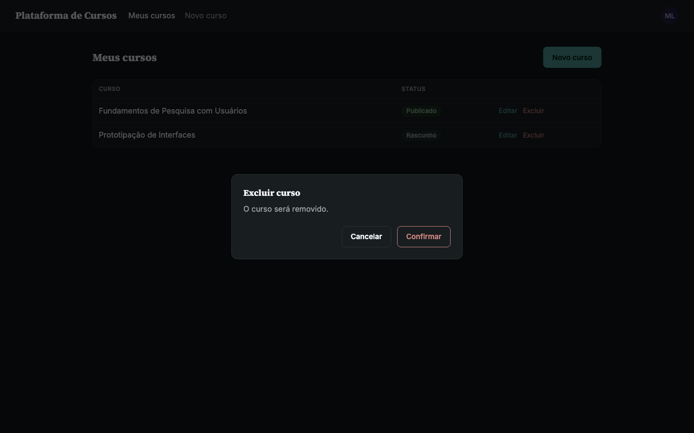

    *Figura 0 – UC006, fluxo alternativo A2: confirmação de exclusão do curso na lista*

    

    *Figura 0 – UC006, fluxo alternativo A2: confirmação de exclusão do curso na lista*
- **Fluxos de exceção:**
  - **E1 – Campos obrigatórios não preenchidos**
    - E-1.1 O sistema identifica título, descrição ou preço ausente.
    - E-1.2 O sistema bloqueia o salvamento e indica os campos pendentes.
    - E-1.3 Este caso de uso retorna ao fluxo básico (passo 3).

    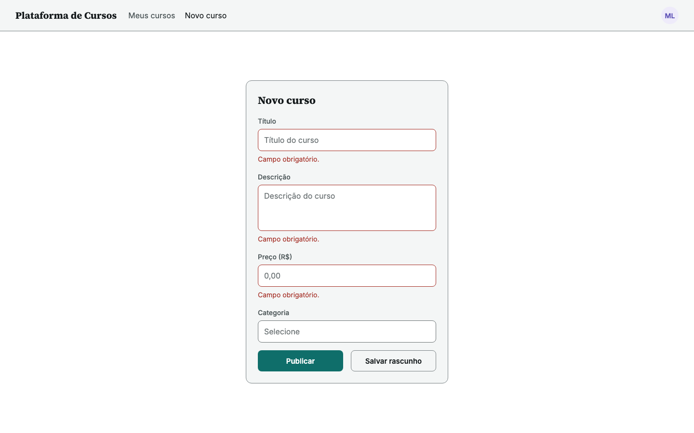

    *Figura 0 – UC006, fluxo de exceção E1: erro "Campo obrigatório" no título*

    

    *Figura 0 – UC006, fluxo de exceção E1: erro "Campo obrigatório" no título*
  - **E2 – Tentativa de excluir curso com alunos matriculados**
    - E-2.1 O sistema identifica matrículas ativas vinculadas ao curso.
    - E-2.2 O sistema impede a exclusão e sugere despublicar o curso.
    - E-2.3 Este caso de uso é finalizado.

    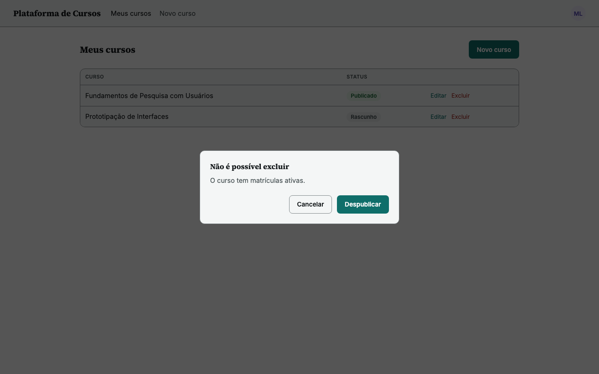

    *Figura 0 – UC006, fluxo de exceção E2: exclusão bloqueada na lista "Meus cursos"*

    

    *Figura 0 – UC006, fluxo de exceção E2: exclusão bloqueada na lista "Meus cursos"*

## UC014 – Gerenciar Módulos do Curso

- **Nome do caso de uso:** Gerenciar Módulos do Curso
- **Ator(es):** Instrutor.
- **Descrição:** o Instrutor cria, edita, reordena e exclui módulos de um curso seu, definindo título e posição (US005, RF003).
- **Pré-condições:** o Instrutor ter realizado login e ter cadastrado o curso (UC006).
- **Pós-condições:** módulo criado, alterado ou excluído e lista de módulos do curso atualizada.
- **Regras de negócio:** R-1 só o Instrutor dono do curso gerencia os seus módulos; R-2 a posição do módulo deve ser única dentro do curso; R-3 a exclusão de um módulo remove as suas aulas e o seu quiz.
- **Protótipo(s) de tela:** tela do curso com lista de módulos, botão “Novo módulo” e formulário de título e posição. As telas de cada fluxo aparecem junto ao fluxo, abaixo. As telas de cada fluxo aparecem junto ao fluxo, abaixo.
- **Fluxo básico:**
  1. O Instrutor acessa o curso.
  2. O Instrutor aciona “Novo módulo”. (A-1) (A-2)
  3. O Instrutor informa o título e a posição do módulo.
  4. O sistema valida os dados informados. (E-1) (E-2)
  5. O sistema salva o módulo e atualiza a lista de módulos.
  6. Este caso de uso é finalizado.

  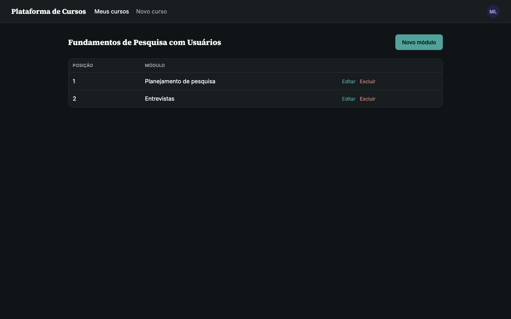

  *Figura 0 – UC014, fluxo básico: tela "Módulos do curso" com botão "Novo módulo"*

  

  *Figura 0 – UC014, fluxo básico: botão "Novo módulo" na tela "Módulos do curso"*

  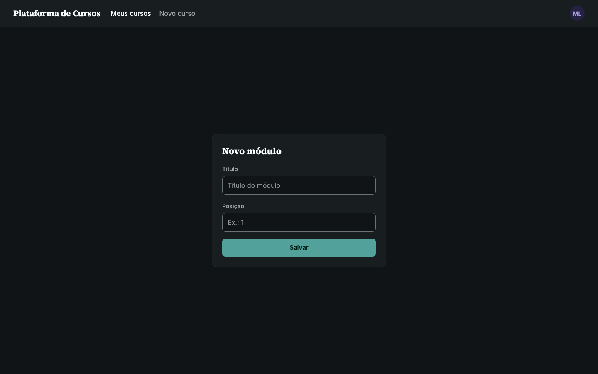

  *Figura 0 – UC014, fluxo básico: formulário "Novo módulo" vazio*

  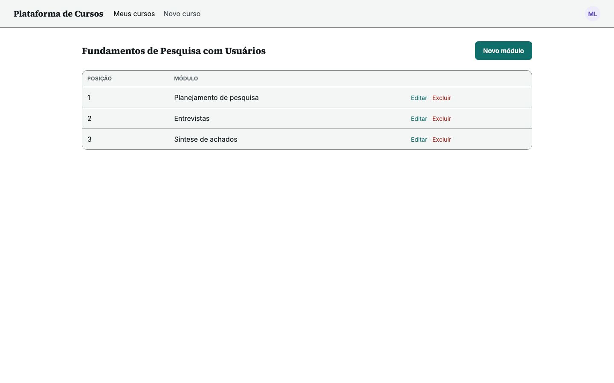

  *Figura 0 – UC014, fluxo básico: tela "Módulos do curso" após criar módulo*

  

  *Figura 0 – UC014, fluxo básico: tela "Módulos do curso" com botão "Novo módulo"*

  

  *Figura 0 – UC014, fluxo básico: botão "Novo módulo" na tela "Módulos do curso"*

  

  *Figura 0 – UC014, fluxo básico: formulário "Novo módulo" vazio*

  

  *Figura 0 – UC014, fluxo básico: tela "Módulos do curso" após criar módulo*
- **Fluxos alternativos:**
  - **A1 – O Instrutor edita ou reordena um módulo**
    - A-1.1 O Instrutor seleciona um módulo existente.
    - A-1.2 O sistema exibe o formulário preenchido com os dados atuais.
    - A-1.3 O Instrutor altera o título ou a posição do módulo.
    - A-1.4 Este caso de uso retorna ao fluxo básico (passo 4).

    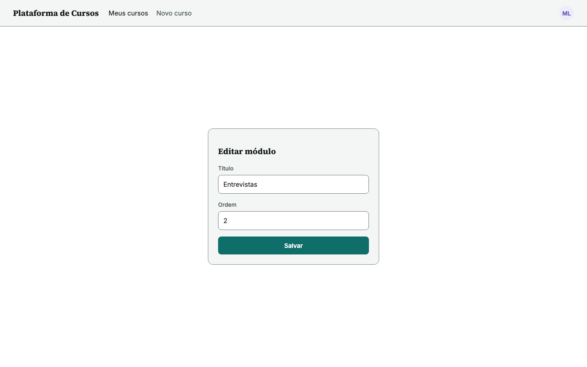

    *Figura 0 – UC014, fluxo alternativo A1: formulário "Editar módulo" com dados atuais*

    

    *Figura 0 – UC014, fluxo alternativo A1: formulário "Editar módulo" com dados atuais*
  - **A2 – O Instrutor exclui um módulo**
    - A-2.1 O Instrutor aciona “Excluir” em um módulo.
    - A-2.2 O sistema avisa que as aulas e o quiz do módulo também serão removidos e pede confirmação.
    - A-2.3 O Instrutor confirma a exclusão.
    - A-2.4 O sistema remove o módulo, as suas aulas e o seu quiz e atualiza a lista.
    - A-2.5 Este caso de uso é finalizado.

    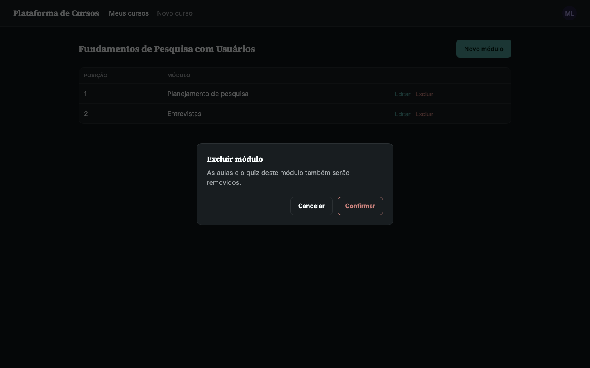

    *Figura 0 – UC014, fluxo alternativo A2: confirmação de exclusão do módulo*

    

    *Figura 0 – UC014, fluxo alternativo A2: confirmação de exclusão do módulo*
- **Fluxos de exceção:**
  - **E1 – Título ausente**
    - E-1.1 O sistema identifica que o título não foi informado.
    - E-1.2 O sistema bloqueia o salvamento e indica o campo obrigatório.
    - E-1.3 Este caso de uso retorna ao fluxo básico (passo 3).

    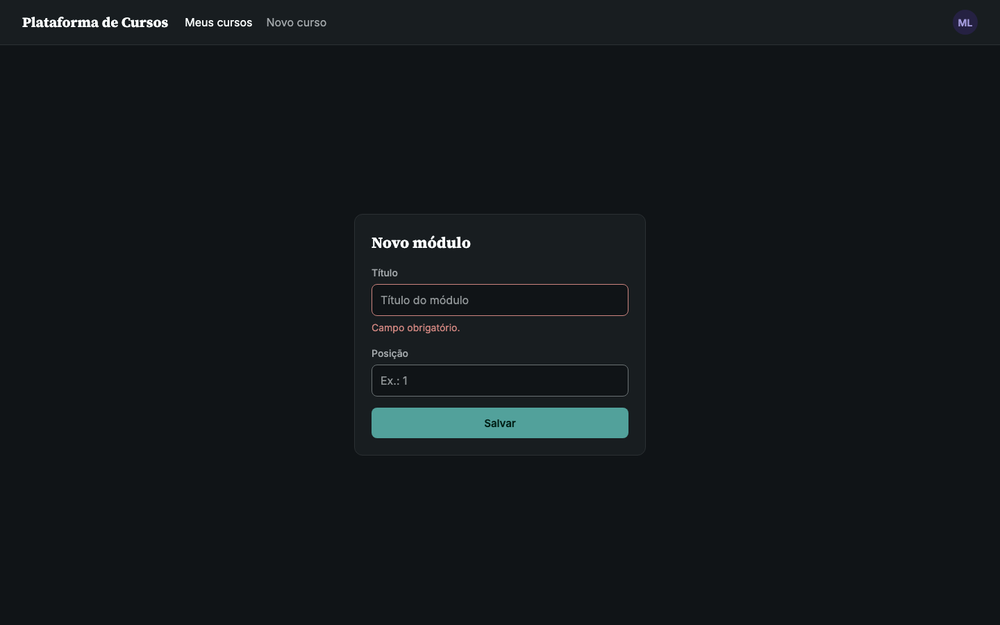

    *Figura 0 – UC014, fluxo de exceção E1: erro "Campo obrigatório" no título do módulo*

    

    *Figura 0 – UC014, fluxo de exceção E1: erro "Campo obrigatório" no título do módulo*
  - **E2 – Posição já utilizada**
    - E-2.1 O sistema identifica que a posição informada já pertence a outro módulo do curso.
    - E-2.2 O sistema informa o conflito e solicita outra posição.
    - E-2.3 Este caso de uso retorna ao fluxo básico (passo 3).

    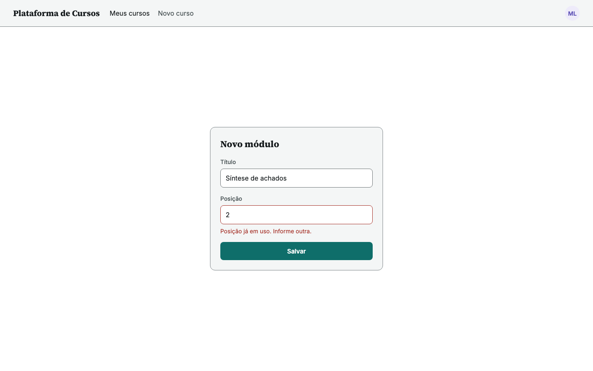

    *Figura 0 – UC014, fluxo de exceção E2: erro "Posição já em uso" no módulo*

    

    *Figura 0 – UC014, fluxo de exceção E2: erro "Posição já em uso" no módulo*

## UC015 – Gerenciar Aulas do Curso

- **Nome do caso de uso:** Gerenciar Aulas do Curso
- **Ator(es):** Instrutor.
- **Descrição:** o Instrutor cria, edita e exclui aulas de um módulo, incluindo o envio do vídeo da aula (US006, RF004).
- **Pré-condições:** o Instrutor ter realizado login e ter cadastrado o módulo (UC014).
- **Pós-condições:** aula salva com o vídeo armazenado; transcrição e indexação do conteúdo iniciadas para uso do Tutor de IA.
- **Regras de negócio:** R-1 só o Instrutor dono do curso gerencia as suas aulas; R-2 o vídeo aceita os formatos mp4 e webm, com até 500 MB por arquivo (RNF018); R-3 o envio do vídeo usa um link de envio temporário, válido por 15 minutos (RNF002); R-4 a transcrição e a indexação do conteúdo são geradas uma única vez por aula (RNF004).
- **Protótipo(s) de tela:** tela do módulo com lista de aulas e formulário de título, descrição, ordem, indicador de prévia e seleção do vídeo. As telas de cada fluxo aparecem junto ao fluxo, abaixo. As telas de cada fluxo aparecem junto ao fluxo, abaixo.
- **Fluxo básico:**
  1. O Instrutor acessa o módulo.
  2. O Instrutor aciona “Nova aula”. (A-1) (A-2)
  3. O Instrutor informa título, descrição, ordem e se a aula é prévia, e seleciona o vídeo.
  4. O sistema valida o formato e o tamanho do vídeo. (E-1)
  5. O sistema gera um link de envio temporário, válido por 15 minutos.
  6. O vídeo é enviado e o sistema confirma o recebimento. (E-2)
  7. O sistema salva a aula e inicia a transcrição e a indexação do conteúdo.
  8. Este caso de uso é finalizado.

  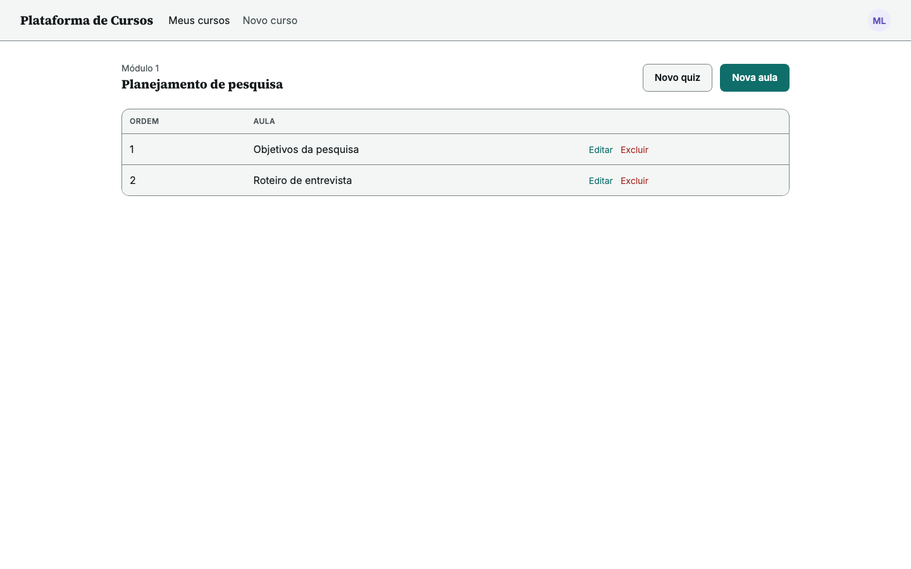

  *Figura 0 – UC015, fluxo básico: tela "Aulas do módulo" com botões "Novo quiz" e "Nova aula"*

  

  *Figura 0 – UC015, fluxo básico: botão "Nova aula" na tela "Aulas do módulo"*

  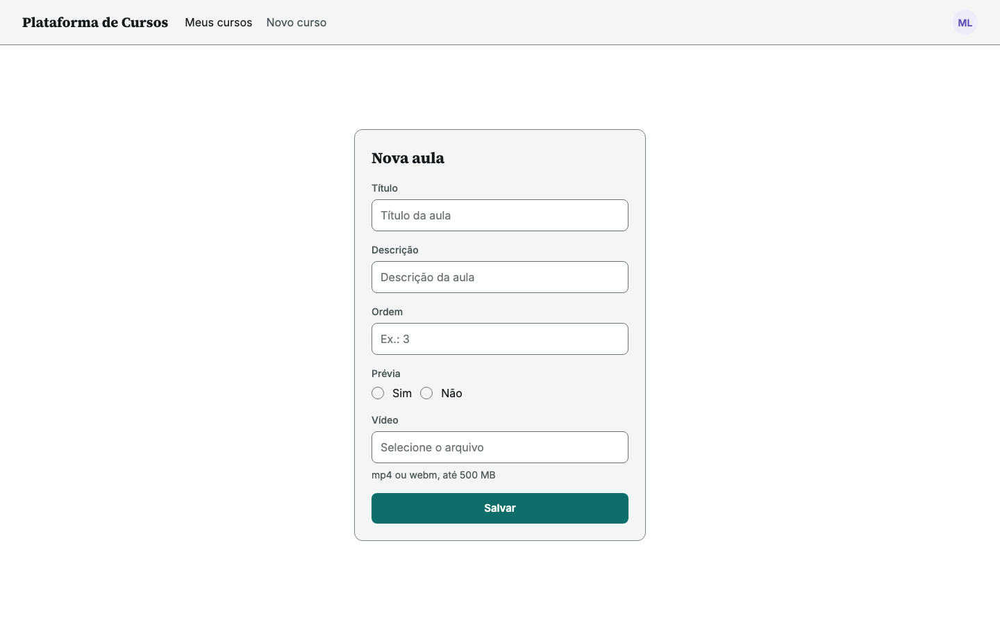

  *Figura 0 – UC015, fluxo básico: formulário "Nova aula" vazio*

  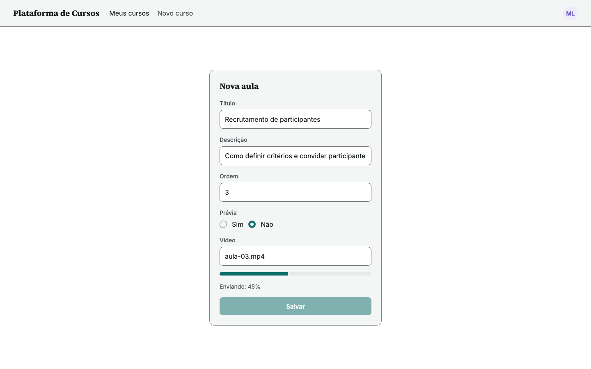

  *Figura 0 – UC015, fluxo básico: formulário "Nova aula" com envio em andamento*

  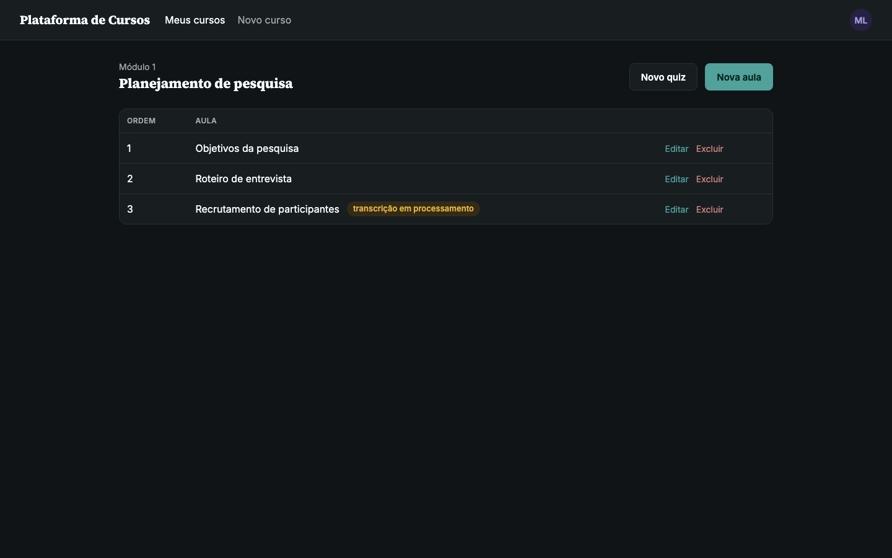

  *Figura 0 – UC015, fluxo básico: tela "Aulas do módulo" após salvar aula*

  

  *Figura 0 – UC015, fluxo básico: tela "Aulas do módulo" com botões "Novo quiz" e "Nova aula"*

  

  *Figura 0 – UC015, fluxo básico: botão "Nova aula" na tela "Aulas do módulo"*

  

  *Figura 0 – UC015, fluxo básico: formulário "Nova aula" vazio*

  

  *Figura 0 – UC015, fluxo básico: formulário "Nova aula" com envio em andamento*

  

  *Figura 0 – UC015, fluxo básico: tela "Aulas do módulo" após salvar aula*
- **Fluxos alternativos:**
  - **A1 – O Instrutor edita a aula ou substitui o vídeo**
    - A-1.1 O Instrutor seleciona uma aula existente.
    - A-1.2 O sistema exibe o formulário preenchido com os dados atuais.
    - A-1.3 O Instrutor altera os dados da aula ou escolhe um novo vídeo.
    - A-1.4 Este caso de uso retorna ao fluxo básico (passo 4).

    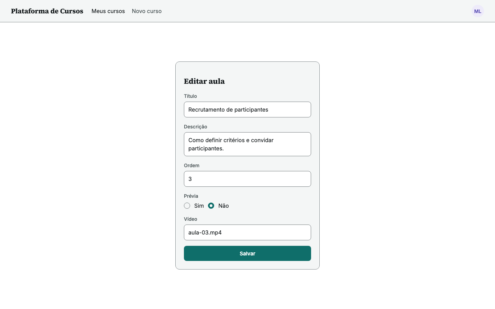

    *Figura 0 – UC015, fluxo alternativo A1: formulário "Editar aula" com dados atuais*

    

    *Figura 0 – UC015, fluxo alternativo A1: formulário "Editar aula" com dados atuais*
  - **A2 – O Instrutor exclui uma aula**
    - A-2.1 O Instrutor aciona “Excluir” em uma aula e confirma a exclusão.
    - A-2.2 O sistema remove a aula e o seu vídeo e atualiza a lista.
    - A-2.3 Este caso de uso é finalizado.

    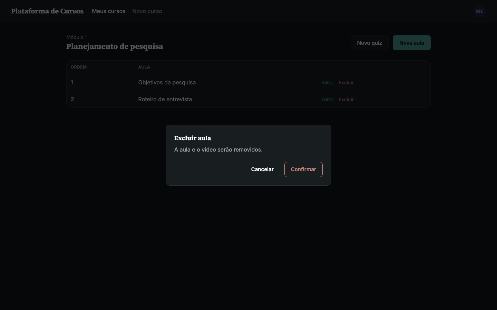

    *Figura 0 – UC015, fluxo alternativo A2: confirmação de exclusão da aula*

    

    *Figura 0 – UC015, fluxo alternativo A2: confirmação de exclusão da aula*
- **Fluxos de exceção:**
  - **E1 – Formato ou tamanho de vídeo inválido**
    - E-1.1 O sistema identifica que o vídeo está fora dos formatos ou do tamanho permitidos.
    - E-1.2 O sistema recusa o arquivo e informa os limites aceitos.
    - E-1.3 Este caso de uso retorna ao fluxo básico (passo 3).

    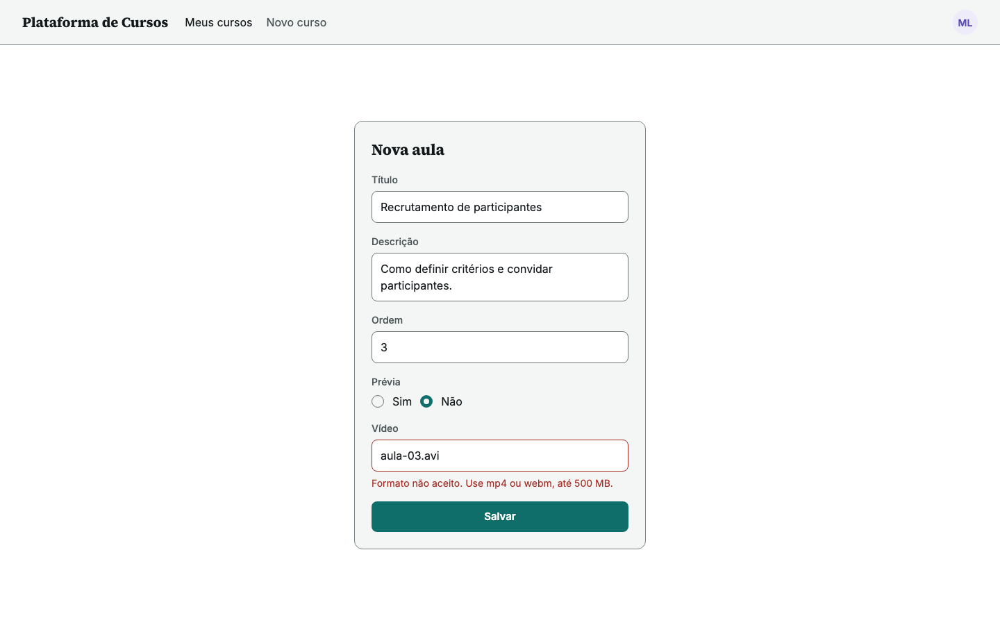

    *Figura 0 – UC015, fluxo de exceção E1: erro "Formato não aceito" no vídeo*

    

    *Figura 0 – UC015, fluxo de exceção E1: erro "Formato não aceito" no vídeo*
  - **E2 – Falha no envio do vídeo**
    - E-2.1 O sistema identifica falha no envio ou link de envio expirado.
    - E-2.2 O sistema informa o erro e gera um novo link de envio para nova tentativa.
    - E-2.3 Este caso de uso retorna ao fluxo básico (passo 6).

    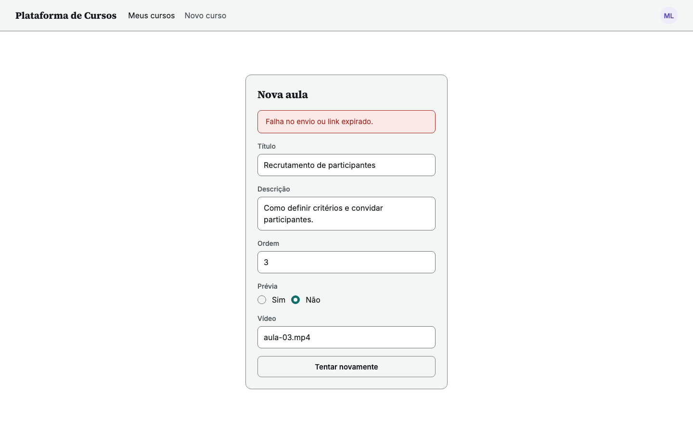

    *Figura 0 – UC015, fluxo de exceção E2: erro "Falha no envio" com botão "Tentar novamente"*

    

    *Figura 0 – UC015, fluxo de exceção E2: erro "Falha no envio" com botão "Tentar novamente"*

## UC004 – Cadastrar Quiz com Gabarito

- **Nome do caso de uso:** Cadastrar Quiz com Gabarito
- **Ator(es):** Instrutor.
- **Descrição:** o Instrutor cadastra um quiz com perguntas e o respectivo gabarito para um módulo do seu curso (US010, RF007).
- **Pré-condições:** o Instrutor ter realizado login, ser dono do curso e ter cadastrado o módulo (UC014).
- **Pós-condições:** quiz disponível para os alunos matriculados responderem, com o gabarito usado na correção automática.
- **Regras de negócio:** R-1 toda pergunta precisa de ao menos duas alternativas, com uma marcada como correta; R-2 a edição do gabarito não altera as notas já lançadas.
- **Protótipo(s) de tela:** formulário de cadastro de pergunta com alternativas e marcação de gabarito. As telas de cada fluxo aparecem junto ao fluxo, abaixo. As telas de cada fluxo aparecem junto ao fluxo, abaixo.
- **Fluxo básico:**
  1. O Instrutor acessa o módulo do curso.
  2. O Instrutor cria um novo quiz.
  3. O Instrutor cadastra as perguntas com alternativas. (A-1)
  4. O Instrutor marca a alternativa correta de cada pergunta.
  5. O Instrutor aciona “Salvar quiz”. (A-2)
  6. O sistema valida as perguntas. (E-1) (E-2)
  7. O sistema publica o quiz, que fica disponível para os alunos do módulo.
  8. Este caso de uso é finalizado.

  

  *Figura 0 – UC004, fluxo básico: botão "Novo quiz" na tela "Aulas do módulo"*

  

  *Figura 0 – UC004, fluxo básico: botão "Novo quiz" acionado na tela "Aulas do módulo"*

  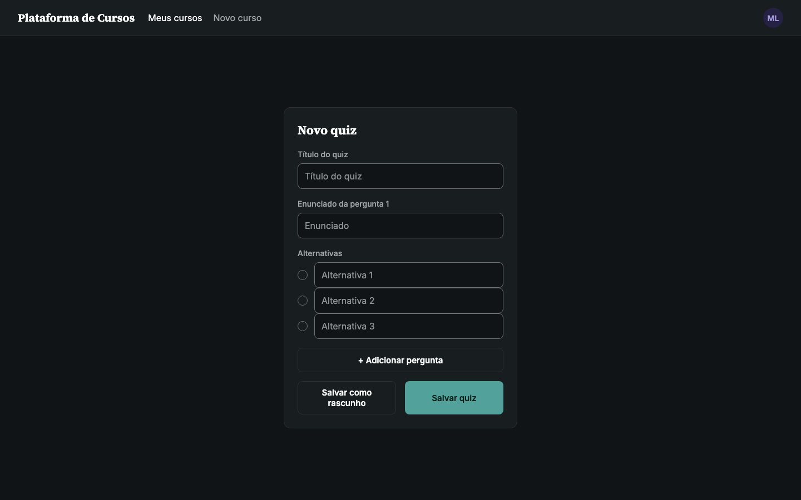

  *Figura 0 – UC004, fluxo básico: formulário "Novo quiz" vazio*

  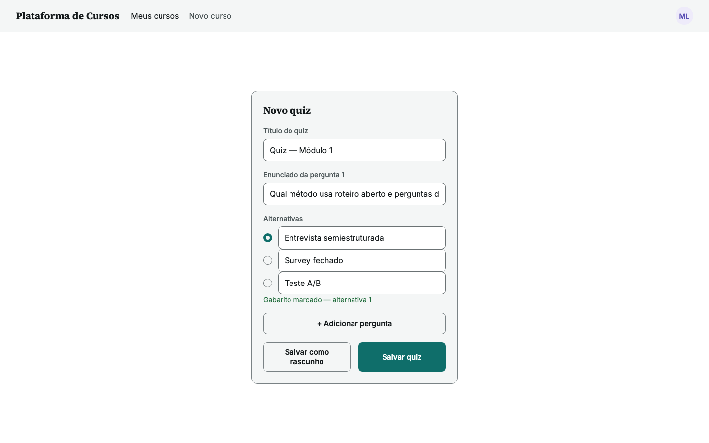

  *Figura 0 – UC004, fluxo básico: formulário "Novo quiz" com alternativa correta marcada*

  

  *Figura 0 – UC004, fluxo básico: "Salvar quiz" dispara validação sobre o estado preenchido*

  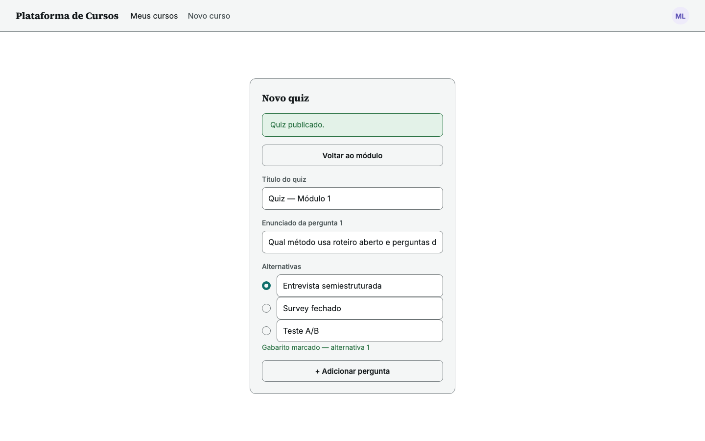

  *Figura 0 – UC004, fluxo básico: formulário "Novo quiz" após publicar com "Voltar ao módulo"*

  

  *Figura 0 – UC004, fluxo básico: botão "Novo quiz" na tela "Aulas do módulo"*

  

  *Figura 0 – UC004, fluxo básico: botão "Novo quiz" acionado na tela "Aulas do módulo"*

  

  *Figura 0 – UC004, fluxo básico: formulário "Novo quiz" vazio*

  

  *Figura 0 – UC004, fluxo básico: formulário "Novo quiz" com alternativa correta marcada*

  

  *Figura 0 – UC004, fluxo básico: "Salvar quiz" dispara validação sobre o estado preenchido*

  

  *Figura 0 – UC004, fluxo básico: formulário "Novo quiz" após publicar com "Voltar ao módulo"*
- **Fluxos alternativos:**
  - **A1 – O Instrutor edita uma pergunta já existente**
    - A-1.1 O Instrutor seleciona a pergunta a editar e altera o enunciado, as alternativas ou o gabarito.
    - A-1.2 O sistema mantém o histórico de respostas e as notas já lançadas.
    - A-1.3 Este caso de uso retorna ao fluxo básico (passo 5).

    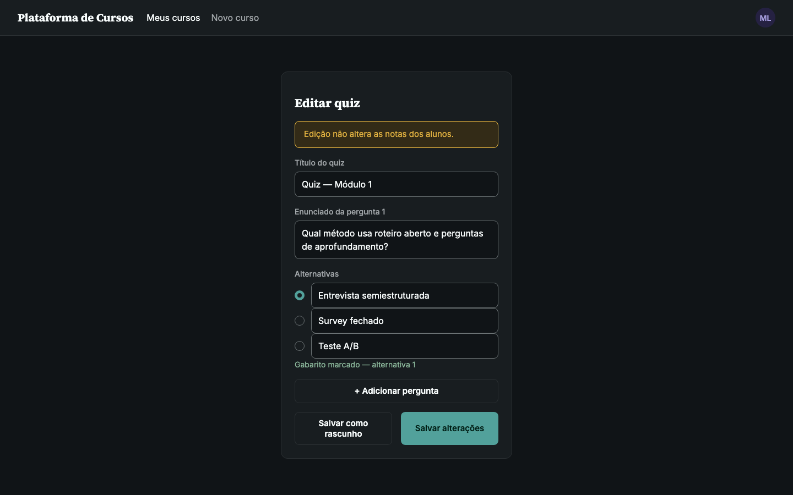

    *Figura 0 – UC004, fluxo alternativo A1: formulário "Editar quiz" com aviso de notas*

    

    *Figura 0 – UC004, fluxo alternativo A1: formulário "Editar quiz" com aviso de notas*
  - **A2 – O Instrutor salva o quiz como rascunho**
    - A-2.1 O Instrutor aciona “Salvar como rascunho” em vez de publicar.
    - A-2.2 O sistema salva o quiz sem torná-lo visível aos alunos.
    - A-2.3 Este caso de uso é finalizado.

    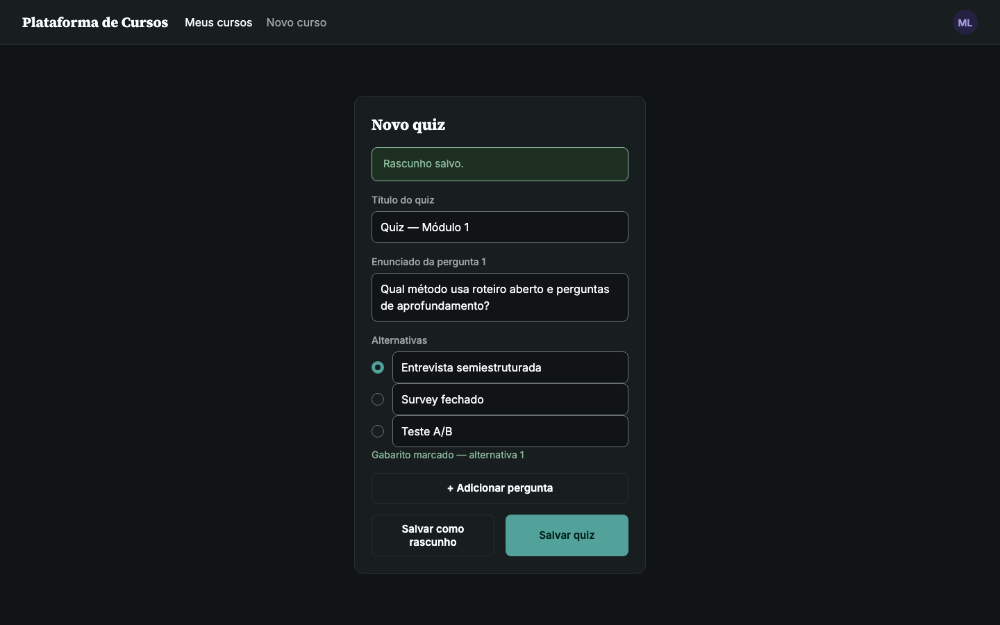

    *Figura 0 – UC004, fluxo alternativo A2: formulário "Novo quiz" após salvar rascunho*

    

    *Figura 0 – UC004, fluxo alternativo A2: formulário "Novo quiz" após salvar rascunho*
- **Fluxos de exceção:**
  - **E1 – Pergunta com menos de duas alternativas**
    - E-1.1 O sistema identifica uma pergunta com menos de duas alternativas cadastradas.
    - E-1.2 O sistema bloqueia o salvamento e pede para cadastrar ao menos duas alternativas.
    - E-1.3 Este caso de uso retorna ao fluxo básico (passo 3).

    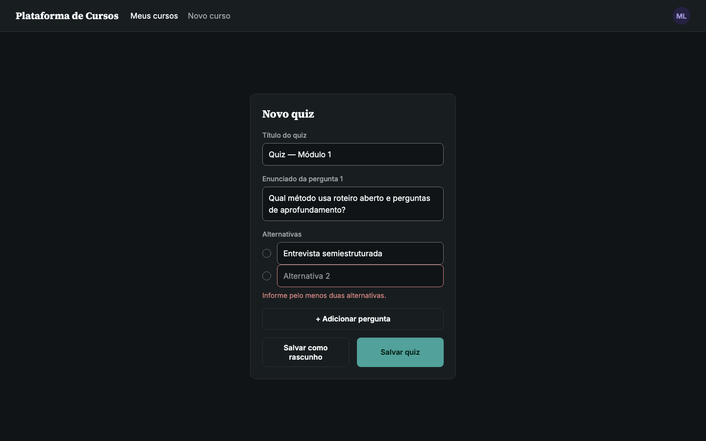

    *Figura 0 – UC004, fluxo de exceção E1: erro "Informe pelo menos duas alternativas"*

    

    *Figura 0 – UC004, fluxo de exceção E1: erro "Informe pelo menos duas alternativas"*
  - **E2 – Pergunta sem alternativa marcada como correta**
    - E-2.1 O sistema identifica uma pergunta sem gabarito definido.
    - E-2.2 O sistema bloqueia o salvamento e pede para marcar a alternativa correta.
    - E-2.3 Este caso de uso retorna ao fluxo básico (passo 4).

    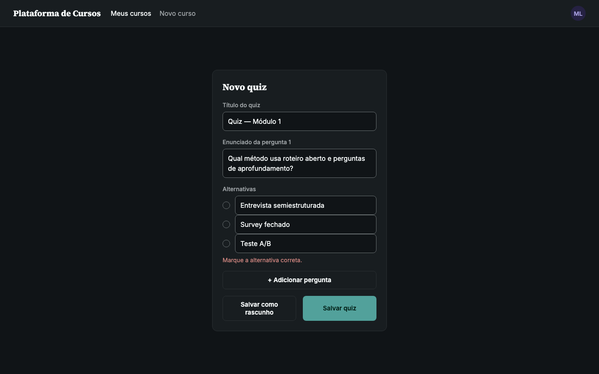

    *Figura 0 – UC004, fluxo de exceção E2: erro "Marque a alternativa correta"*

    

    *Figura 0 – UC004, fluxo de exceção E2: erro "Marque a alternativa correta"*
