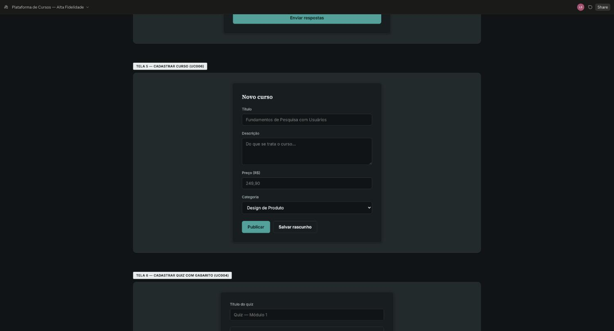
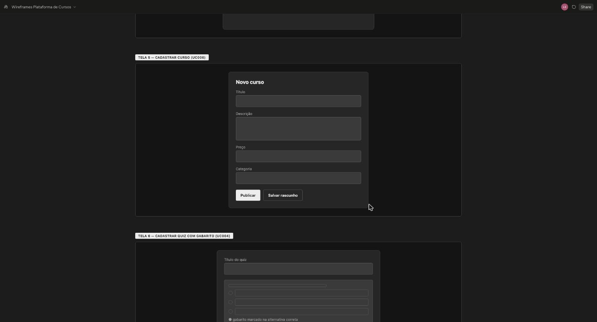
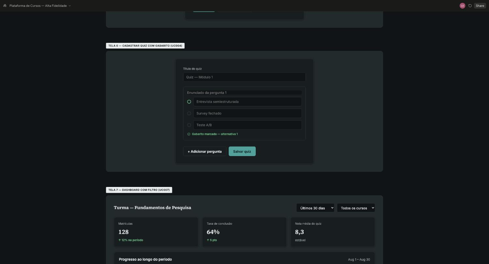
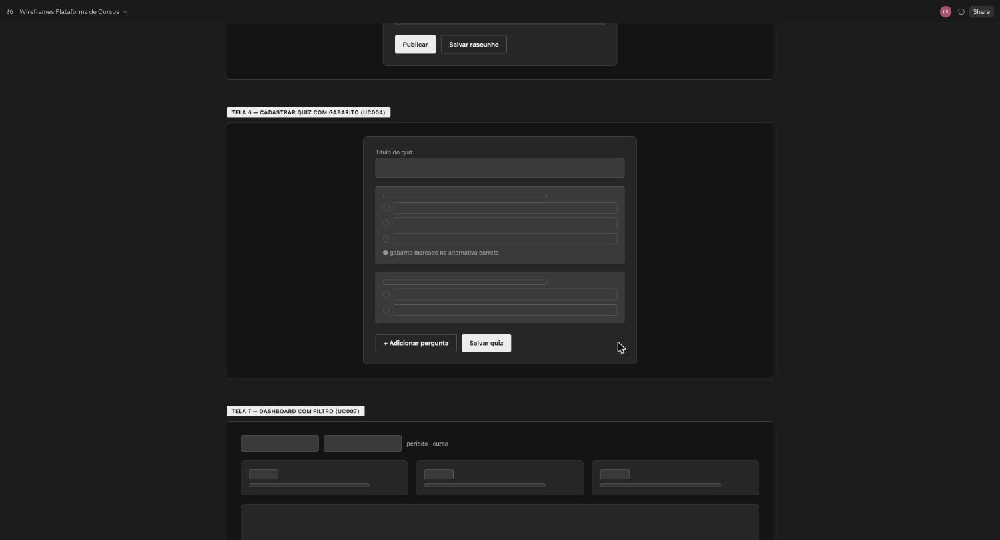

# 10 ESPECIFICAÇÕES DE CASO DE USO – ÁREA B (Autoria do instrutor)

O template exige a especificação de, no mínimo, 8 casos de uso, com protótipos de tela de alta fidelidade e fluxos principal, alternativo e de exceção.

Área B: Autoria do instrutor. Responsável: Adrian Antônio de Souza Gomes (`adrian69-droid`). IDs: UC-B1, UC-B2… (mínimo 4 por integrante, sem máximo). Cada RF da área deve estar coberto por algum caso de uso; um RF extra pode entrar por include/extend de um caso existente..

## UC-B1 (UC006) – Cadastrar Curso

- **Nome do caso de uso:** Cadastrar Curso
- **Ator(es):** Instrutor.
- **Descrição:** o instrutor cria, edita, exclui e lista os cursos do seu catálogo.
- **Pré-condições:** instrutor autenticado.
- **Pós-condições:** curso criado/atualizado fica disponível no catálogo do instrutor, com status rascunho ou publicado.
- **Regras de negócio:** curso é criado com status rascunho por padrão; exclusão é bloqueada se houver alunos matriculados (nesse caso, só despublicar).
- **Protótipo(s) de tela:** formulário de cadastro de curso com título, descrição, preço e categoria.

  

  

  *Figura 8 – Protótipo de tela do UC006 — Cadastrar Curso*
- **Fluxo básico:**
  1. O instrutor acessa “Meus cursos”.
  2. O instrutor aciona “Novo curso”.
  3. O instrutor preenche título, descrição, preço e categoria.
  4. O sistema salva o curso com status rascunho. (E-1)
  5. O instrutor aciona “Publicar” quando estiver pronto. (A-1)
  6. O sistema torna o curso visível no catálogo.
  7. Este caso de uso é finalizado.
- **Fluxos alternativos:**
  - **A1 – O instrutor edita um curso já publicado**
    - A-1.1 O instrutor altera título, descrição ou preço do curso.
    - A-1.2 O sistema salva as alterações e reflete no catálogo, sem afetar matrículas existentes.
    - A-1.3 Este caso de uso é finalizado.
  - **A2 – O instrutor exclui um curso sem matrículas**
    - A-2.1 O instrutor aciona “Excluir curso” em um curso sem alunos matriculados.
    - A-2.2 O sistema remove o curso do catálogo.
    - A-2.3 Este caso de uso é finalizado.
- **Fluxos de exceção:**
  - **E1 – Campos obrigatórios não preenchidos**
    - E-1.1 O sistema identifica título, descrição ou preço ausente.
    - E-1.2 O sistema bloqueia o salvamento e indica o(s) campo(s) pendente(s).
    - E-1.3 Este caso de uso retorna ao fluxo básico (passo 3).
  - **E2 – Tentativa de excluir curso com alunos matriculados**
    - E-2.1 O sistema identifica matrículas ativas vinculadas ao curso.
    - E-2.2 O sistema impede a exclusão e sugere despublicar o curso em vez de excluir.
    - E-2.3 Este caso de uso é finalizado.

## UC-B2 (UC014) – Gerenciar Módulos do Curso

- **Nome do caso de uso:** Gerenciar Módulos do Curso
- **Ator(es):** Instrutor.
- **Descrição:** o instrutor cria, edita e exclui módulos de um curso seu, definindo título e posição (US005, RF003).
- **Pré-condições:** o instrutor ter realizado login e ter cadastrado o curso (UC006).
- **Pós-condições:** módulo criado, alterado ou excluído e lista de módulos do curso atualizada.
- **Regras de negócio:** R-1 só o instrutor dono do curso gerencia seus módulos; R-2 a posição do módulo deve ser única dentro do curso; R-3 a exclusão de um módulo remove suas aulas e seu quiz.
- **Protótipo(s) de tela:** tela do curso com lista de módulos, botão “Novo módulo” e formulário de título e posição. Imagem do protótipo pendente.
- **Fluxo básico:**
  1. O instrutor acessa o curso.
  2. O instrutor aciona “Novo módulo”. (A-1) (A-2)
  3. O instrutor informa o título e a posição do módulo.
  4. O sistema valida os dados informados. (E-1) (E-2)
  5. O sistema salva o módulo e atualiza a lista de módulos.
  6. Este caso de uso é finalizado.
- **Fluxos alternativos:**
  - **A1 – O instrutor edita um módulo**
    - A-1.1 O instrutor seleciona um módulo existente e altera título ou posição.
    - A-1.2 O sistema exibe o formulário preenchido com os dados atuais.
    - A-1.3 Este caso de uso retorna ao fluxo básico (passo 4).
  - **A2 – O instrutor exclui um módulo**
    - A-2.1 O instrutor aciona “Excluir” em um módulo e confirma a exclusão.
    - A-2.2 O sistema remove o módulo, suas aulas e seu quiz e atualiza a lista.
    - A-2.3 Este caso de uso é finalizado.
- **Fluxos de exceção:**
  - **E1 – Título ausente**
    - E-1.1 O sistema identifica que o título não foi informado.
    - E-1.2 O sistema bloqueia o salvamento e indica o campo obrigatório.
    - E-1.3 Este caso de uso retorna ao fluxo básico (passo 3).
  - **E2 – Posição já utilizada**
    - E-2.1 O sistema identifica que a posição informada já pertence a outro módulo do curso.
    - E-2.2 O sistema informa o conflito e solicita outra posição.
    - E-2.3 Este caso de uso retorna ao fluxo básico (passo 3).

## UC-B3 (UC015) – Gerenciar Aulas do Curso

- **Nome do caso de uso:** Gerenciar Aulas do Curso
- **Ator(es):** Instrutor.
- **Descrição:** o instrutor cria, edita e exclui aulas de um módulo, incluindo o envio do vídeo por URL assinada (US006, RF004).
- **Pré-condições:** o instrutor ter realizado login e ter cadastrado o módulo (UC014).
- **Pós-condições:** aula salva com vídeo no armazenamento; transcrição e embeddings iniciados para uso do tutor de IA.
- **Regras de negócio:** R-1 só o instrutor dono do curso gerencia suas aulas; R-2 o vídeo aceita os formatos mp4 e webm, com tamanho máximo de 500 MB (valor proposto, a confirmar); R-3 o envio usa URL assinada com validade de 15 minutos (RNF002); R-4 a transcrição e os embeddings são gerados uma única vez por aula (RNF004).
- **Protótipo(s) de tela:** tela do módulo com lista de aulas e formulário de título, descrição, ordem, indicador de prévia e seleção do vídeo. Imagem do protótipo pendente.
- **Fluxo básico:**
  1. O instrutor acessa o módulo.
  2. O instrutor aciona “Nova aula”. (A-1) (A-2)
  3. O instrutor informa título, descrição, ordem e se a aula é prévia, e seleciona o vídeo.
  4. O sistema valida o formato e o tamanho do vídeo. (E-1)
  5. O sistema gera uma URL assinada de envio com validade de 15 minutos.
  6. O vídeo é enviado ao armazenamento e o sistema confirma o recebimento. (E-2)
  7. O sistema salva a aula e inicia a transcrição e a geração dos embeddings.
  8. Este caso de uso é finalizado.
- **Fluxos alternativos:**
  - **A1 – O instrutor edita ou substitui o vídeo de uma aula**
    - A-1.1 O instrutor seleciona uma aula existente e altera seus dados ou escolhe um novo vídeo.
    - A-1.2 O sistema exibe o formulário preenchido com os dados atuais.
    - A-1.3 Este caso de uso retorna ao fluxo básico (passo 4).
  - **A2 – O instrutor exclui uma aula**
    - A-2.1 O instrutor aciona “Excluir” em uma aula e confirma a exclusão.
    - A-2.2 O sistema remove a aula e seu vídeo e atualiza a lista.
    - A-2.3 Este caso de uso é finalizado.
- **Fluxos de exceção:**
  - **E1 – Formato ou tamanho de vídeo inválido**
    - E-1.1 O sistema identifica que o vídeo está fora dos formatos ou do tamanho permitidos.
    - E-1.2 O sistema recusa o arquivo e informa os limites aceitos.
    - E-1.3 Este caso de uso retorna ao fluxo básico (passo 3).
  - **E2 – Falha no envio do vídeo**
    - E-2.1 O sistema identifica falha no envio ou URL assinada expirada.
    - E-2.2 O sistema informa o erro e gera uma nova URL assinada para nova tentativa.
    - E-2.3 Este caso de uso retorna ao fluxo básico (passo 5).

## UC-B4 (UC004) – Cadastrar Quiz com Gabarito

- **Nome do caso de uso:** Cadastrar Quiz com Gabarito
- **Ator(es):** Instrutor.
- **Descrição:** o instrutor cadastra um quiz com perguntas e respectivo gabarito pra um módulo do seu curso.
- **Pré-condições:** instrutor autenticado; instrutor é dono do curso/módulo; módulo já está cadastrado.
- **Pós-condições:** quiz fica disponível pros alunos matriculados responderem, com o gabarito usado na correção automática.
- **Regras de negócio:** toda pergunta precisa ter ao menos uma alternativa marcada como correta; edição do gabarito não altera retroativamente notas já lançadas.
- **Protótipo(s) de tela:** formulário de cadastro de pergunta com alternativas e marcação de gabarito.

  

  

  *Figura 6 – Protótipo de tela do UC004 — Cadastrar Quiz com Gabarito*
- **Fluxo básico:**
  1. O instrutor acessa o módulo do curso.
  2. O instrutor cria um novo quiz.
  3. O instrutor cadastra as perguntas com alternativas. (A-1)
  4. O instrutor marca a alternativa correta de cada pergunta.
  5. O instrutor aciona “Salvar quiz”. (A-2)
  6. O sistema publica o quiz, que fica disponível para os alunos do módulo. (E-1) (E-2)
  7. Este caso de uso é finalizado.
- **Fluxos alternativos:**
  - **A1 – O instrutor edita uma pergunta já existente**
    - A-1.1 O instrutor seleciona a pergunta a editar.
    - A-1.2 O sistema atualiza a pergunta, mantendo o histórico de respostas já dadas pelos alunos.
    - A-1.3 Este caso de uso retorna ao fluxo básico (passo 5).
  - **A2 – O instrutor salva o quiz como rascunho**
    - A-2.1 O instrutor aciona “Salvar como rascunho” em vez de publicar.
    - A-2.2 O sistema salva o quiz sem torná-lo visível aos alunos.
    - A-2.3 Este caso de uso é finalizado.
- **Fluxos de exceção:**
  - **E1 – Pergunta cadastrada sem nenhuma alternativa**
    - E-1.1 O sistema identifica pergunta sem alternativas cadastradas.
    - E-1.2 O sistema bloqueia o avanço e pede pra cadastrar ao menos duas alternativas.
    - E-1.3 Este caso de uso retorna ao fluxo básico (passo 3).
  - **E2 – Pergunta sem alternativa marcada como correta**
    - E-2.1 O sistema identifica pergunta sem gabarito definido.
    - E-2.2 O sistema bloqueia o salvamento e pede pra marcar a alternativa correta.
    - E-2.3 Este caso de uso retorna ao fluxo básico (passo 4).
