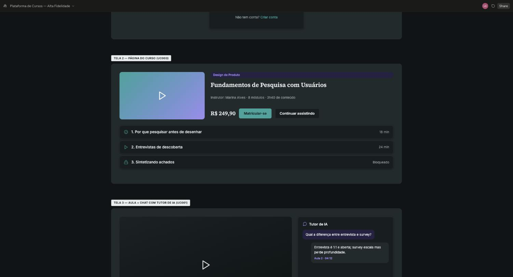
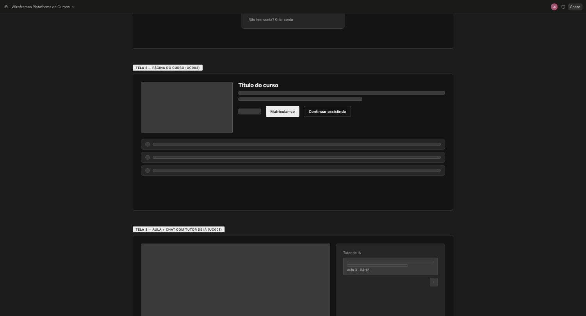
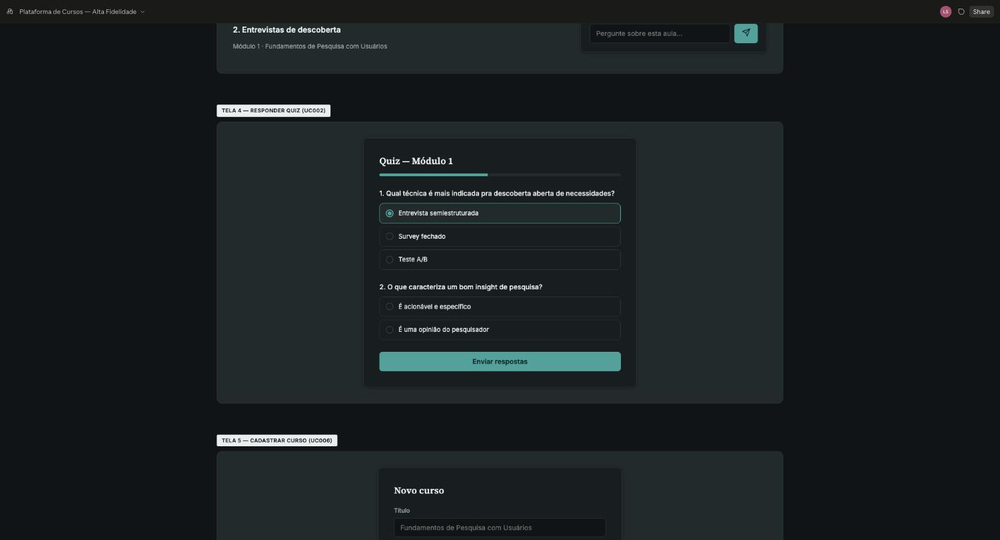
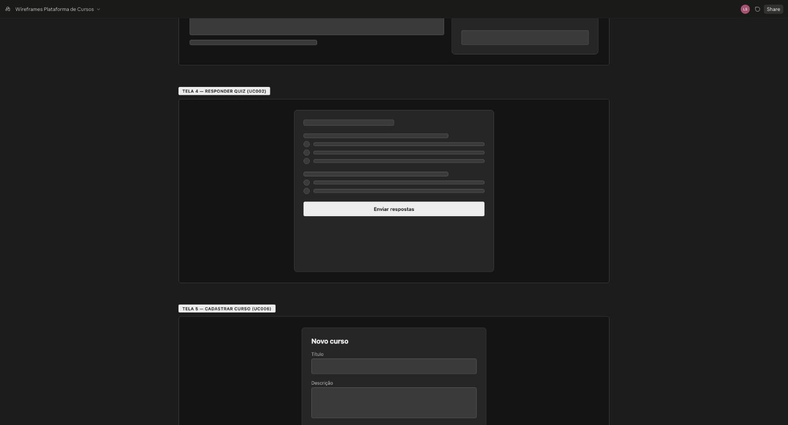

# 10 ESPECIFICAÇÕES DE CASO DE USO – ÁREA C (Aprendizagem do aluno)

O template exige a especificação de, no mínimo, 8 casos de uso, com protótipos de tela de alta fidelidade e fluxos principal, alternativo e de exceção.

Área C: Aprendizagem do aluno. Responsável: Lucas Bruno e Silva (`Luc-Bruno`). IDs: UC-C1, UC-C2… (mínimo 4 por integrante, sem máximo). Cada RF da área deve estar coberto por algum caso de uso; um RF extra pode entrar por include/extend de um caso existente..

## UC-C1 (UC003) – Matricular-se em Curso

- **Nome do caso de uso:** Matricular-se em Curso
- **Ator(es):** Aluno.
- **Descrição:** o aluno se matricula em um curso publicado pra ter acesso ao conteúdo das aulas.
- **Pré-condições:** aluno autenticado; curso está com status publicado; aluno ainda não está matriculado no curso.
- **Pós-condições:** matrícula é registrada vinculando aluno e curso; curso passa a aparecer em “meus cursos” do aluno.
- **Regras de negócio:** matrícula só é permitida em curso publicado; não é permitida matrícula duplicada no mesmo curso (unique userId+courseId); pagamento (simulado) é processado antes da confirmação da matrícula, quando o curso é pago; o pagamento da matrícula em curso pago é simulado, sem gateway externo (RF014).
- **Protótipo(s) de tela:** página do curso com botão “matricular-se” e confirmação.

  

  

  *Figura 5 – Protótipo de tela do UC003 — Matricular-se em Curso*
- **Fluxo básico:**
  1. O aluno acessa a página de um curso publicado.
  2. O aluno aciona “Matricular-se”. (A-1)
  3. O sistema processa o pagamento simulado. (E-1) (E-2)
  4. O sistema registra a matrícula do aluno no curso.
  5. O curso passa a aparecer em “meus cursos” e o aluno pode iniciar as aulas.
  6. Este caso de uso é finalizado.
- **Fluxos alternativos:**
  - **A1 – O aluno já está matriculado no curso**
    - A-1.1 O sistema identifica matrícula existente do aluno para esse curso.
    - A-1.2 O sistema exibe o botão “Continuar assistindo” no lugar de “Matricular-se”.
    - A-1.3 Este caso de uso é finalizado.
  - **A2 – O curso é gratuito**
    - A-2.1 O sistema identifica que o curso não tem preço definido.
    - A-2.2 O sistema registra a matrícula sem executar o passo de pagamento.
    - A-2.3 Este caso de uso retorna ao fluxo básico (passo 4).
- **Fluxos de exceção:**
  - **E1 – Curso está em rascunho (não publicado)**
    - E-1.1 O sistema verifica que o curso não está publicado.
    - E-1.2 O sistema retorna erro de “curso não encontrado” ao tentar acessar ou matricular.
    - E-1.3 Este caso de uso é finalizado.
  - **E2 – Pagamento simulado recusado**
    - E-2.1 O sistema identifica falha no processamento do pagamento simulado.
    - E-2.2 O sistema informa o erro ao aluno e não registra a matrícula.
    - E-2.3 Este caso de uso retorna ao fluxo básico (passo 2).

## UC-C2 (UC009) – Assistir Aula

- **Nome do caso de uso:** Assistir Aula
- **Ator(es):** Aluno.
- **Descrição:** o aluno reproduz o vídeo de uma aula do curso em que está matriculado, podendo abrir o chat com o tutor de IA a qualquer momento (ver UC001).
- **Pré-condições:** aluno autenticado e matriculado no curso; aula já cadastrada com vídeo.
- **Pós-condições:** progresso de visualização do aluno é atualizado; aula é marcada como concluída quando o vídeo termina.
- **Regras de negócio:** aula marcada como “prévia” (isPreview) pode ser assistida sem matrícula; progresso é salvo em segundos assistidos, não só como concluído/não concluído.
- **Protótipo(s) de tela:** mesma tela do UC001 — reprodução do vídeo-aula com o chat do tutor de IA lateral.

  

  

  *Figura 11 – Protótipo de tela do UC009 — Assistir Aula (mesma tela do UC001)*
- **Fluxo básico:**
  1. O aluno acessa a aula dentro do curso. (A-2)
  2. O sistema reproduz o vídeo da aula. (E-1) (E-2)
  3. O aluno assiste ao vídeo até o fim. (A-1) (A-3)
  4. O sistema marca a aula como concluída e atualiza o progresso do aluno no curso.
  5. Este caso de uso é finalizado.
- **Fluxos alternativos:**
  - **A1 – O aluno pausa a aula antes do fim**
    - A-1.1 O aluno sai da tela antes do vídeo terminar.
    - A-1.2 O sistema salva os segundos assistidos até aquele ponto.
    - A-1.3 Este caso de uso é finalizado.
  - **A2 – O aluno retoma uma aula já iniciada**
    - A-2.1 O aluno acessa novamente uma aula que já tinha assistido parcialmente.
    - A-2.2 O sistema inicia a reprodução a partir do ponto salvo anteriormente.
    - A-2.3 Este caso de uso retorna ao fluxo básico (passo 2).
  - **A3 – O aluno tem dúvida sobre a aula**
    - A-3.1 O aluno aciona o chat do tutor de IA durante a aula.
    - A-3.2 O caso de uso UC001 (Conversar com Tutor de IA) é iniciado.
    - A-3.3 Este caso de uso retorna ao fluxo básico (passo 3).
- **Fluxos de exceção:**
  - **E1 – Aula ainda não disponível (sem matrícula e sem prévia)**
    - E-1.1 O sistema identifica que o aluno não está matriculado no curso e a aula não é prévia.
    - E-1.2 O sistema bloqueia o acesso e sugere a matrícula no curso.
    - E-1.3 Este caso de uso é finalizado.
  - **E2 – Falha ao carregar o vídeo**
    - E-2.1 O sistema identifica falha na entrega do arquivo de vídeo (URL assinada expirada ou indisponível).
    - E-2.2 O sistema exibe erro e oferece opção de recarregar a página.
    - E-2.3 Este caso de uso é finalizado.

## UC-C3 (UC002) – Responder Quiz

- **Nome do caso de uso:** Responder Quiz
- **Ator(es):** Aluno.
- **Descrição:** o aluno responde as questões do quiz de um módulo e recebe a nota calculada automaticamente com base no gabarito.
- **Pré-condições:** aluno autenticado e matriculado no curso; aluno completou as aulas do módulo; quiz do módulo está cadastrado com gabarito.
- **Pós-condições:** resposta do aluno e nota calculada ficam salvas no seu progresso; resultado fica disponível pra consulta posterior.
- **Regras de negócio:** envio só é aceito com todas as questões respondidas; a nota é calculada automaticamente comparando a resposta do aluno com o gabarito; aluno só pode refazer o quiz se o instrutor permitir.
- **Protótipo(s) de tela:** tela de quiz com questões de múltipla escolha e botão de envio.

  

  

  *Figura 4 – Protótipo de tela do UC002 — Responder Quiz*
- **Fluxo básico:**
  1. O aluno acessa o quiz do módulo. (A-1)
  2. O aluno responde às questões do quiz. (A-2)
  3. O aluno aciona “Enviar respostas”.
  4. O sistema compara as respostas com o gabarito e calcula a nota. (E-1) (E-2)
  5. O sistema exibe o resultado ao aluno e salva o progresso.
  6. Este caso de uso é finalizado.
- **Fluxos alternativos:**
  - **A1 – O aluno acessa um quiz já respondido**
    - A-1.1 O sistema identifica que já existe um envio anterior do aluno para esse quiz.
    - A-1.2 O sistema exibe o resultado salvo, sem permitir novo envio.
    - A-1.3 Este caso de uso é finalizado.
  - **A2 – O aluno salva um rascunho e retoma depois**
    - A-2.1 O aluno aciona “Salvar rascunho” antes de enviar todas as respostas.
    - A-2.2 O sistema salva as respostas parciais vinculadas ao aluno e ao quiz.
    - A-2.3 Este caso de uso retorna ao fluxo básico (passo 2) na próxima vez que o aluno acessar o quiz.
- **Fluxos de exceção:**
  - **E1 – Aluno tenta enviar sem responder todas as questões**
    - E-1.1 O sistema identifica questão(ões) sem resposta.
    - E-1.2 O sistema bloqueia o envio e indica a(s) questão(ões) pendente(s).
    - E-1.3 Este caso de uso retorna ao fluxo básico (passo 2).
  - **E2 – Falha ao calcular a nota (gabarito inconsistente)**
    - E-2.1 O sistema identifica que o quiz não tem gabarito completo cadastrado.
    - E-2.2 O sistema informa erro ao aluno e notifica o instrutor responsável.
    - E-2.3 Este caso de uso é finalizado.

## UC-C4 (UC010) – Avaliar Curso

- **Nome do caso de uso:** Avaliar Curso
- **Ator(es):** Aluno.
- **Descrição:** o aluno avalia um curso em que está matriculado com nota de 1 a 5 e comentário opcional.
- **Pré-condições:** aluno autenticado e matriculado no curso; aluno completou ao menos uma aula do curso.
- **Pós-condições:** avaliação fica salva e visível na página do curso; nota agregada do curso é recalculada.
- **Regras de negócio:** só é possível 1 avaliação ativa por aluno por curso (nova avaliação substitui a anterior); nota é obrigatória, comentário é opcional.
- **Protótipo(s) de tela:** formulário na página do curso (a partir da mesma página do UC003) com seleção de nota de 1 a 5 e campo opcional de comentário. Imagem do protótipo pendente.
- **Fluxo básico:**
  1. O aluno acessa a página do curso em que está matriculado.
  2. O aluno aciona “Avaliar curso”. (A-1)
  3. O aluno informa a nota (1 a 5) e, opcionalmente, um comentário.
  4. O aluno confirma o envio. (A-2)
  5. O sistema salva a avaliação e recalcula a nota média do curso. (E-1) (E-2)
  6. Este caso de uso é finalizado.
- **Fluxos alternativos:**
  - **A1 – O aluno já avaliou o curso antes**
    - A-1.1 O sistema identifica avaliação anterior do aluno para esse curso.
    - A-1.2 O sistema pré-preenche o formulário com a avaliação existente, pronta pra edição.
    - A-1.3 Este caso de uso retorna ao fluxo básico (passo 3), atualizando a avaliação existente em vez de criar uma nova.
  - **A2 – O aluno cancela antes de confirmar**
    - A-2.1 O aluno fecha o formulário de avaliação sem confirmar.
    - A-2.2 O sistema descarta as alterações, mantendo a avaliação anterior (se houver).
    - A-2.3 Este caso de uso é finalizado.
- **Fluxos de exceção:**
  - **E1 – Aluno não está matriculado no curso**
    - E-1.1 O sistema identifica que o aluno não tem matrícula ativa naquele curso.
    - E-1.2 O sistema bloqueia a ação e informa que só alunos matriculados podem avaliar.
    - E-1.3 Este caso de uso é finalizado.
  - **E2 – Envio sem nota selecionada**
    - E-2.1 O sistema identifica que o campo de nota não foi preenchido.
    - E-2.2 O sistema bloqueia o envio e indica que a nota é obrigatória.
    - E-2.3 Este caso de uso retorna ao fluxo básico (passo 3).
