## UC003 – Matricular-se em Curso

- **Nome do caso de uso:** Matricular-se em Curso
- **Ator(es):** Aluno.
- **Descrição:** o Aluno se matricula em um curso publicado para ter acesso ao conteúdo das aulas, com pagamento simulado quando o curso é pago (US007, RF005; US018, RF014).
- **Pré-condições:** o Aluno ter realizado login na plataforma; o curso estar com status publicado.
- **Pós-condições:** matrícula registrada vinculando Aluno e curso; o curso passa a aparecer em “Meus cursos” do Aluno.
- **Regras de negócio:** R-1 a matrícula só é permitida em curso publicado; R-2 um Aluno só pode ter uma matrícula por curso; R-3 em curso pago, o pagamento simulado é processado antes da confirmação da matrícula, sem gateway externo (RF014); R-4 em curso gratuito, nenhum pagamento é exigido.
- **Protótipo(s) de tela:** página do curso com botão “Matricular-se” e confirmação. As telas de cada fluxo aparecem junto ao fluxo, abaixo.
- **Fluxo básico:**
  1. O Aluno acessa a página de um curso publicado. (A-1)
  2. O Aluno aciona “Matricular-se”.
  3. O sistema processa o pagamento simulado. (A-2) (E-1) (E-2)
  4. O sistema registra a matrícula do Aluno no curso.
  5. O curso passa a aparecer em “Meus cursos” e o Aluno pode iniciar as aulas.
  6. Este caso de uso é finalizado.

  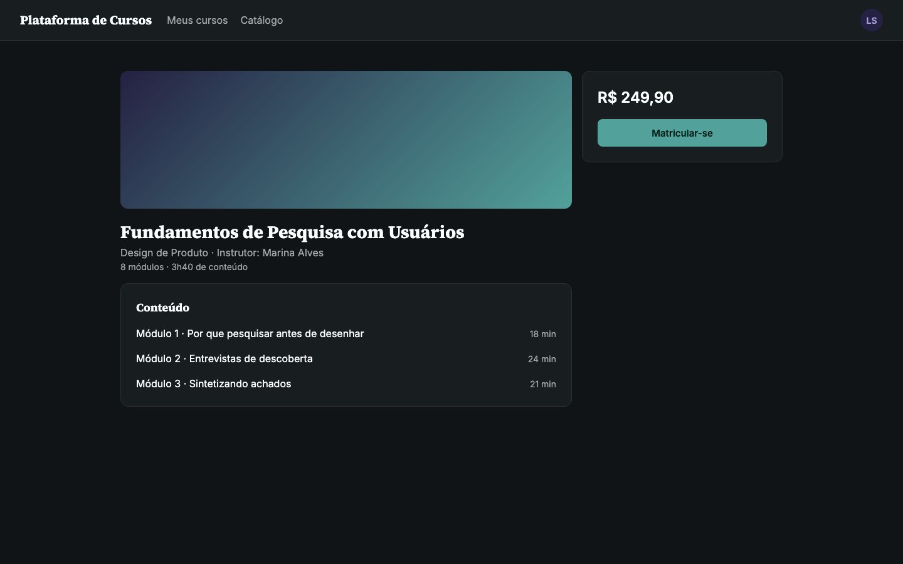

  *Figura 0 – UC003, fluxo básico: página do curso com botão Matricular-se*

  

  *Figura 0 – UC003, fluxo básico: processando pagamento simulado*

  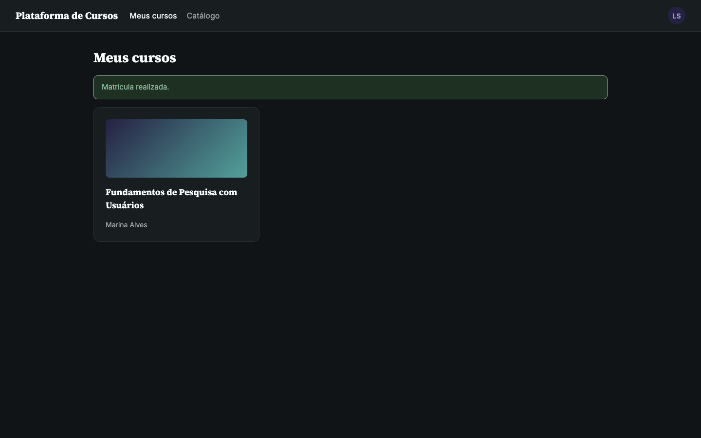

  *Figura 0 – UC003, fluxo básico: meus cursos do aluno após matrícula*
- **Fluxos alternativos:**
  - **A1 – O Aluno já está matriculado no curso**
    - A-1.1 O sistema identifica matrícula existente do Aluno para esse curso.
    - A-1.2 O sistema exibe o botão “Continuar assistindo” no lugar de “Matricular-se”.
    - A-1.3 Este caso de uso é finalizado.

    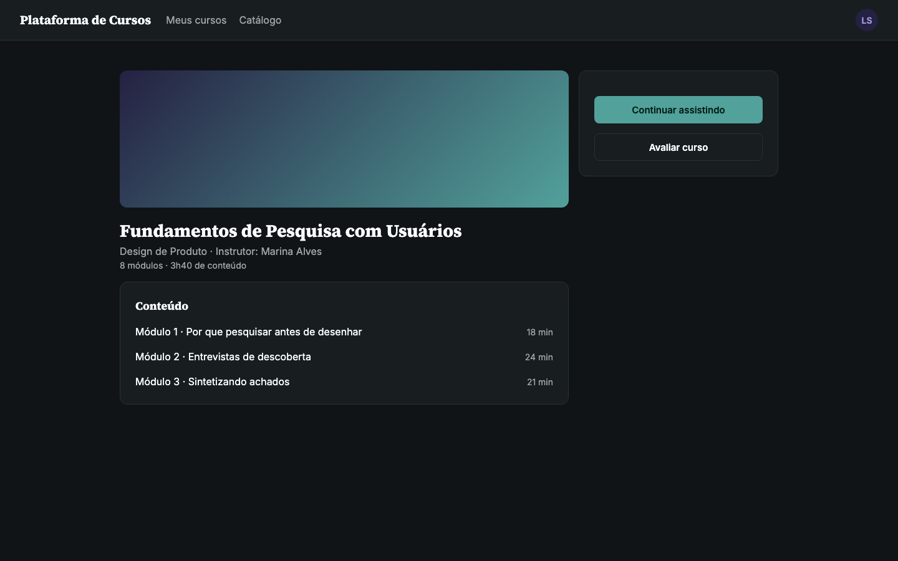

    *Figura 0 – UC003, fluxo alternativo A1: aluno matriculado: Continuar assistindo*
  - **A2 – O curso é gratuito**
    - A-2.1 O sistema identifica que o curso não tem preço definido.
    - A-2.2 O sistema não executa o pagamento simulado.
    - A-2.3 Este caso de uso retorna ao fluxo básico (passo 4).

    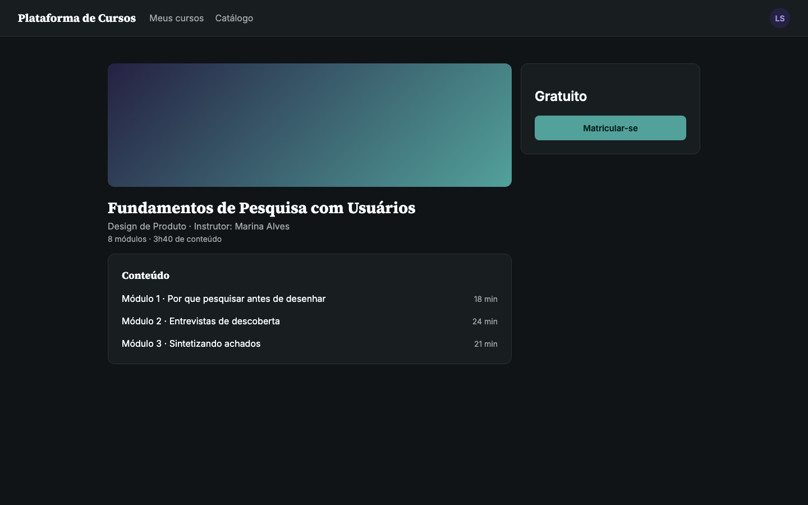

    *Figura 0 – UC003, fluxo alternativo A2: curso gratuito: matrícula sem preço*
- **Fluxos de exceção:**
  - **E1 – Curso despublicado durante a matrícula**
    - E-1.1 O sistema verifica que o curso deixou de estar publicado.
    - E-1.2 O sistema informa que o curso não está mais disponível e não registra a matrícula.
    - E-1.3 Este caso de uso é finalizado.

    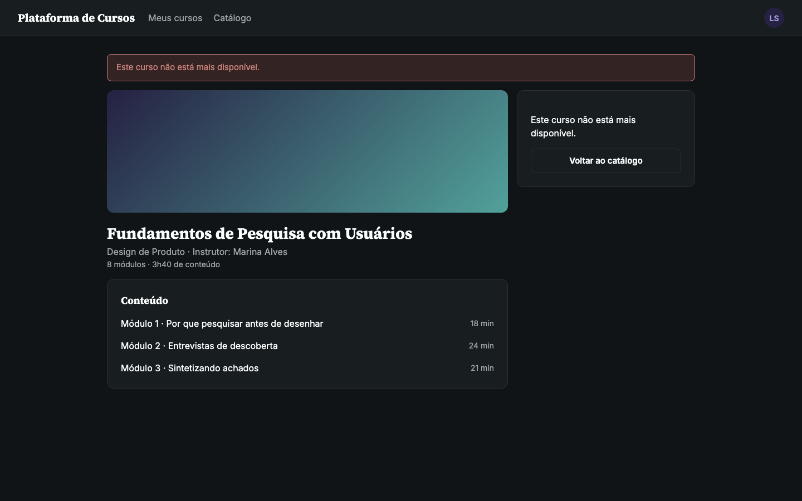

    *Figura 0 – UC003, fluxo de exceção E1: curso indisponível: aviso e sem matrícula*
  - **E2 – Pagamento simulado recusado**
    - E-2.1 O sistema identifica falha no processamento do pagamento simulado.
    - E-2.2 O sistema informa o erro ao Aluno e não registra a matrícula.
    - E-2.3 Este caso de uso retorna ao fluxo básico (passo 2).

    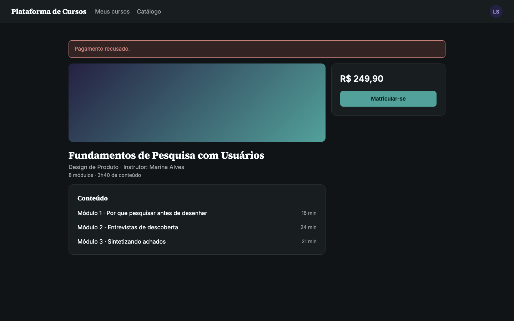

    *Figura 0 – UC003, fluxo de exceção E2: pagamento recusado: aviso e nova tentativa*

## UC009 – Assistir Aula

- **Nome do caso de uso:** Assistir Aula
- **Ator(es):** Aluno.
- **Descrição:** o Aluno reproduz o vídeo de uma aula do curso em que está matriculado, com o progresso registrado automaticamente, e pode abrir o chat com o Tutor de IA a qualquer momento (US008, US009, RF006). UC001 «extend» UC009.
- **Pré-condições:** o Aluno ter realizado login na plataforma; a aula estar cadastrada com vídeo.
- **Pós-condições:** progresso de visualização do Aluno atualizado; aula marcada como concluída quando o vídeo termina.
- **Regras de negócio:** R-1 só o Aluno matriculado assiste às aulas do curso, exceto as aulas marcadas como prévia, que podem ser assistidas sem matrícula; R-2 o progresso é salvo em segundos assistidos, e não só como concluído ou não concluído; R-3 o ponto salvo é o mesmo em qualquer dispositivo.
- **Protótipo(s) de tela:** mesma tela do UC001: reprodução da videoaula com o chat do Tutor de IA na lateral. As telas de cada fluxo aparecem junto ao fluxo, abaixo.
- **Fluxo básico:**
  1. O Aluno acessa a aula dentro do curso. (A-2) (E-1)
  2. O sistema reproduz o vídeo da aula. (E-2)
  3. O Aluno assiste ao vídeo até o fim. (A-1) (A-3)
  4. O sistema marca a aula como concluída e atualiza o progresso do Aluno no curso.
  5. Este caso de uso é finalizado.

  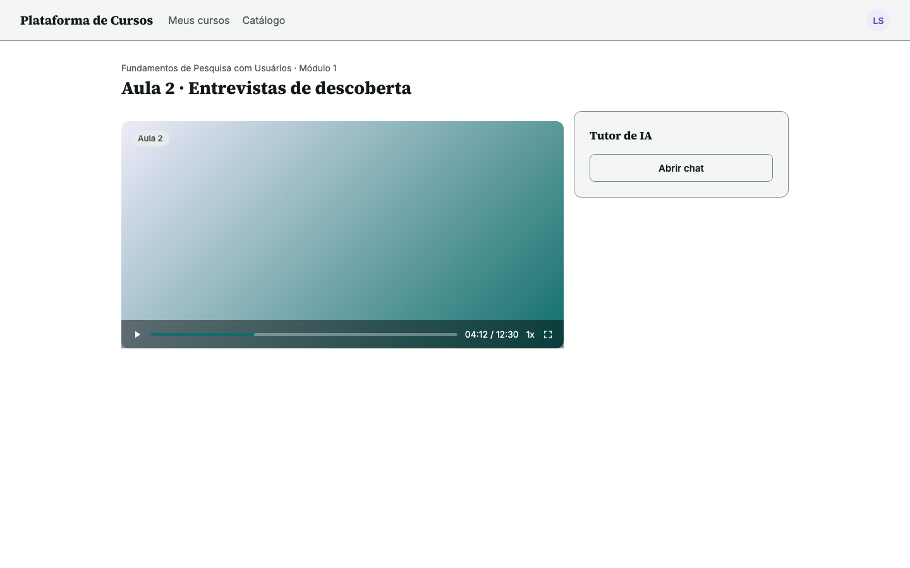

  *Figura 0 – UC009, fluxo básico: aula com vídeo e Tutor de IA fechado*

  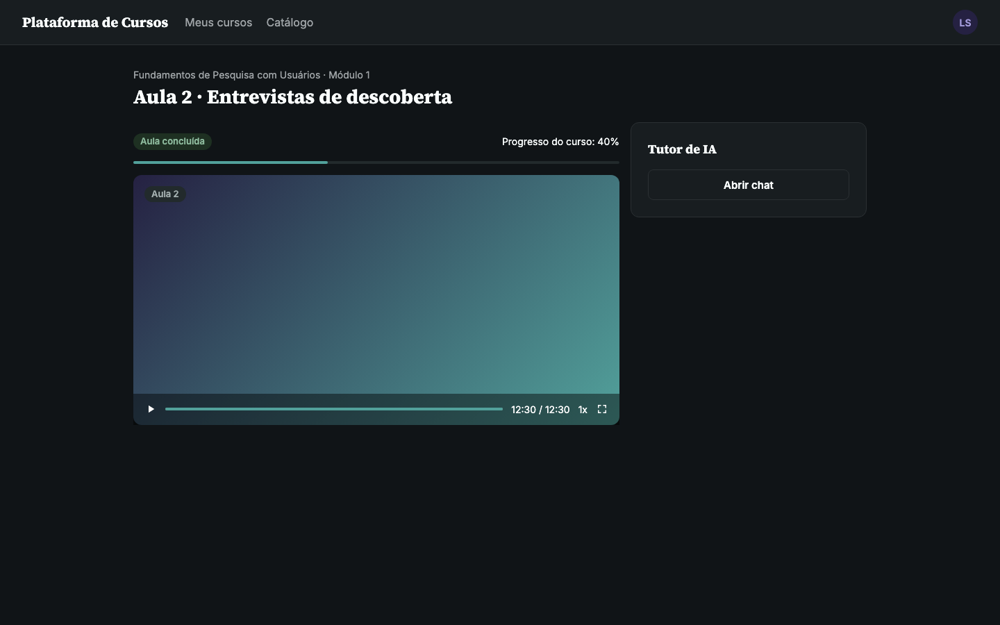

  *Figura 0 – UC009, fluxo básico: aula concluída*
- **Fluxos alternativos:**
  - **A1 – O Aluno sai da aula antes do fim**
    - A-1.1 O Aluno sai da tela antes de o vídeo terminar.
    - A-1.2 O sistema salva os segundos assistidos até aquele ponto.
    - A-1.3 Este caso de uso é finalizado.
  - **A2 – O Aluno retoma uma aula já iniciada**
    - A-2.1 O Aluno acessa novamente uma aula que já tinha assistido parcialmente.
    - A-2.2 O sistema inicia a reprodução a partir do ponto salvo anteriormente.
    - A-2.3 Este caso de uso retorna ao fluxo básico (passo 3).

    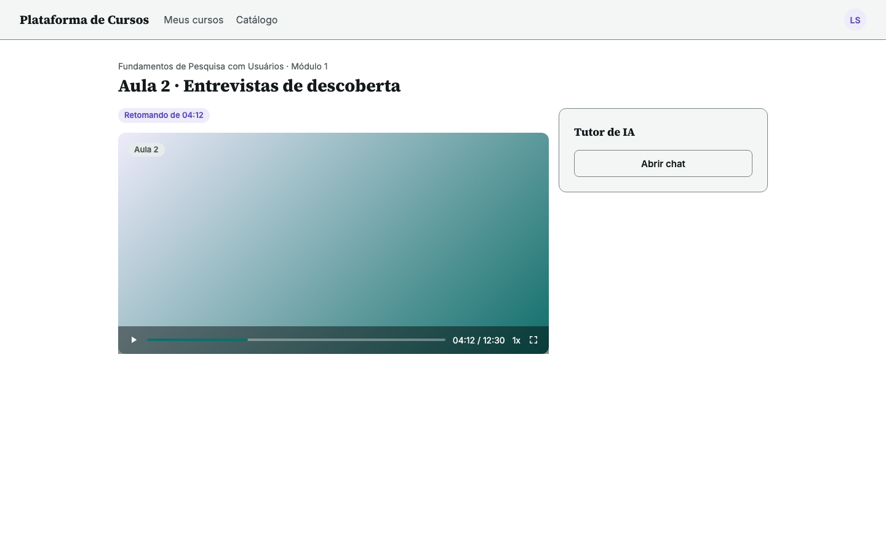

    *Figura 0 – UC009, fluxo alternativo A2: aula retomada do ponto salvo*
  - **A3 – O Aluno tem dúvida sobre a aula**
    - A-3.1 O Aluno aciona o chat do Tutor de IA durante a aula.
    - A-3.2 O caso de uso UC001 (Conversar com Tutor de IA) é iniciado.
    - A-3.3 Este caso de uso retorna ao fluxo básico (passo 3).

    

    *Figura 0 – UC009, fluxo alternativo A3: abrir chat: mesma tela do UC001 chat*
- **Fluxos de exceção:**
  - **E1 – Aula indisponível (sem matrícula e sem prévia)**
    - E-1.1 O sistema identifica que o Aluno não está matriculado no curso e a aula não é prévia.
    - E-1.2 O sistema bloqueia o acesso e sugere a matrícula no curso (UC003).
    - E-1.3 Este caso de uso é finalizado.

    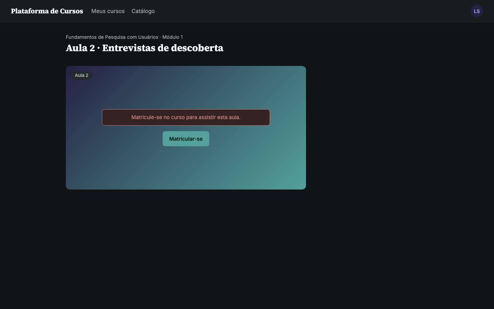

    *Figura 0 – UC009, fluxo de exceção E1: aula bloqueada: matricule-se para assistir*
  - **E2 – Falha ao carregar o vídeo**
    - E-2.1 O sistema identifica falha na entrega do vídeo da aula.
    - E-2.2 O sistema exibe o erro e oferece a opção de tentar carregar novamente.
    - E-2.3 Este caso de uso é finalizado.

    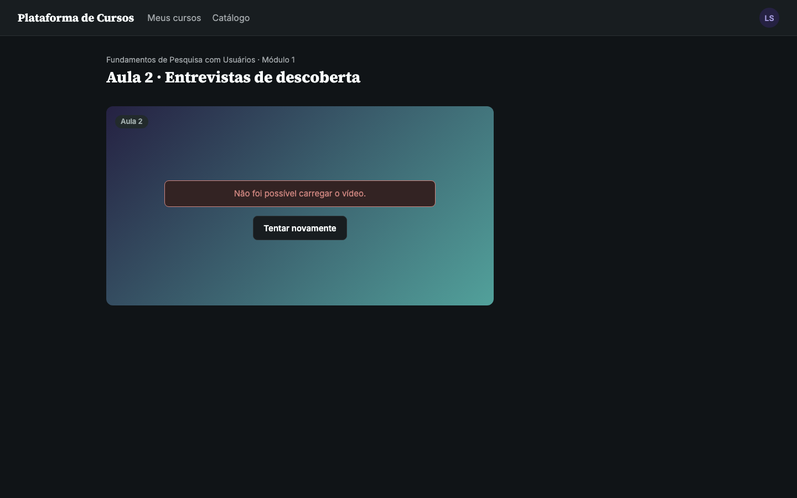

    *Figura 0 – UC009, fluxo de exceção E2: erro ao carregar o vídeo*

## UC002 – Responder Quiz

- **Nome do caso de uso:** Responder Quiz
- **Ator(es):** Aluno.
- **Descrição:** o Aluno responde às questões do quiz de um módulo e recebe a nota calculada automaticamente com base no gabarito (US011, RF008).
- **Pré-condições:** o Aluno ter realizado login e estar matriculado no curso; o Aluno ter concluído as aulas do módulo; o quiz do módulo estar cadastrado com gabarito (UC004).
- **Pós-condições:** respostas do Aluno e nota calculada salvas no seu progresso; resultado disponível para consulta posterior.
- **Regras de negócio:** R-1 o envio só é aceito com todas as questões respondidas; R-2 a nota é calculada automaticamente comparando as respostas do Aluno com o gabarito; R-3 o Aluno só pode refazer o quiz se o Instrutor permitir.
- **Protótipo(s) de tela:** tela de quiz com questões de múltipla escolha e botão de envio. As telas de cada fluxo aparecem junto ao fluxo, abaixo.
- **Fluxo básico:**
  1. O Aluno acessa o quiz do módulo. (A-1)
  2. O Aluno responde às questões do quiz. (A-2)
  3. O Aluno aciona “Enviar respostas”.
  4. O sistema compara as respostas com o gabarito e calcula a nota. (E-1) (E-2)
  5. O sistema exibe o resultado ao Aluno e salva o progresso.
  6. Este caso de uso é finalizado.

  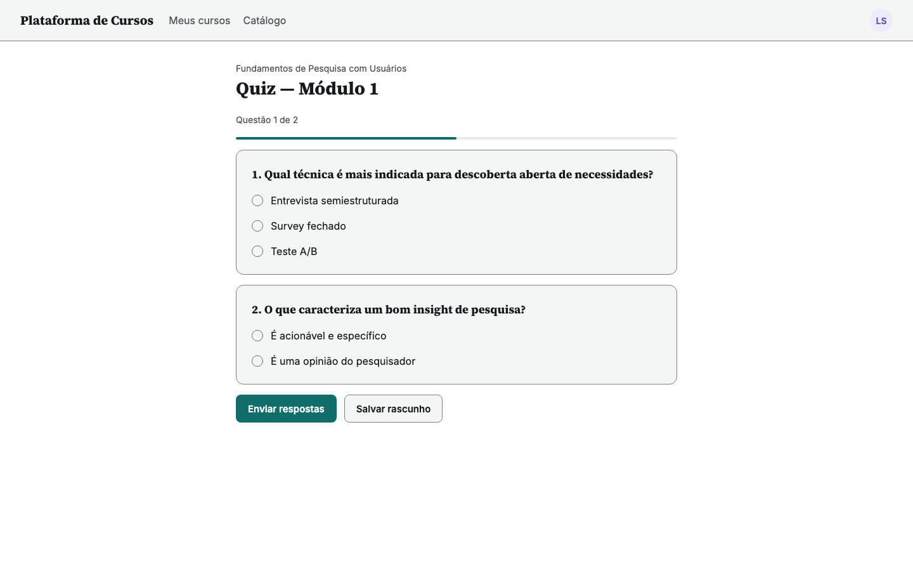

  *Figura 0 – UC002, fluxo básico: quiz sem respostas*

  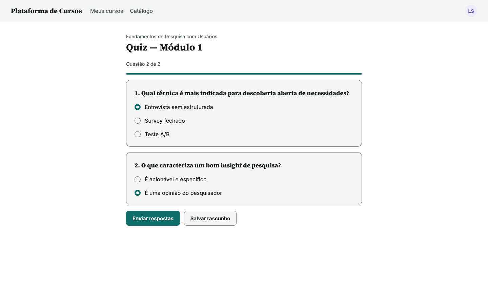

  *Figura 0 – UC002, fluxo básico: quiz com respostas preenchidas*

  

  *Figura 0 – UC002, fluxo básico: resultado do quiz com nota e gabarito*
- **Fluxos alternativos:**
  - **A1 – O Aluno acessa um quiz já respondido**
    - A-1.1 O sistema identifica que já existe um envio anterior do Aluno para esse quiz.
    - A-1.2 O sistema exibe o resultado salvo; se o Instrutor permitir refazer, oferece a opção de novo envio.
    - A-1.3 Este caso de uso é finalizado, ou retorna ao fluxo básico (passo 2) se o Aluno escolher refazer.

    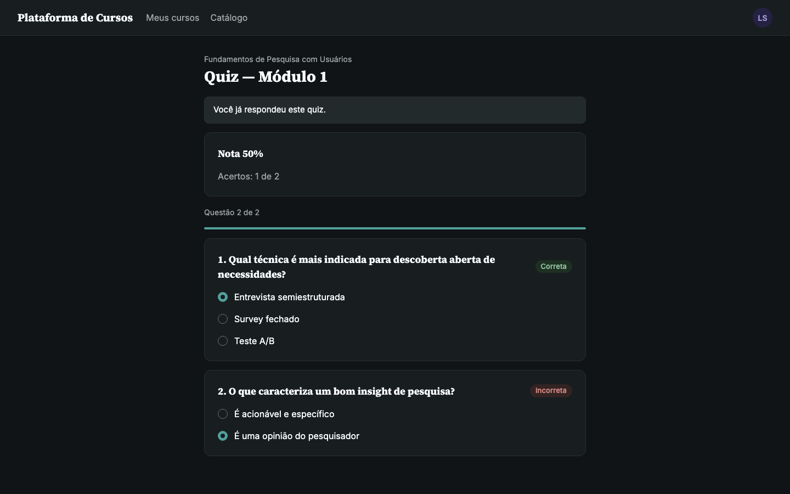

    *Figura 0 – UC002, fluxo alternativo A1: resultado salvo*

    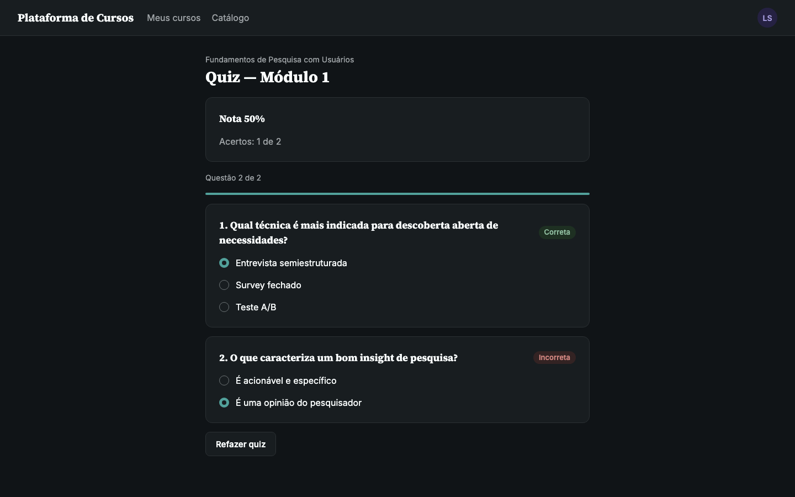

    *Figura 0 – UC002, fluxo alternativo A1: resultado salvo com opção de refazer*
  - **A2 – O Aluno salva um rascunho e retoma depois**
    - A-2.1 O Aluno aciona “Salvar rascunho” antes de enviar todas as respostas.
    - A-2.2 O sistema salva as respostas parciais vinculadas ao Aluno e ao quiz.
    - A-2.3 Este caso de uso retorna ao fluxo básico (passo 2) na próxima vez que o Aluno acessar o quiz.

    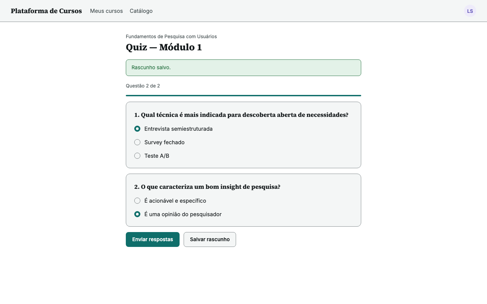

    *Figura 0 – UC002, fluxo alternativo A2: rascunho salvo do quiz*
- **Fluxos de exceção:**
  - **E1 – Envio sem todas as questões respondidas**
    - E-1.1 O sistema identifica questões sem resposta.
    - E-1.2 O sistema bloqueia o envio e indica as questões pendentes.
    - E-1.3 Este caso de uso retorna ao fluxo básico (passo 2).

    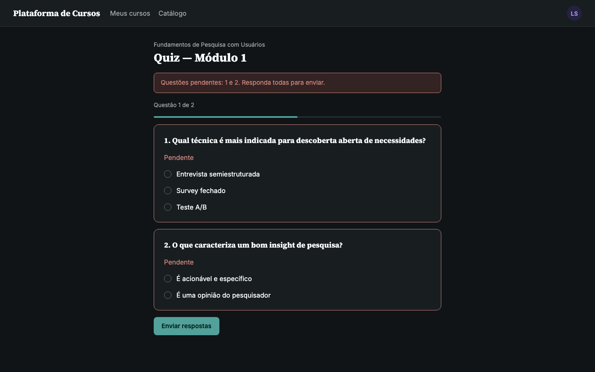

    *Figura 0 – UC002, fluxo de exceção E1: questões pendentes impedem o envio*
  - **E2 – Falha ao calcular a nota (gabarito incompleto)**
    - E-2.1 O sistema identifica que o quiz não tem gabarito completo cadastrado.
    - E-2.2 O sistema informa o erro ao Aluno e registra a falha para o Instrutor responsável.
    - E-2.3 Este caso de uso é finalizado.

    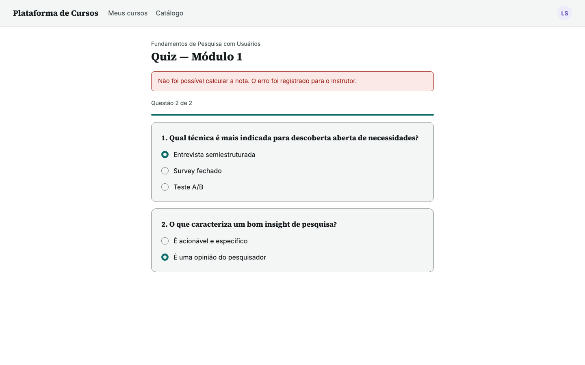

    *Figura 0 – UC002, fluxo de exceção E2: gabarito incompleto: nota não calculada*

## UC010 – Avaliar Curso

- **Nome do caso de uso:** Avaliar Curso
- **Ator(es):** Aluno.
- **Descrição:** o Aluno avalia um curso em que está matriculado com nota de 1 a 5 e comentário opcional (US014, RF011).
- **Pré-condições:** o Aluno ter realizado login e estar matriculado no curso.
- **Pós-condições:** avaliação salva e visível na página do curso; nota média do curso recalculada.
- **Regras de negócio:** R-1 o Aluno precisa ter concluído ao menos uma aula do curso para avaliá-lo; R-2 cada Aluno tem uma única avaliação por curso, e uma nova avaliação substitui a anterior; R-3 a nota é obrigatória e o comentário é opcional.
- **Protótipo(s) de tela:** formulário na página do curso (a mesma página do UC003) com seleção de nota de 1 a 5 e campo opcional de comentário. As telas de cada fluxo aparecem junto ao fluxo, abaixo.
- **Fluxo básico:**
  1. O Aluno acessa a página do curso em que está matriculado.
  2. O Aluno aciona “Avaliar curso”. (A-1) (E-1)
  3. O Aluno informa a nota (1 a 5) e, opcionalmente, um comentário.
  4. O Aluno confirma o envio. (A-2)
  5. O sistema salva a avaliação e recalcula a nota média do curso. (E-2)
  6. Este caso de uso é finalizado.

  

  *Figura 0 – UC010, fluxo básico: avaliar curso: abrir a partir de Avaliar curso*

  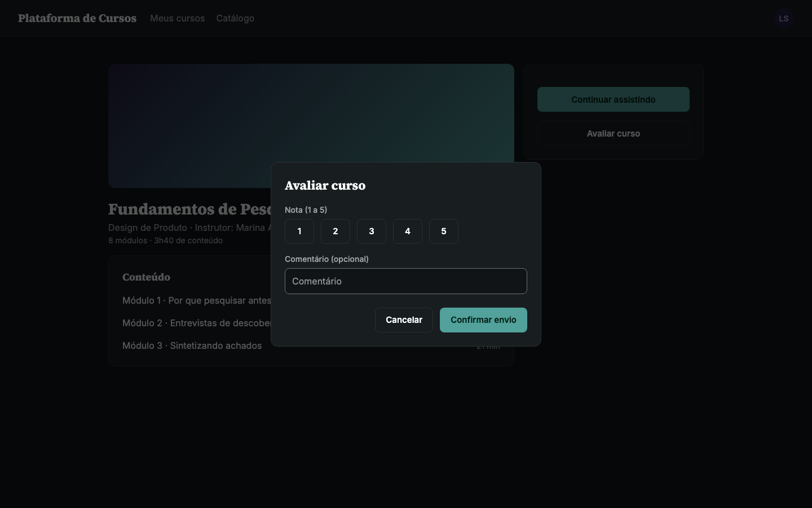

  *Figura 0 – UC010, fluxo básico: modal Avaliar curso vazio*

  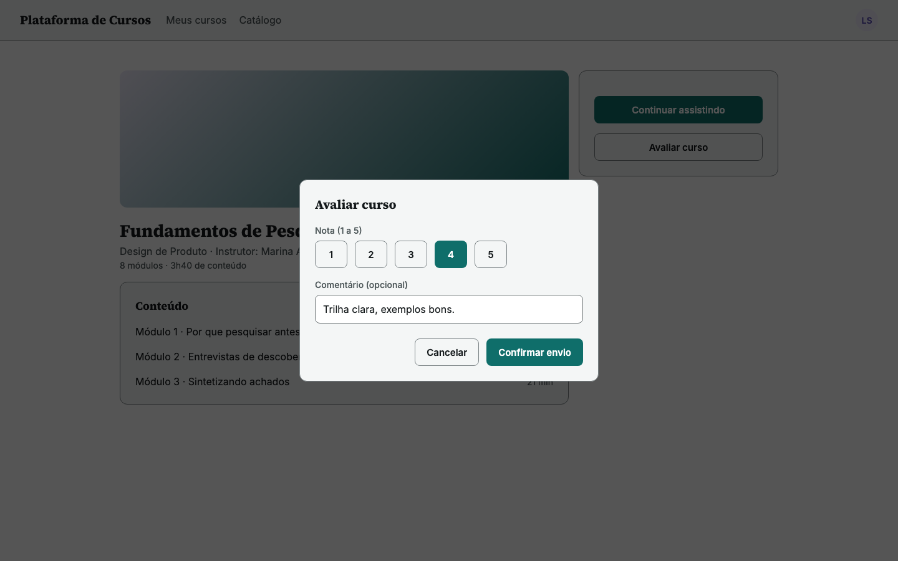

  *Figura 0 – UC010, fluxo básico: modal Avaliar curso preenchido*

  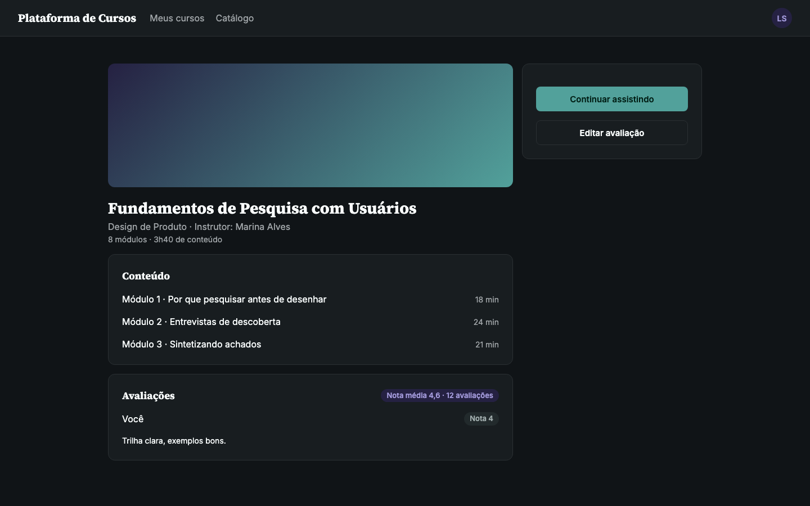

  *Figura 0 – UC010, fluxo básico: avaliação salva na página do curso*
- **Fluxos alternativos:**
  - **A1 – O Aluno já avaliou o curso antes**
    - A-1.1 O sistema identifica avaliação anterior do Aluno para esse curso.
    - A-1.2 O sistema preenche o formulário com a avaliação existente, pronta para edição.
    - A-1.3 Este caso de uso retorna ao fluxo básico (passo 3), atualizando a avaliação existente em vez de criar uma nova.

    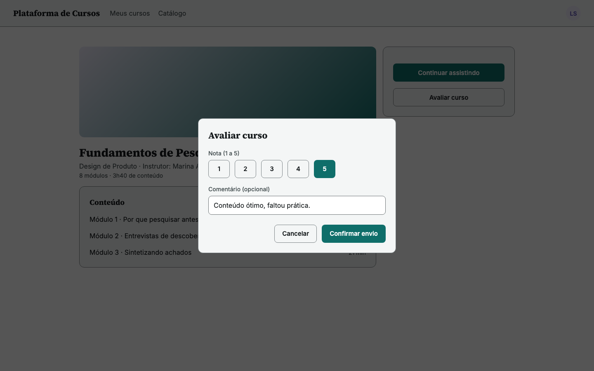

    *Figura 0 – UC010, fluxo alternativo A1: avaliação existente para editar*
  - **A2 – O Aluno cancela antes de confirmar**
    - A-2.1 O Aluno fecha o formulário de avaliação sem confirmar.
    - A-2.2 O sistema descarta as alterações e mantém a avaliação anterior, se houver.
    - A-2.3 Este caso de uso é finalizado.
- **Fluxos de exceção:**
  - **E1 – Aluno sem aula concluída**
    - E-1.1 O sistema identifica que o Aluno ainda não concluiu nenhuma aula do curso.
    - E-1.2 O sistema bloqueia a avaliação e informa que é preciso concluir ao menos uma aula.
    - E-1.3 Este caso de uso é finalizado.

    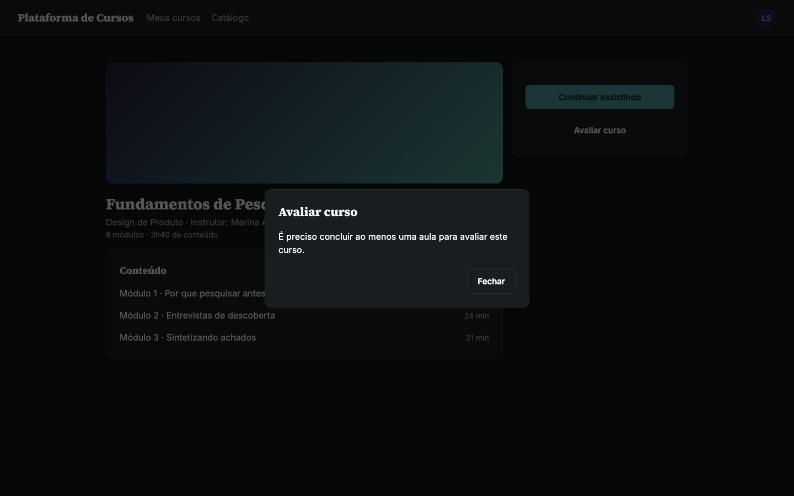

    *Figura 0 – UC010, fluxo de exceção E1: avaliação bloqueada: concluir uma aula antes*
  - **E2 – Envio sem nota selecionada**
    - E-2.1 O sistema identifica que o campo de nota não foi preenchido.
    - E-2.2 O sistema bloqueia o envio e indica que a nota é obrigatória.
    - E-2.3 Este caso de uso retorna ao fluxo básico (passo 3).

    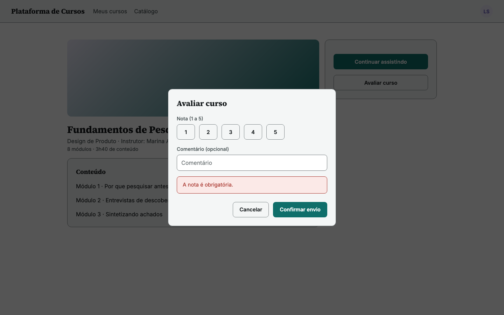

    *Figura 0 – UC010, fluxo de exceção E2: avaliação sem nota: aviso obrigatório*
