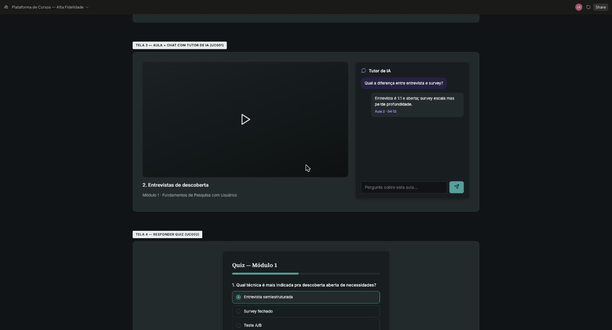
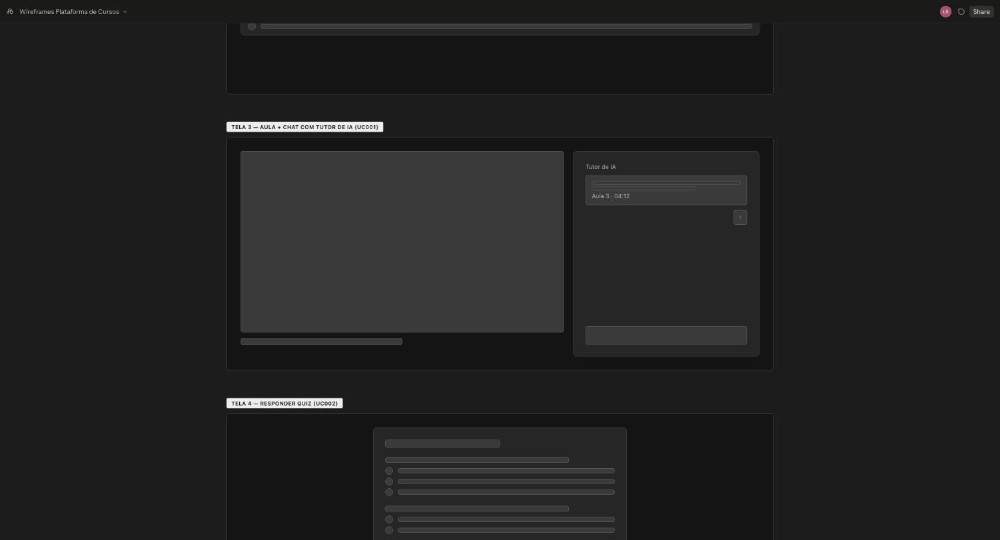
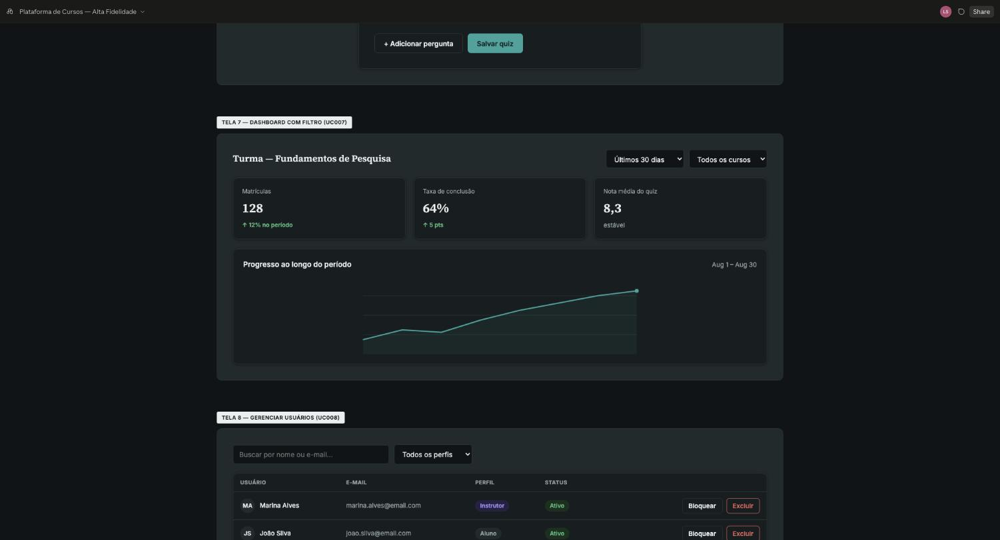
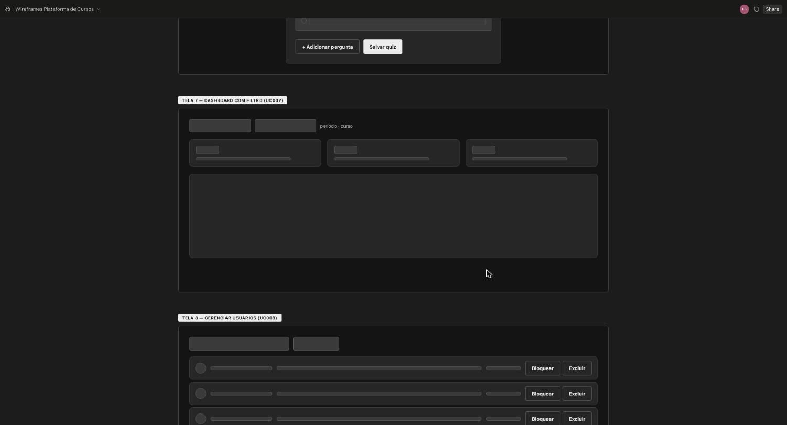
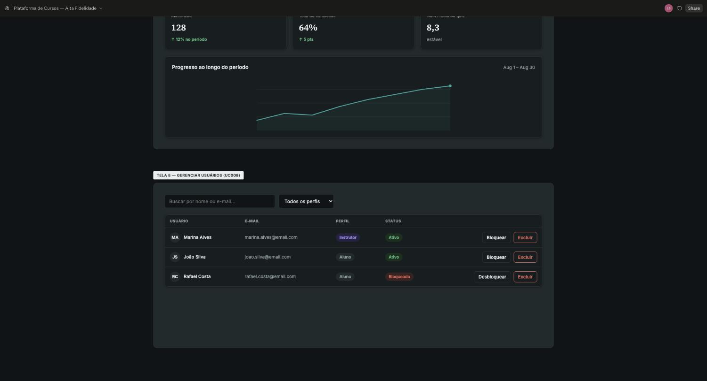
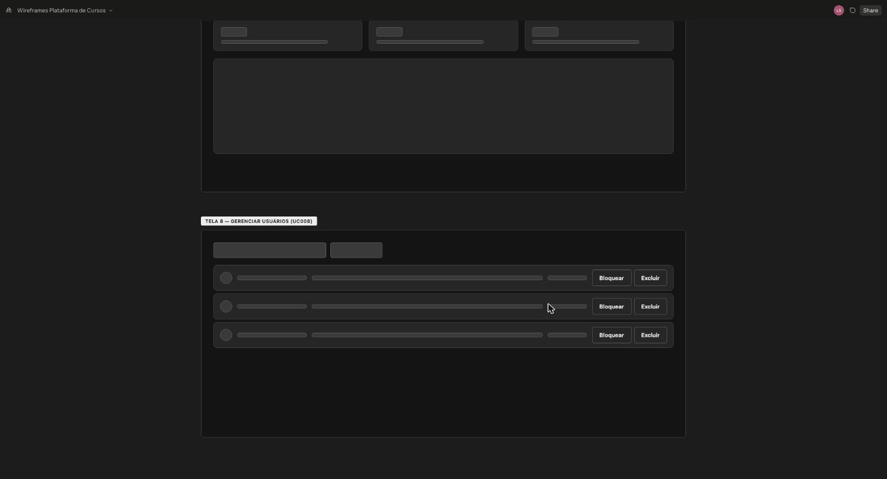

# 10 ESPECIFICAÇÕES DE CASO DE USO – ÁREA D (Tutor de IA, analytics e administração)

O template exige a especificação de, no mínimo, 8 casos de uso, com protótipos de tela de alta fidelidade e fluxos principal, alternativo e de exceção.

Área D: Tutor de IA, analytics e administração. Responsável: Vinicius Lima Teider (`Teider011`). IDs: UC-D1, UC-D2… (mínimo 4 por integrante, sem máximo). Cada RF da área deve estar coberto por algum caso de uso; um RF extra pode entrar por include/extend de um caso existente..

## UC-D1 (UC001) – Conversar com Tutor de IA

- **Nome do caso de uso:** Conversar com Tutor de IA
- **Ator(es):** Aluno (primário); Tutor de IA (ator sistêmico, secundário).
- **Descrição:** o aluno faz uma pergunta sobre o conteúdo da aula ao tutor de IA do curso e recebe resposta com citação de origem.
- **Pré-condições:** aluno autenticado e matriculado no curso; aula já transcrita e indexada (embeddings gerados).
- **Pós-condições:** mensagem e resposta ficam salvas no histórico de conversa do aluno com aquele curso.
- **Regras de negócio:** o tutor só responde com base no material do próprio curso (RAG restrito por course\_id); limite de mensagens por aluno por período (rate limit).
- **Protótipo(s) de tela:** tela de chat lateral à reprodução do vídeo, com bolha de resposta trazendo aula + timestamp de origem.

  

  

  *Figura 3 – Protótipo de tela do UC001 — Conversar com Tutor de IA*
- **Fluxo básico:**
  1. O aluno abre o chat na página da aula. (A-2)
  2. O aluno digita a pergunta e aciona “Enviar”. (A-1)
  3. O sistema busca trecho relevante (similarity search) restrito ao curso. (E-1)
  4. O sistema gera resposta citando aula e timestamp de origem. (E-2)
  5. O sistema exibe a resposta no chat e salva no histórico de conversa.
  6. Este caso de uso é finalizado.
- **Fluxos alternativos:**
  - **A1 – O aluno faz pergunta fora do escopo do curso**
    - A-1.1 O sistema identifica que a pergunta não tem correspondência no material indexado do curso.
    - A-1.2 O sistema informa que não tem essa informação no material do curso e sugere reformular a pergunta.
    - A-1.3 Este caso de uso retorna ao fluxo básico (passo 2).
  - **A2 – O aluno reabre uma conversa anterior**
    - A-2.1 O aluno acessa o histórico de conversa da aula.
    - A-2.2 O sistema carrega as mensagens anteriores no chat.
    - A-2.3 Este caso de uso retorna ao fluxo básico (passo 2).
- **Fluxos de exceção:**
  - **E1 – Aula ainda não processada (sem embeddings)**
    - E-1.1 O sistema verifica que a aula ainda não tem conteúdo indexado.
    - E-1.2 O sistema avisa que o conteúdo ainda está sendo preparado e sugere tentar novamente mais tarde.
    - E-1.3 Este caso de uso é finalizado.
  - **E2 – Limite de mensagens atingido (rate limit)**
    - E-2.1 O sistema identifica que o aluno excedeu o limite de mensagens do período.
    - E-2.2 O sistema bloqueia o novo envio e informa o tempo de espera restante.
    - E-2.3 Este caso de uso é finalizado.

## UC-D2 (UC007) – Ver Dashboard com Filtro

- **Nome do caso de uso:** Ver Dashboard com Filtro
- **Ator(es):** Instrutor, Administrador.
- **Descrição:** o instrutor consulta o dashboard de progresso e engajamento da turma, filtrando por período e curso.
- **Pré-condições:** instrutor autenticado, com pelo menos um curso e alunos matriculados.
- **Pós-condições:** dashboard exibe métricas agregadas conforme o filtro aplicado.
- **Regras de negócio:** métricas são agregadas apenas do período selecionado; instrutor só vê dados dos próprios cursos (administrador vê todos).
- **Protótipo(s) de tela:** dashboard com gráficos, seletor de intervalo de datas e filtro por curso.

  

  

  *Figura 9 – Protótipo de tela do UC007 — Ver Dashboard com Filtro*
- **Fluxo básico:**
  1. O instrutor (ou administrador) acessa o dashboard.
  2. O usuário seleciona um intervalo de datas.
  3. O usuário opcionalmente filtra por curso. (A-1) (A-2)
  4. O sistema agrega o progresso e o engajamento do período selecionado. (E-1) (E-2)
  5. O sistema exibe os gráficos atualizados no dashboard.
  6. Este caso de uso é finalizado.
- **Fluxos alternativos:**
  - **A1 – O instrutor filtra por um curso específico**
    - A-1.1 O instrutor seleciona um curso no filtro (restrito aos seus próprios cursos).
    - A-1.2 O sistema restringe a agregação aos dados desse curso.
    - A-1.3 Este caso de uso retorna ao fluxo básico (passo 4).
  - **A2 – O administrador visualiza todos os cursos**
    - A-2.1 O administrador acessa o dashboard sem restrição de instrutor.
    - A-2.2 O sistema agrega dados de todos os cursos da plataforma no período.
    - A-2.3 Este caso de uso retorna ao fluxo básico (passo 4).
- **Fluxos de exceção:**
  - **E1 – Intervalo de datas inválido**
    - E-1.1 O sistema identifica data final anterior à data inicial.
    - E-1.2 O sistema exibe mensagem de erro e mantém o último intervalo válido selecionado.
    - E-1.3 Este caso de uso retorna ao fluxo básico (passo 2).
  - **E2 – Nenhum aluno com atividade no período selecionado**
    - E-2.1 O sistema identifica ausência de dados de progresso/engajamento no período.
    - E-2.2 O sistema exibe um estado vazio claro, sem erro.
    - E-2.3 Este caso de uso é finalizado.

## UC-D3 (UC008) – Gerenciar Usuários

- **Nome do caso de uso:** Gerenciar Usuários
- **Ator(es):** Administrador.
- **Descrição:** o administrador consulta e gerencia o status dos usuários da plataforma (bloqueio, exclusão).
- **Pré-condições:** administrador autenticado.
- **Pós-condições:** status do usuário atualizado é aplicado imediatamente, revogando ou restaurando o acesso.
- **Regras de negócio:** administrador não pode bloquear a própria conta; exclusão de usuário remove dados pessoais mas mantém o histórico de matrícula/pagamento anonimizado.
- **Protótipo(s) de tela:** lista de usuários com busca, filtro por perfil e ações de bloquear/excluir.

  

  

  *Figura 10 – Protótipo de tela do UC008 — Gerenciar Usuários*
- **Fluxo básico:**
  1. O administrador busca um usuário (por nome, e-mail ou perfil). (A-1)
  2. O administrador seleciona a ação (bloquear/desbloquear/excluir).
  3. O administrador confirma a ação. (A-2)
  4. O sistema aplica a mudança de status. (E-1) (E-2)
  5. O acesso do usuário é revogado ou restaurado imediatamente.
  6. Este caso de uso é finalizado.
- **Fluxos alternativos:**
  - **A1 – O administrador filtra a lista por perfil**
    - A-1.1 O administrador seleciona um perfil (aluno/instrutor/admin) no filtro.
    - A-1.2 O sistema exibe somente os usuários daquele perfil.
    - A-1.3 Este caso de uso retorna ao fluxo básico (passo 1).
  - **A2 – O administrador cancela a ação na confirmação**
    - A-2.1 O administrador aciona “Cancelar” na tela de confirmação.
    - A-2.2 O sistema descarta a ação selecionada, sem alterar o status do usuário.
    - A-2.3 Este caso de uso retorna ao fluxo básico (passo 1).
- **Fluxos de exceção:**
  - **E1 – Tentativa de bloquear a própria conta admin**
    - E-1.1 O sistema identifica que o usuário-alvo é a própria conta do administrador logado.
    - E-1.2 O sistema impede a ação e exibe um aviso.
    - E-1.3 Este caso de uso retorna ao fluxo básico (passo 1).
  - **E2 – Usuário-alvo já foi removido por outro administrador**
    - E-2.1 O sistema identifica que o usuário-alvo não existe mais na base de dados.
    - E-2.2 O sistema informa que o usuário não foi encontrado e atualiza a lista.
    - E-2.3 Este caso de uso retorna ao fluxo básico (passo 1).

## UC-D4 (UC016) – Acessar Área Protegida por Perfil

- **Nome do caso de uso:** Acessar Área Protegida por Perfil
- **Ator(es):** Aluno, Instrutor, Administrador.
- **Descrição:** o usuário acessa uma área da plataforma e o sistema libera ou nega o acesso conforme o token e o perfil do usuário (US015, RF012).
- **Pré-condições:** o usuário ter solicitado o acesso a uma área restrita da plataforma.
- **Pós-condições:** área exibida se o perfil for compatível; caso contrário, acesso negado e registrado em auditoria.
- **Regras de negócio:** R-1 os perfis são aluno, instrutor e administrador; R-2 100% das rotas protegidas verificam o perfil (RNF001); R-3 toda negação de acesso é registrada na trilha de auditoria (RNF016).
- **Protótipo(s) de tela:** sem tela própria; usa as telas de login (UC005) e a página inicial de cada perfil, além de uma mensagem de acesso negado. Imagem do protótipo pendente.
- **Fluxo básico:**
  1. O usuário acessa uma área da plataforma. (A-1)
  2. O sistema valida o token de autenticação do usuário. (E-1)
  3. O sistema verifica se o perfil do usuário é o exigido pela área. (E-2)
  4. O sistema exibe a área solicitada.
  5. Este caso de uso é finalizado.
- **Fluxos alternativos:**
  - **A1 – O usuário acessa após o login**
    - A-1.1 O usuário conclui o login (UC005).
    - A-1.2 O sistema direciona o usuário à página inicial do seu perfil.
    - A-1.3 Este caso de uso retorna ao fluxo básico (passo 4).
- **Fluxos de exceção:**
  - **E1 – Token ausente ou expirado**
    - E-1.1 O sistema identifica que o token está ausente ou expirado.
    - E-1.2 O sistema redireciona o usuário ao login (UC005).
    - E-1.3 Este caso de uso é finalizado.
  - **E2 – Perfil sem permissão**
    - E-2.1 O sistema identifica que o perfil do usuário não é o exigido pela área.
    - E-2.2 O sistema nega o acesso, informa a restrição e registra a tentativa na trilha de auditoria.
    - E-2.3 Este caso de uso é finalizado.

## Analytics (Sprint 4)

Objetivo: dar a instrutores e administradores uma visão gerencial do progresso e do engajamento da turma, permitindo identificar quais alunos estão avançando e quais estão parados, e comparar esse comportamento entre períodos para decidir ajustes no curso (US013).

Dados coletados para análise de séries temporais (ETL): eventos de progresso de aula assistida (RF006 — cada avanço/conclusão de aula é registrado com timestamp) e eventos de matrícula (RF005 — timestamp de quando o aluno se matriculou no curso). Esses eventos são agregados por período (dia/semana/mês) para compor as métricas de engajamento e conclusão exibidas no dashboard, permitindo identificar tendências (queda ou crescimento de engajamento ao longo do tempo) e comparar intervalos diferentes.

Protótipo do painel de controle: ver Figura 9 — dashboard com gráficos de progresso/engajamento, seletor de intervalo de datas e filtro por curso, restrito aos cursos do próprio instrutor (administrador vê todos).
