## UC001 – Conversar com Tutor de IA

- **Nome do caso de uso:** Conversar com Tutor de IA
- **Ator(es):** Aluno (primário); Tutor de IA (ator sistêmico, secundário).
- **Descrição:** o Aluno faz uma pergunta sobre o conteúdo da aula ao Tutor de IA do curso e recebe uma resposta que cita a origem no material (US012, RF009). Iniciado a partir do UC009 (Assistir Aula), fluxo alternativo A3: UC001 «extend» UC009 (a seta sai do UC001 e aponta para o UC009).
- **Pré-condições:** o Aluno ter realizado login e estar matriculado no curso; a aula já ter sido transcrita e indexada.
- **Pós-condições:** pergunta e resposta salvas no histórico de conversa do Aluno com aquele curso.
- **Regras de negócio:** R-1 o Tutor de IA só responde com base no material do próprio curso; R-2 cada Aluno tem um limite de mensagens por período.
- **Protótipo(s) de tela:** chat na lateral da reprodução do vídeo, com a resposta indicando a aula e o minuto do vídeo de origem. As telas de cada fluxo aparecem junto ao fluxo, abaixo.
- **Fluxo básico:**
  1. O Aluno abre o chat na página da aula. (A-2)
  2. O Aluno digita a pergunta e aciona “Enviar”. (E-2)
  3. O Tutor de IA busca os trechos do material do curso relacionados à pergunta. (A-1) (E-1)
  4. O Tutor de IA gera a resposta citando a aula e o minuto do vídeo de origem.
  5. O sistema exibe a resposta no chat e a salva no histórico de conversa.
  6. Este caso de uso é finalizado.

  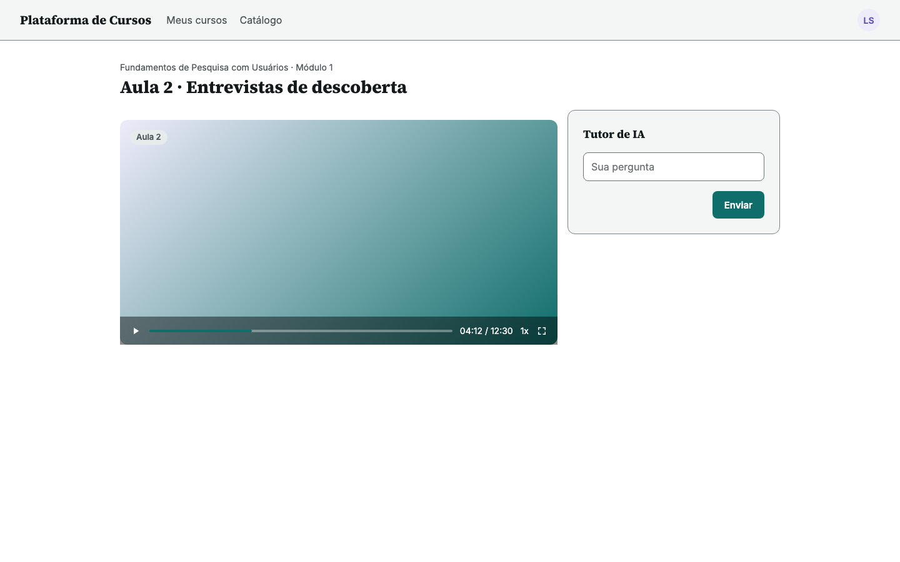

  *Figura 0 – UC001, fluxo básico: tutor de IA aberto e vazio*

  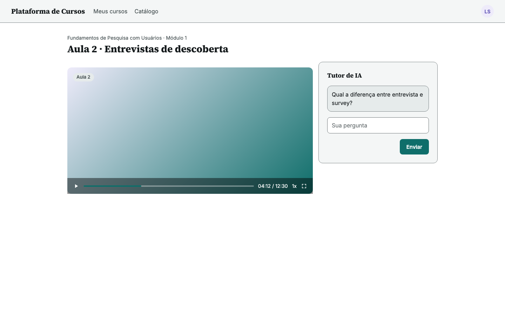

  *Figura 0 – UC001, fluxo básico: pergunta enviada ao Tutor de IA*

  

  *Figura 0 – UC001, fluxo básico: resposta do Tutor de IA*
- **Fluxos alternativos:**
  - **A1 – O Aluno faz pergunta fora do escopo do curso**
    - A-1.1 O Tutor de IA não encontra correspondência para a pergunta no material do curso.
    - A-1.2 O Tutor de IA informa que não tem essa informação no material do curso e sugere reformular a pergunta.
    - A-1.3 Este caso de uso retorna ao fluxo básico (passo 2).

    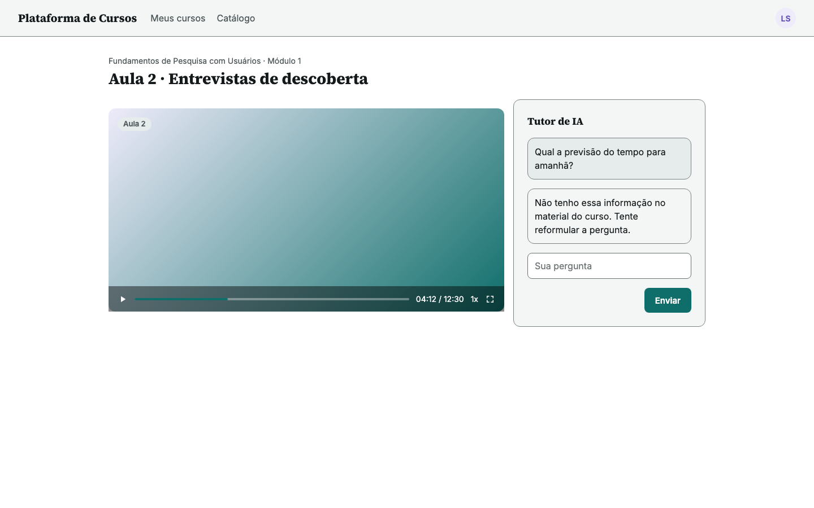

    *Figura 0 – UC001, fluxo alternativo A1: tutor sem informação no material*
  - **A2 – O Aluno reabre uma conversa anterior**
    - A-2.1 O Aluno acessa o histórico de conversa da aula.
    - A-2.2 O sistema carrega as mensagens anteriores no chat.
    - A-2.3 Este caso de uso retorna ao fluxo básico (passo 2).

    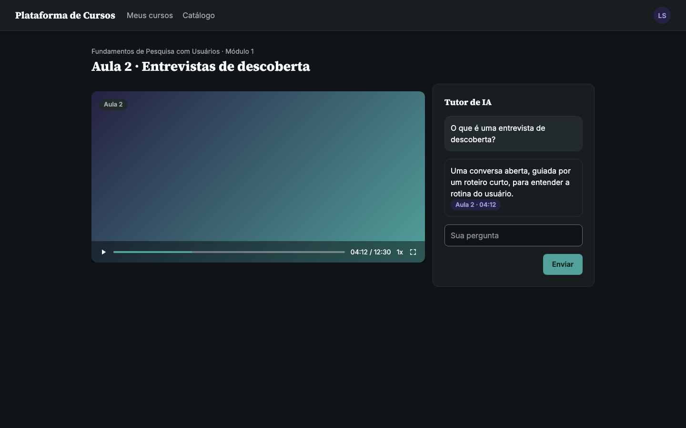

    *Figura 0 – UC001, fluxo alternativo A2: histórico de perguntas no chat*
- **Fluxos de exceção:**
  - **E1 – Aula ainda não processada**
    - E-1.1 O sistema verifica que a aula ainda não foi transcrita e indexada.
    - E-1.2 O sistema avisa que o conteúdo ainda está sendo preparado e sugere tentar novamente mais tarde.
    - E-1.3 Este caso de uso é finalizado.

    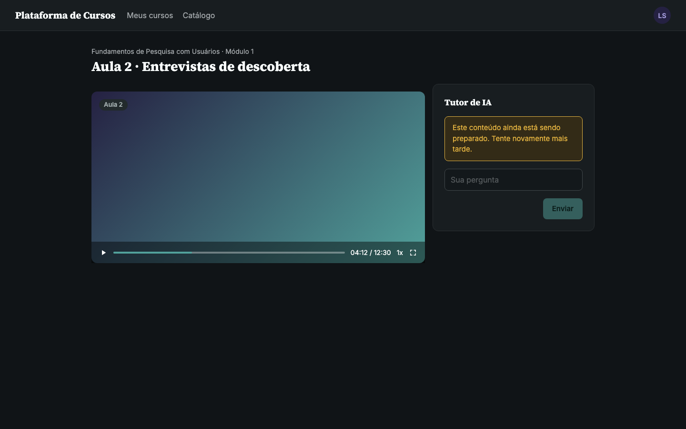

    *Figura 0 – UC001, fluxo de exceção E1: conteúdo em preparo*
  - **E2 – Limite de mensagens atingido**
    - E-2.1 O sistema identifica que o Aluno excedeu o limite de mensagens do período.
    - E-2.2 O sistema bloqueia o novo envio e informa o tempo de espera restante.
    - E-2.3 Este caso de uso é finalizado.

    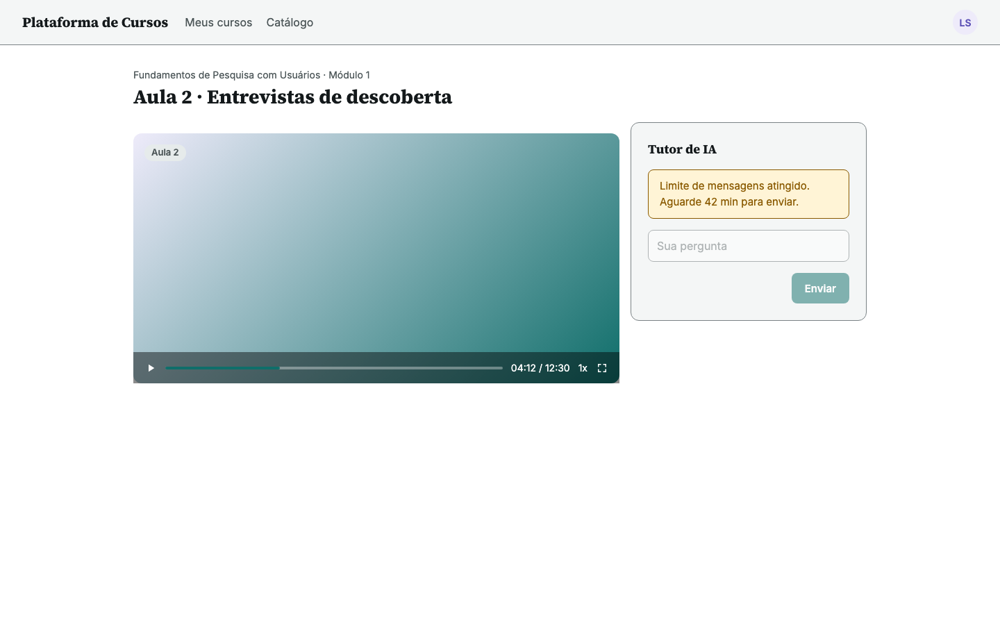

    *Figura 0 – UC001, fluxo de exceção E2: limite de mensagens atingido*

## UC007 – Ver Dashboard com Filtro

- **Nome do caso de uso:** Ver Dashboard com Filtro
- **Ator(es):** Instrutor, Administrador.
- **Descrição:** o Instrutor ou o Administrador consulta o dashboard de progresso e engajamento dos alunos, filtrando por período e por curso, para identificar quem está avançando e quem está parado e comparar períodos (US013, RF010).
- **Pré-condições:** o Instrutor ou o Administrador ter realizado login; existir ao menos um curso com alunos matriculados.
- **Pós-condições:** dashboard exibe as métricas agregadas conforme o filtro aplicado.
- **Regras de negócio:** R-1 as métricas consideram apenas o período selecionado; R-2 o Instrutor só vê dados dos próprios cursos, e o Administrador vê os de todos os cursos; R-3 as métricas são calculadas a partir dos registros de progresso de aula (RF006) e de matrícula (RF005), agregados por dia, semana ou mês, o que permite ver tendências de engajamento e comparar intervalos.
- **Protótipo(s) de tela:** dashboard com gráficos de progresso e engajamento, seletor de intervalo de datas e filtro por curso. As telas de cada fluxo aparecem junto ao fluxo, abaixo.
- **Fluxo básico:**
  1. O Instrutor ou o Administrador acessa o dashboard. (A-2)
  2. O usuário seleciona um intervalo de datas. (E-1)
  3. O usuário opcionalmente filtra por curso. (A-1)
  4. O sistema agrega o progresso e o engajamento do período selecionado. (E-2)
  5. O sistema exibe os gráficos atualizados no dashboard.
  6. Este caso de uso é finalizado.

  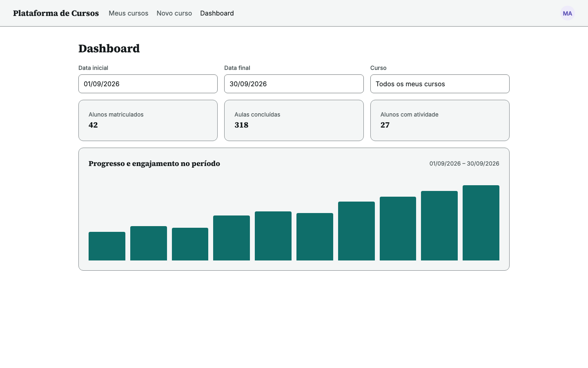

  *Figura 0 – UC007, fluxo básico: dashboard do Aluno com todos os cursos*
- **Fluxos alternativos:**
  - **A1 – O Instrutor filtra por um curso específico**
    - A-1.1 O Instrutor seleciona um dos seus cursos no filtro.
    - A-1.2 O sistema restringe a agregação aos dados desse curso.
    - A-1.3 Este caso de uso retorna ao fluxo básico (passo 4).

    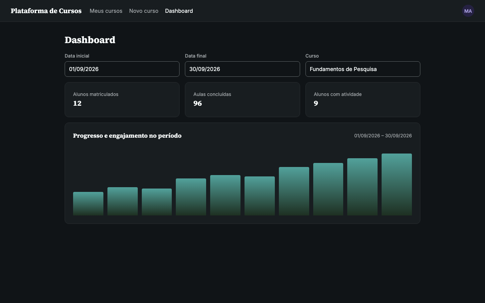

    *Figura 0 – UC007, fluxo alternativo A1: dashboard filtrado pelo curso "Fundamentos de Pesquisa"*
  - **A2 – O Administrador visualiza todos os cursos**
    - A-2.1 O Administrador acessa o dashboard sem restrição de Instrutor.
    - A-2.2 O sistema considera os dados de todos os cursos da plataforma.
    - A-2.3 Este caso de uso retorna ao fluxo básico (passo 2).

    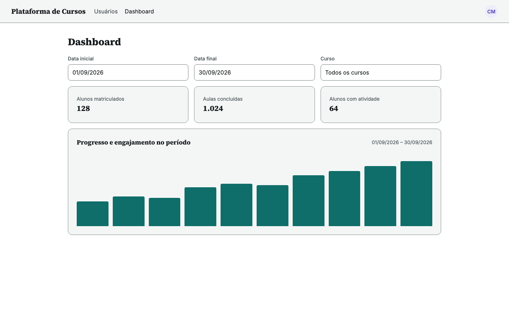

    *Figura 0 – UC007, fluxo alternativo A2: dashboard do Administrador com todos os cursos*
- **Fluxos de exceção:**
  - **E1 – Intervalo de datas inválido**
    - E-1.1 O sistema identifica data final anterior à data inicial.
    - E-1.2 O sistema exibe mensagem de erro e mantém o último intervalo válido selecionado.
    - E-1.3 Este caso de uso retorna ao fluxo básico (passo 2).

    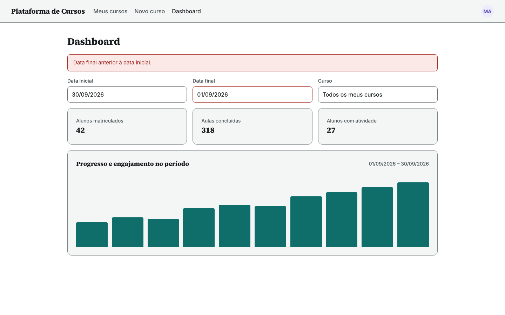

    *Figura 0 – UC007, fluxo de exceção E1: erro "Data final anterior à data inicial"*
  - **E2 – Nenhum aluno com atividade no período selecionado**
    - E-2.1 O sistema identifica ausência de dados de progresso ou engajamento no período.
    - E-2.2 O sistema exibe um aviso claro de que não há dados, sem erro.
    - E-2.3 Este caso de uso é finalizado.

    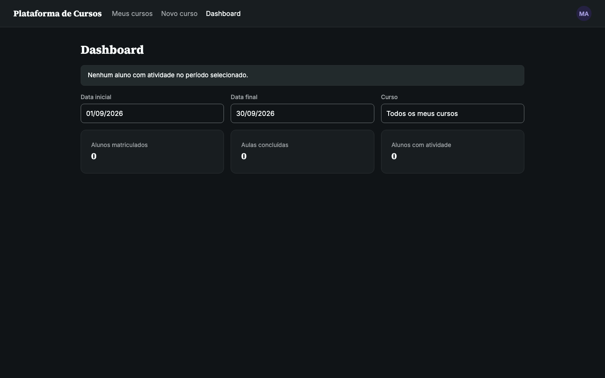

    *Figura 0 – UC007, fluxo de exceção E2: aviso "Nenhum aluno com atividade no período selecionado"*

## UC008 – Gerenciar Usuários

- **Nome do caso de uso:** Gerenciar Usuários
- **Ator(es):** Administrador.
- **Descrição:** o Administrador consulta os usuários da plataforma e gerencia o seu status de acesso: bloqueio e desbloqueio (US016, RF012). A exclusão fica no UC018, acionado a partir desta lista.
- **Pré-condições:** o Administrador ter realizado login na plataforma.
- **Pós-condições:** status do usuário atualizado e aplicado imediatamente, revogando ou restaurando o acesso.
- **Regras de negócio:** R-1 o Administrador não pode bloquear a própria conta.
- **Protótipo(s) de tela:** lista de usuários com busca, filtro por perfil e ações de bloquear, desbloquear e excluir. As telas de cada fluxo aparecem junto ao fluxo, abaixo.
- **Fluxo básico:**
  1. O Administrador busca um usuário por nome, e-mail ou perfil. (A-1)
  2. O Administrador seleciona a ação: bloquear ou desbloquear. (A-3)
  3. O Administrador confirma a ação. (A-2)
  4. O sistema aplica a mudança de status. (E-1) (E-2)
  5. O sistema revoga ou restaura imediatamente o acesso do usuário.
  6. Este caso de uso é finalizado.

  

  *Figura 0 – UC008, fluxo básico: lista de usuários com avatar e perfis*

  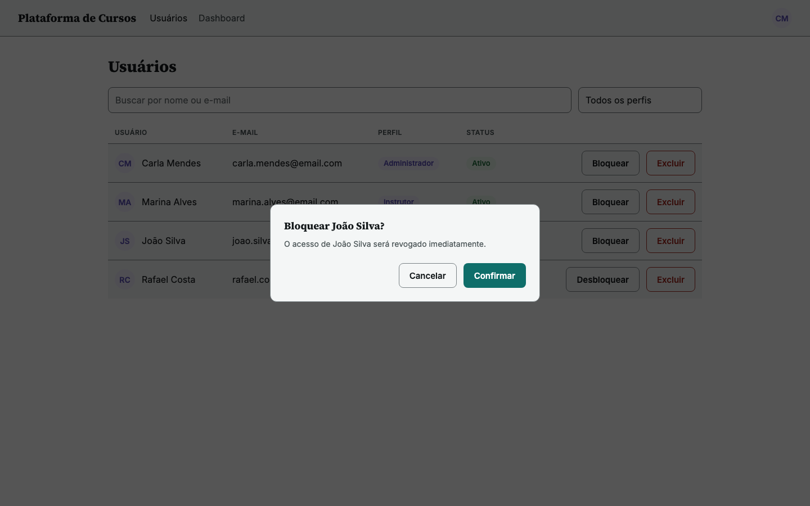

  *Figura 0 – UC008, fluxo básico: modal de confirmação "Bloquear João Silva?"*

  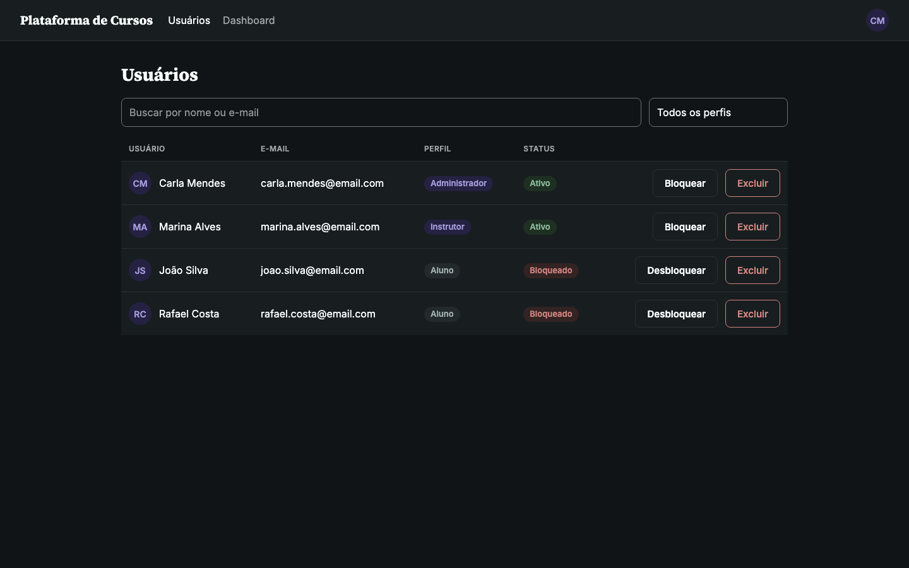

  *Figura 0 – UC008, fluxo básico: lista com João Silva bloqueado*
- **Fluxos alternativos:**
  - **A1 – O Administrador filtra a lista por perfil**
    - A-1.1 O Administrador seleciona um perfil no filtro: Aluno, Instrutor ou Administrador.
    - A-1.2 O sistema exibe somente os usuários daquele perfil.
    - A-1.3 Este caso de uso retorna ao fluxo básico (passo 1).

    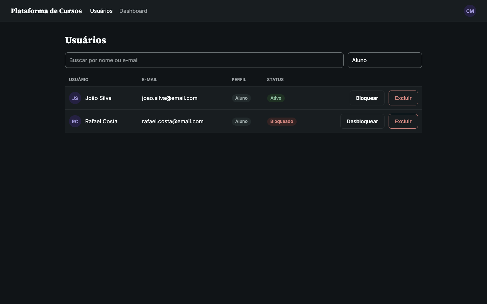

    *Figura 0 – UC008, fluxo alternativo A1: lista filtrada pelo perfil Aluno*
  - **A2 – O Administrador cancela a ação na confirmação**
    - A-2.1 O Administrador aciona “Cancelar” na tela de confirmação.
    - A-2.2 O sistema descarta a ação selecionada, sem alterar o status do usuário.
    - A-2.3 Este caso de uso retorna ao fluxo básico (passo 1).

    

    *Figura 0 – UC008, fluxo alternativo A2: lista de usuários sem alteração após cancelar*
  - **A3 – O Administrador aciona “Excluir”**
    - A-3.1 O Administrador aciona “Excluir” na linha do usuário.
    - A-3.2 O sistema executa o UC018 – Excluir e Anonimizar Usuário.
    - A-3.3 Este caso de uso retorna ao fluxo básico (passo 1).
- **Fluxos de exceção:**
  - **E1 – Tentativa de bloquear a própria conta de Administrador**
    - E-1.1 O sistema identifica que o usuário-alvo é a própria conta do Administrador que está logado.
    - E-1.2 O sistema impede a ação e exibe um aviso.
    - E-1.3 Este caso de uso retorna ao fluxo básico (passo 1).

    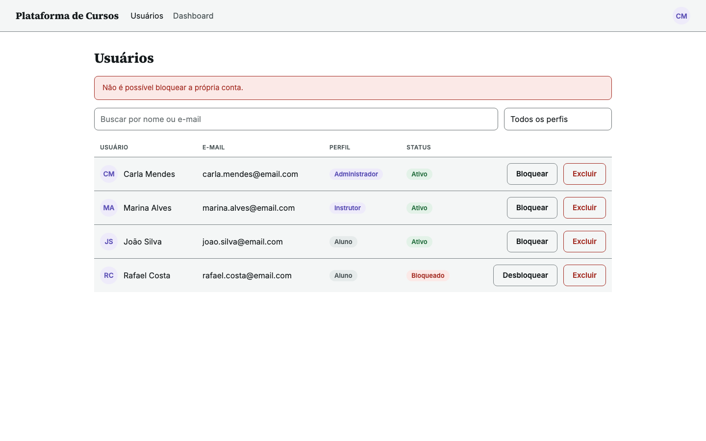

    *Figura 0 – UC008, fluxo de exceção E1: erro "Não é possível bloquear a própria conta"*
  - **E2 – Usuário-alvo já removido por outro Administrador**
    - E-2.1 O sistema identifica que o usuário-alvo não existe mais.
    - E-2.2 O sistema informa que o usuário não foi encontrado e atualiza a lista.
    - E-2.3 Este caso de uso retorna ao fluxo básico (passo 1).

    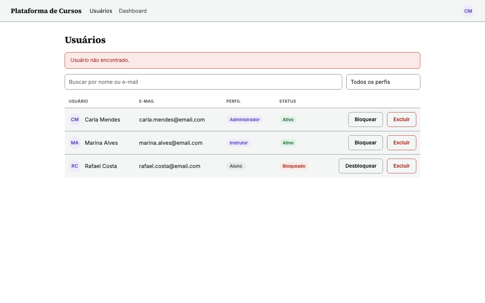

    *Figura 0 – UC008, fluxo de exceção E2: erro "Usuário não encontrado"*

## UC018 – Excluir e Anonimizar Usuário

- **Nome do caso de uso:** Excluir e Anonimizar Usuário
- **Ator(es):** Administrador.
- **Descrição:** o Administrador exclui a conta de um usuário; o sistema remove os dados pessoais e mantém o histórico de matrícula e pagamento anonimizado (US016, RF012). Estende o UC008 – Gerenciar Usuários, a partir da ação “Excluir”.
- **Pré-condições:** o Administrador ter realizado login e estar na lista de usuários (UC008).
- **Pós-condições:** dados pessoais do usuário removidos, histórico de matrícula e pagamento mantido anonimizado, acesso revogado e usuário fora da lista.
- **Regras de negócio:** R-1 a exclusão remove os dados pessoais, mas mantém o histórico de matrícula e pagamento anonimizado; R-2 o Administrador não pode excluir a própria conta; R-3 a exclusão é irreversível e exige confirmação explícita.
- **Protótipo(s) de tela:** modal de confirmação “Excluir usuário?” com aviso de anonimização irreversível sobre a lista de usuários. As telas de cada fluxo aparecem junto ao fluxo, abaixo.
- **Fluxo básico:**
  1. O sistema exibe a confirmação de exclusão com o nome do usuário e o aviso de que a ação é irreversível. (A-1)
  2. O Administrador aciona “Excluir”.
  3. O sistema valida o usuário-alvo. (E-1) (E-2)
  4. O sistema anonimiza os dados pessoais, mantém o histórico anonimizado e revoga o acesso.
  5. O sistema retira o usuário da lista e confirma a exclusão.
  6. Este caso de uso é finalizado.

  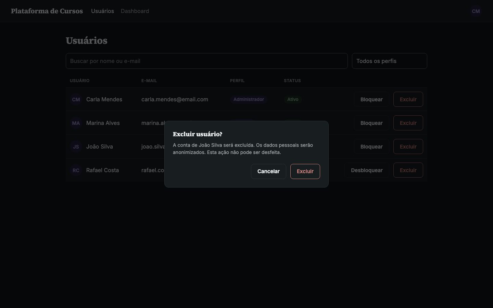

  *Figura 0 – UC018, fluxo básico: modal de confirmação com aviso de anonimização irreversível*

  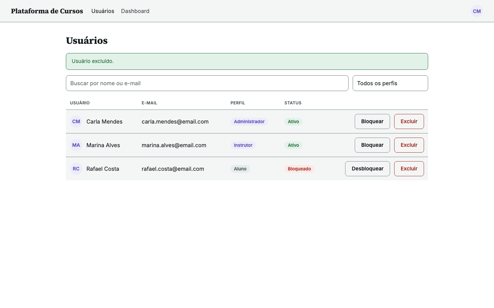

  *Figura 0 – UC018, fluxo básico: lista sem o usuário excluído e aviso "Usuário excluído"*
- **Fluxos alternativos:**
  - **A1 – O Administrador cancela a exclusão**
    - A-1.1 O Administrador aciona “Cancelar” na confirmação.
    - A-1.2 O sistema fecha a confirmação sem alterar o usuário.
    - A-1.3 Este caso de uso é finalizado.

    

    *Figura 0 – UC018, fluxo alternativo A1: lista de usuários sem alteração após cancelar*
- **Fluxos de exceção:**
  - **E1 – Tentativa de excluir a própria conta**
    - E-1.1 O sistema identifica que o usuário-alvo é a própria conta do Administrador que está logado.
    - E-1.2 O sistema impede a exclusão e exibe um aviso.
    - E-1.3 Este caso de uso é finalizado.

    

    *Figura 0 – UC018, fluxo de exceção E1: erro "Não é possível excluir a própria conta"*
  - **E2 – Usuário-alvo já removido por outro Administrador**
    - E-2.1 O sistema identifica que o usuário-alvo não existe mais.
    - E-2.2 O sistema informa que o usuário não foi encontrado e atualiza a lista.
    - E-2.3 Este caso de uso é finalizado.

    

    *Figura 0 – UC018, fluxo de exceção E2: erro "Usuário não encontrado"*

## UC016 – Acessar Área Protegida por Perfil

- **Nome do caso de uso:** Acessar Área Protegida por Perfil
- **Ator(es):** Usuário (Aluno, Instrutor ou Administrador).
- **Descrição:** o Usuário acessa uma área da plataforma e o sistema libera ou nega o acesso conforme a sessão e o perfil do Usuário (US015, RF018). Incluído pelo UC005 (Realizar Login): UC005 «include» UC016.
- **Pré-condições:** o Usuário ter conta na plataforma.
- **Pós-condições:** área exibida se o perfil for compatível; caso contrário, acesso negado e registrado na trilha de auditoria.
- **Regras de negócio:** R-1 os perfis são Aluno, Instrutor e Administrador; R-2 todas as áreas protegidas verificam o perfil do Usuário (RNF001); R-3 toda negação de acesso é registrada na trilha de auditoria (RNF016).
- **Protótipo(s) de tela:** sem tela própria; usa a tela de login (UC005), a página inicial de cada perfil e uma mensagem de acesso negado. As telas de cada fluxo aparecem junto ao fluxo, abaixo.
- **Fluxo básico:**
  1. O Usuário acessa uma área da plataforma. (A-1)
  2. O sistema verifica se a sessão do Usuário está ativa. (E-1)
  3. O sistema verifica se o perfil do Usuário é o exigido pela área. (E-2)
  4. O sistema exibe a área solicitada.
  5. Este caso de uso é finalizado.

- **Fluxos alternativos:**
  - **A1 – O Usuário chega após o login**
    - A-1.1 O Usuário conclui o login (UC005).
    - A-1.2 O sistema direciona o Usuário à página inicial do seu perfil.
    - A-1.3 Este caso de uso retorna ao fluxo básico (passo 4).

    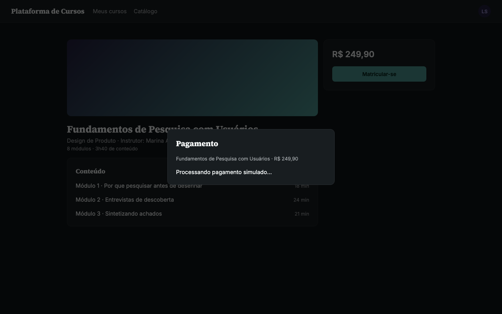

    *Figura 0 – UC016, fluxo alternativo A1: página inicial do Aluno*

    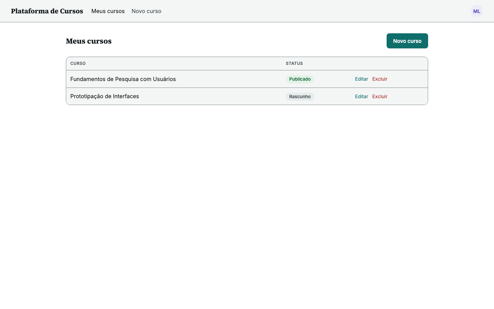

    *Figura 0 – UC016, fluxo alternativo A1: página inicial do Instrutor*

    

    *Figura 0 – UC016, fluxo alternativo A1: página inicial do Administrador*

- **Fluxos de exceção:**
  - **E1 – Sessão ausente ou expirada**
    - E-1.1 O sistema identifica que não há sessão ativa ou que a sessão expirou.
    - E-1.2 O sistema direciona o Usuário ao login (UC005), sem exibir os dados da área.
    - E-1.3 Este caso de uso é finalizado.

    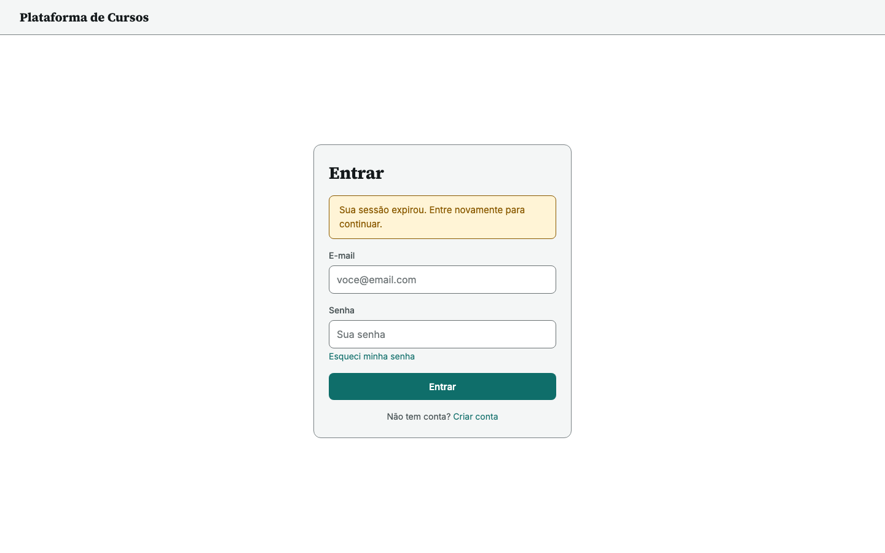

    *Figura 0 – UC016, fluxo de exceção E1: login com aviso de sessão expirada*
  - **E2 – Perfil sem permissão**
    - E-2.1 O sistema identifica que o perfil do Usuário não é o exigido pela área.
    - E-2.2 O sistema nega o acesso, informa a restrição, registra a tentativa na trilha de auditoria e direciona o Usuário à sua área.
    - E-2.3 Este caso de uso é finalizado.

    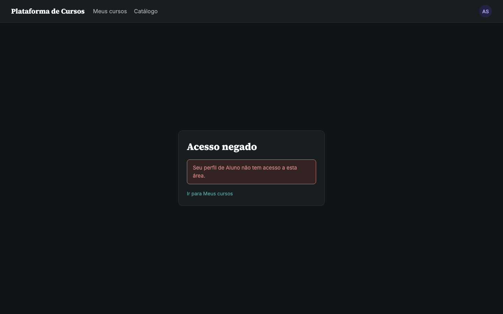

    *Figura 0 – UC016, fluxo de exceção E2: tela "Acesso negado" com aviso de perfil sem acesso*
