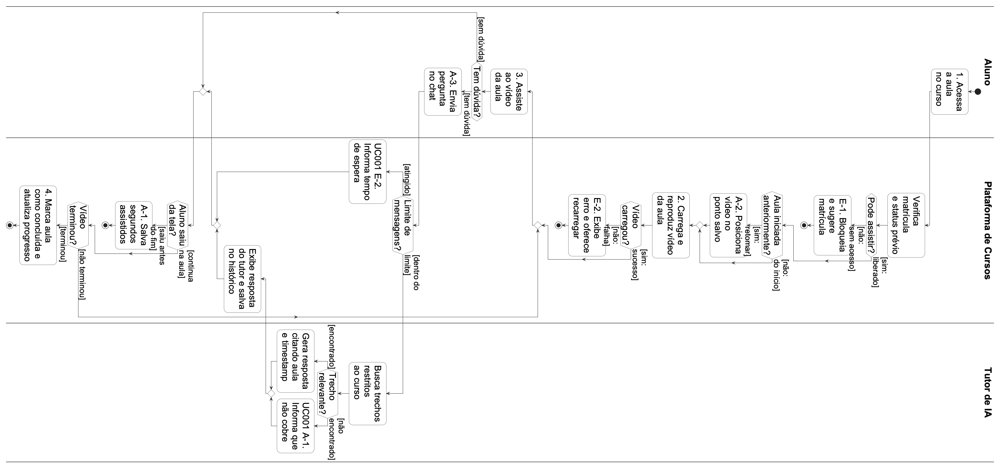

# 11 DIAGRAMA DE ATIVIDADES

Fonte: `especificacao/diagramas/11-atividades.puml` (PlantUML, [ADR-0004](../docs/adr/0004-diagramas-como-codigo.md)).

Diagrama de atividades do UC009 (Assistir aula), com o UC001 (Conversar com Tutor de IA) iniciado pelo fluxo alternativo A-3. Os números nas atividades indicam o passo do fluxo básico (passos 1 a 4), e A-x e E-x indicam o fluxo alternativo ou de exceção. O fluxo é particionado em raias por ator responsável (Aluno, Plataforma de Cursos e Tutor de IA). As três partes anteriores ficam preservadas em `diagramas/11-atividades-*.png` como registro.

*Figura 12 – Diagrama de Atividades do UC009 (Assistir Aula)*
