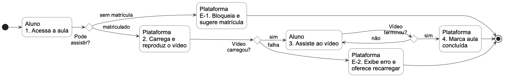
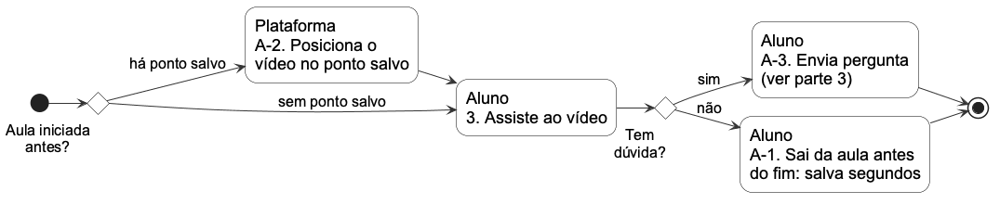
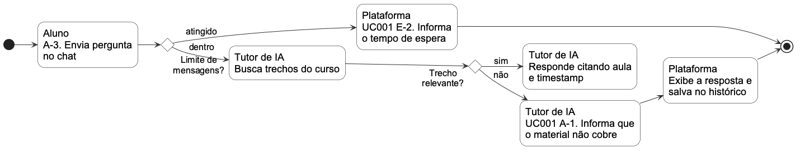

# 11 DIAGRAMA DE ATIVIDADES

Fonte: `especificacao/diagramas/11-atividades-1.puml`, `11-atividades-2.puml` e `11-atividades-3.puml` (PlantUML, [ADR-0004](../docs/adr/0004-diagramas-como-codigo.md)). O diagrama do UC009 (Assistir aula) está dividido em três partes, cada uma em página paisagem inteira, para ficar legível.

A primeira parte mostra o fluxo básico, com os passos 1 a 4, e as exceções E-1 e E-2. A segunda parte mostra os fluxos alternativos A-1 e A-2. A terceira parte mostra o fluxo alternativo A-3, que inicia o UC001 (Conversar com Tutor de IA), com o fluxo alternativo A-1 e a exceção E-2 desse caso de uso. Os números nas atividades indicam o passo do fluxo básico, e A-x e E-x indicam o fluxo alternativo ou de exceção.

*Figura 12 – Diagrama de Atividades do UC009, parte 1 (fluxo básico e exceções E-1 e E-2)*

*Figura 13 – Diagrama de Atividades do UC009, parte 2 (fluxos alternativos A-1 e A-2)*

*Figura 14 – Diagrama de Atividades do UC009, parte 3 (fluxo alternativo A-3, com o UC001)*
